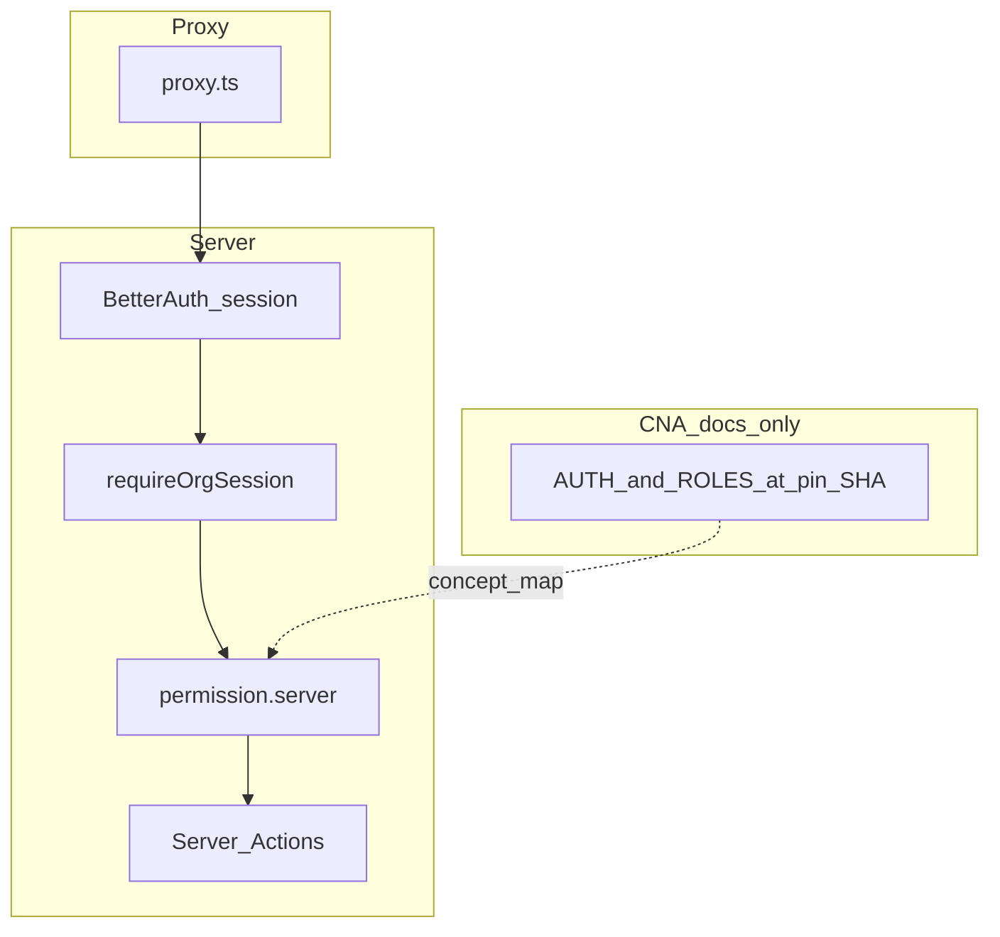

# Auth & IAM roadmap (final)

This file **replaces** maintaining two separate plans for the same program. For history: prior splits were [cna-iam-learning-track.plan.md](cna-iam-learning-track.plan.md) and [auth-enrichment-from-legacy.plan.md](auth-enrichment-from-legacy.plan.md).

## Document control

| Field | Value |
|--------|--------|
| plan_id | `auth-iam-roadmap-final` |
| plan_version | `2.0` (merged) |
| status | `active` — implementation partial; WP-05 deferred; optional WPs open |
| target_repo | `afenda-vercel` |
| legacy_extract | `C:\JackProject\afenda-next` (patterns only) |
| cna_reference | [nextjs-saas-ai-starter @ `ccbb30f6…`](https://github.com/Create-Node-App/cna-templates/tree/ccbb30f6a4d79f0b9d37de9df0a17e7ac8b567f7/templates/nextjs-saas-ai-starter) (IAM docs only; not a port) |
| deferred_source | `afenda-node` (host-tenant / IdP doctrine later) |

## Goals

1. **Primary (auth enrichment):** Tenant-facing auth that feels complete — sessions, devices, identity linking, org-aware UX — by extracting **patterns** from `afenda-next`, without its `/iam` tree or non-contract folders.
2. **Secondary (CNA track):** When resuming **WP-05**, use pinned CNA **documentation** (Auth.js + PBAC *concepts*) as a **checklist** mapped to Better Auth + this repo — not a stack swap.

## Non-goals (freeze)

- No Auth.js / Auth0 migration.
- No slug/subdomain host-tenant routing (afenda-node scope later).
- No new `lib/features/*` architectural categories beyond [AGENTS.md](AGENTS.md) vocabulary.
- No wholesale copy of CNA `src/features` + `src/shared`.
- No Vitest → Jest / Storybook / DevContainer adoption from CNA unless a separate decision.

## Platform alignment

### Vercel (non-negotiable on Vercel)

1. **Authenticate before privileged work** — Route handlers and upload/token flows verify server-side (e.g. Blob `onBeforeGenerateToken` rejects unauthenticated callers).
2. **Server redirects** — `redirect()` from `next/navigation` in server contexts (aligned with `lib/auth/stepup.server.ts`, `lib/tenant.ts`).
3. **Cron / internal HTTP** — Bearer secret (`CRON_SECRET` or dedicated); no unauthenticated state-changing routes.
4. **Routing gate** — Root [`proxy.ts`](proxy.ts) **narrow matcher**; **session cookie presence / redirects only**; no DB or authorization logic in the proxy.
5. **Env** — Vercel project for prod secrets; local `.env.config` → `pnpm env:sync` → `.env.local`.
6. **Build context** — `VERCEL_ENV` / `VERCEL_URL` for non-security branching only.

### Next.js 16 (Context7 — `/vercel/next.js` v16.1.x auth guide)

| Guidance | Implication |
|----------|-------------|
| Proxy/edge: lightweight session/cookie checks for redirects; avoid heavy DB at edge | Matches [`proxy.ts`](proxy.ts); do not port CNA Auth.js `middleware` verbatim. |
| **Authorization in Server Actions** — verify session/role in the action; UI gating is not enough | Use [`requireOrgSession`](lib/tenant.ts), [`lib/auth/permission.server.ts`](lib/auth/permission.server.ts), `forbidden()` as needed. |
| `cookies()` / `headers()` in RSC | Dynamic rendering is acceptable when reading session. |

## Repository alignment (AGENTS)

- **IAM authority:** [`lib/auth/`](lib/auth/) only; **`app/`** = routes + composition.
- **Surfaces:** `/account/*`, `/sign-in`, `/dashboard`, `/api/auth/*` — no `app/iam/*` unless AGENTS is updated.
- **Mutations:** Server Actions; keep `experimental.serverActions.allowedOrigins` aligned with [`lib/site.ts`](lib/site.ts) / `BETTER_AUTH_*` ([`next.config.ts`](next.config.ts)).
- **Audit:** `iam_audit_event` + [`lib/auth/audit.server.ts`](lib/auth/audit.server.ts).
- **Imports:** `#lib/auth` public door; cross-module via `#features/<module>` only.

## Serialized work packages

Ordered JSON; `depends_on` must complete first.

```json
[
  {"id": "WP-01", "title": "Security center — sessions and passkeys", "depends_on": [], "status": "done"},
  {"id": "WP-02", "title": "User-visible security activity feed", "depends_on": ["WP-01"], "status": "done"},
  {"id": "WP-03", "title": "Identity — profile + OAuth linking", "depends_on": ["WP-01"], "status": "done"},
  {"id": "WP-04", "title": "Policy — verified email + step-up", "depends_on": [], "status": "done"},
  {"id": "WP-05", "title": "Organization UX + org audit events", "depends_on": ["WP-03", "WP-04"], "status": "deferred_partial", "note": "Partial: org summary page. Deferred: invites/members/roles + org.* writeIamAuditEvent. Resume with CNA mapping doc."},
  {"id": "WP-06", "title": "Optional @better-auth/infra", "depends_on": ["WP-01"], "status": "open"},
  {"id": "WP-07", "title": "Regression tests (auth module)", "depends_on": ["WP-04"], "status": "open"}
]
```

Full detail (deliverables and primary files) remains aligned with the historical definitions in the archived [auth-enrichment-from-legacy.plan.md](auth-enrichment-from-legacy.plan.md) § Serialized work packages — **no semantic change** to deliverables beyond WP-05 deferral note above.

## CNA reference track (pins WP-05 resume)

**Commit:** `ccbb30f6a4d79f0b9d37de9df0a17e7ac8b567f7`

**Read:**

- [README.md](https://github.com/Create-Node-App/cna-templates/blob/ccbb30f6a4d79f0b9d37de9df0a17e7ac8b567f7/templates/nextjs-saas-ai-starter/README.md)
- [docs/AUTHENTICATION.md](https://github.com/Create-Node-App/cna-templates/blob/ccbb30f6a4d79f0b9d37de9df0a17e7ac8b567f7/templates/nextjs-saas-ai-starter/docs/AUTHENTICATION.md)
- [docs/ROLES_AND_PERMISSIONS.md](https://github.com/Create-Node-App/cna-templates/blob/ccbb30f6a4d79f0b9d37de9df0a17e7ac8b567f7/templates/nextjs-saas-ai-starter/docs/ROLES_AND_PERMISSIONS.md)

**Deliverable before WP-05 coding:** one markdown file with this mapping (file pointers, not pasted CNA source):

| CNA concept | afenda equivalent | Gap |
|-------------|-------------------|-----|
| `/t/[tenant]` route | `activeOrganizationId` + `requireOrgSession` | URL shape differs |
| Session | Better Auth + [`lib/session-cache.ts`](lib/session-cache.ts) | API differs |
| PBAC `hasPermission` (DB) | `canActInOrganization` / org roles | Fine-grained keys TBD |
| Session UI permissions | Nav hints only | Same rule |
| Invitations + roles | Better Auth organization plugin | Deferred |



## Phases

| Phase | Scope |
|-------|--------|
| **A — Documentation** | Add IAM mapping doc (single path); keep this final plan’s status table accurate. |
| **B — Optional infra/tests** | WP-06 / WP-07 when prioritized. |
| **C — WP-05 resume** | Org admin UX + `org.*` audit using phase A doc + AGENTS Server Action checklist. |

## Environment (serial)

- **Stable:** `BETTER_AUTH_SECRET`, `BETTER_AUTH_URL`, `DATABASE_URL`, OAuth clients.
- **WP-06 optional:** `BETTER_AUTH_API_KEY`, `BETTER_AUTH_API_URL`, `BETTER_AUTH_KV_URL`.
- **Cron:** `CRON_SECRET` if new scheduled routes.

## Verification gates

Every merge touching auth:

1. `pnpm lint`
2. `pnpm typecheck`
3. Manual: `/account/security`, `/account/identity`, step-up + verified-email behavior
4. Prod: Vercel env complete for target deployment

Doc-only changes in `.cursor/plans`: optional lint if repo markdown rules apply.

## Implementation vs plan (rolled-up)

| WP | Status |
|----|--------|
| WP-01 | **Done** — [`lib/auth/security.server.ts`](lib/auth/security.server.ts), [`app/account/security/`](app/account/security/) |
| WP-02 | **Done** — [`lib/auth/activity.server.ts`](lib/auth/activity.server.ts) |
| WP-03 | **Done** — [`lib/auth/accounts.server.ts`](lib/auth/accounts.server.ts), [`app/account/identity/`](app/account/identity/) |
| WP-04 | **Done** — [`lib/auth/policy.server.ts`](lib/auth/policy.server.ts) |
| WP-05 | **Deferred / partial** — read-only org summary; **not** invites/members/roles or `org.*` write audit |
| WP-06 | **Not done** (optional) |
| WP-07 | **Not done** (no vitest in repo yet) |
| afenda-node | **Deferred** |

## Checklist (mirror)

- [x] WP-01 Security center
- [x] WP-02 Activity feed
- [x] WP-03 Identity + linking
- [x] WP-04 Verified email + step-up
- [ ] WP-05 Org UX + org audit (deferred; partial summary only today)
- [ ] WP-06 Infra plugins (optional)
- [ ] WP-07 Auth tests (optional)
- [x] CNA mapping doc — [cna-iam-reference.md](cna-iam-reference.md)
- [ ] Deferred: afenda-node review
