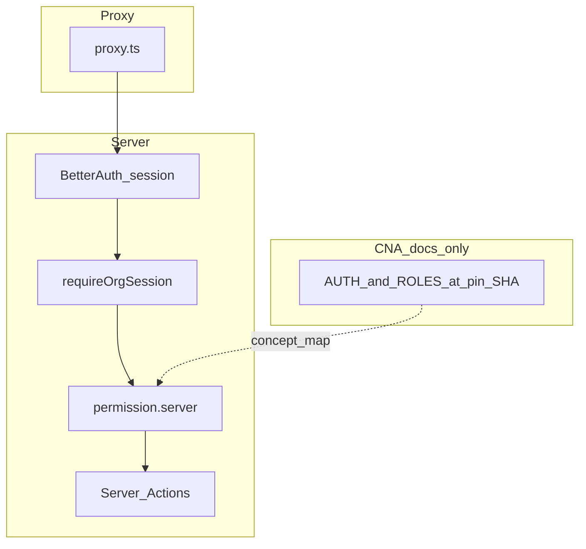

# Auth & IAM roadmap (final)

This file **replaces** maintaining separate backlog plans for the same program. Historical splits: [cna-iam-learning-track.plan.md](cna-iam-learning-track.plan.md), [auth-enrichment-from-legacy.plan.md](auth-enrichment-from-legacy.plan.md). The backlog refinement previously in `complete_pending_iam_backlog.plan.md` is **merged here** — see [Remaining backlog](#remaining-backlog-nextjs-aligned).

## Document control

| Field | Value |
|--------|--------|
| plan_id | `auth-iam-roadmap-final` |
| plan_version | `3.1` (WP-05 appendix closed; WP-06 implemented env-gated; backlog trimmed) |
| status | `active` — WP-01–06 complete in repo (Infra off unless env set); WP-07 ongoing; optional E2E invite |
| target_repo | `afenda-vercel` |
| legacy_extract | `C:\JackProject\afenda-next` (patterns only) |
| cna_reference | [nextjs-saas-ai-starter @ `ccbb30f6…`](https://github.com/Create-Node-App/cna-templates/tree/ccbb30f6a4d79f0b9d37de9df0a17e7ac8b567f7/templates/nextjs-saas-ai-starter) (IAM docs only; not a port) |
| deferred_source | `afenda-node` (host-tenant / IdP doctrine later) |

## Goals

1. **Primary (auth enrichment):** Tenant-facing auth — sessions, devices, identity linking, org-aware UX — by extracting **patterns** from `afenda-next`, without its `/iam` tree or non-contract folders.
2. **Secondary (CNA track):** Pinned CNA **documentation** (Auth.js + PBAC *concepts*) as a **checklist** mapped to Better Auth + this repo — not a stack swap.

## Non-goals (freeze)

- No Auth.js / Auth0 migration.
- No slug/subdomain host-tenant routing (afenda-node scope later).
- No new `lib/features/*` architectural categories beyond [AGENTS.md](AGENTS.md) vocabulary.
- No wholesale copy of CNA `src/features` + `src/shared`.
- No Vitest → Jest / Storybook / DevContainer adoption from CNA unless a separate decision.

## Platform alignment

### Vercel (non-negotiable on Vercel)

1. **Authenticate before privileged work** — Route handlers and upload/token flows verify server-side.
2. **Server redirects** — `redirect()` from `next/navigation` in server contexts.
3. **Cron / internal HTTP** — Bearer secret; no unauthenticated state-changing routes.
4. **Routing gate** — Root [`proxy.ts`](proxy.ts) **narrow matcher**; cookie/session hints only; **no DB or authorization logic** in the proxy.
5. **Env** — Vercel project for prod secrets; local `.env.config` → `pnpm env:sync` → `.env.local`.
6. **Build context** — `VERCEL_ENV` / `VERCEL_URL` for non-security branching only.

### Next.js 16 — docs alignment (Context7 / MCP)

| Guidance | Implication |
|----------|-------------|
| Proxy: lightweight session/cookie checks; avoid heavy DB at edge | Matches [`proxy.ts`](proxy.ts). |
| **Authorization in Server Actions** — verify session/role in the action | [`requireOrgSession`](lib/tenant.ts), [`permission.server.ts`](lib/auth/permission.server.ts). |
| `cookies()` / `headers()` in RSC | Dynamic rendering acceptable for session-backed routes. |

### Next.js official (nextjs_docs MCP, v16.2.x)

Use as **engineering constraints** for remaining work:

| Doc | Use |
|-----|-----|
| [Testing: Vitest](https://nextjs.org/docs/app/guides/testing/vitest) | Async Server Components are not isolated in Vitest; **E2E** for full route flows. **Vitest** = `lib/**` + RTL/jsdom for client islands. |
| [Testing: Playwright](https://nextjs.org/docs/app/guides/testing/playwright) | E2E against a **running** server; **`build` + `start`** closer to production (repo: `next start` on **3001**). |
| [Authentication](https://nextjs.org/docs/app/guides/authentication) | Server Actions: authorize **before** mutation. Route Handlers: **session + role** like public APIs. Proxy: optimistic; **secure checks** in actions/RSC/DAL. |
| [Route Handlers](https://nextjs.org/docs/app/getting-started/route-handlers) | Authenticated streaming GET stays **dynamic**; do **not** force-static org CSV export. |

## Repository alignment (AGENTS)

- **IAM authority:** [`lib/auth/`](lib/auth/) only; **`app/`** = routes + composition.
- **Surfaces:** `/account/*`, `/sign-in`, `/dashboard`, `/api/auth/*`.
- **Mutations:** Server Actions; `experimental.serverActions.allowedOrigins` in [`next.config.ts`](next.config.ts).
- **Audit:** `iam_audit_event` + [`audit.server.ts`](lib/auth/audit.server.ts).
- **Imports:** `#lib/auth` public door; cross-module via `#features/<module>` only.

## Serialized work packages

```json
[
  {"id": "WP-01", "title": "Security center — sessions and passkeys", "depends_on": [], "status": "done"},
  {"id": "WP-02", "title": "User-visible security activity feed", "depends_on": ["WP-01"], "status": "done"},
  {"id": "WP-03", "title": "Identity — profile + OAuth linking", "depends_on": ["WP-01"], "status": "done"},
  {"id": "WP-04", "title": "Policy — verified email + step-up", "depends_on": [], "status": "done"},
  {"id": "WP-05", "title": "Organization UX + org audit events", "depends_on": ["WP-03", "WP-04"], "status": "done", "note": "Invites, cancel, role, remove, accept/reject, org.* audit, audit UI + streaming CSV, ORG_AUDIT_EXPORT_HMAC_SECRET + verifyOrganizationIamAuditExportCsv, org-admin Playwright shell. Optional: deeper invite E2E."},
  {"id": "WP-06", "title": "Optional @better-auth/infra", "depends_on": ["WP-01"], "status": "done_env_gated", "note": "dash/sentinel server plugins + client plugins when BETTER_AUTH_API_KEY and NEXT_PUBLIC_BETTER_AUTH_INFRA (+ sentinel flags) set."},
  {"id": "WP-07", "title": "Regression tests (auth module)", "depends_on": ["WP-04"], "status": "partial", "note": "Vitest + coverage gates exist; expand lib/RTL — not async RSC pages per Next Vitest guide."}
]
```

Full historical deliverable text: [auth-enrichment-from-legacy.plan.md](auth-enrichment-from-legacy.plan.md).

## CNA reference track

**Commit:** `ccbb30f6a4d79f0b9d37de9df0a17e7ac8b567f7`

**Read:**

- [README.md](https://github.com/Create-Node-App/cna-templates/blob/ccbb30f6a4d79f0b9d37de9df0a17e7ac8b567f7/templates/nextjs-saas-ai-starter/README.md)
- [docs/AUTHENTICATION.md](https://github.com/Create-Node-App/cna-templates/blob/ccbb30f6a4d79f0b9d37de9df0a17e7ac8b567f7/templates/nextjs-saas-ai-starter/docs/AUTHENTICATION.md)
- [docs/ROLES_AND_PERMISSIONS.md](https://github.com/Create-Node-App/cna-templates/blob/ccbb30f6a4d79f0b9d37de9df0a17e7ac8b567f7/templates/nextjs-saas-ai-starter/docs/ROLES_AND_PERMISSIONS.md)

**Mapping:** [cna-iam-reference.md](cna-iam-reference.md) (single source; update row 31 when backlog items close).

| CNA concept | afenda equivalent | Gap |
|-------------|-------------------|-----|
| `/t/[tenant]` route | `activeOrganizationId` + `requireOrgSession` | URL shape differs |
| Session | Better Auth + [`session-cache.ts`](lib/session-cache.ts) | API differs |
| PBAC `hasPermission` (DB) | `canActInOrganization` / org roles | Fine-grained keys TBD |
| Session UI permissions | Nav hints only | Same rule |
| Invitations + roles | Better Auth org plugin + [`organization-actions.ts`](app/[locale]/account/organization/organization-actions.ts) | **Core shipped** — see residual backlog |



## Phases

| Phase | Scope |
|-------|--------|
| **A — Documentation** | IAM mapping doc — **done** ([cna-iam-reference.md](cna-iam-reference.md)). Keep status tables honest. |
| **B — Infra enablement** | WP-06 **wired** — turn on in staging/prod via env ([Remaining backlog](#remaining-backlog-nextjs-aligned)). |
| **C — WP-05** | **Complete** — optional deeper invite E2E only if CI secrets allow. |

## Environment (serial)

- **Stable:** `BETTER_AUTH_SECRET`, `BETTER_AUTH_URL`, `DATABASE_URL`, OAuth clients.
- **Org audit export (signing):** optional **`ORG_AUDIT_EXPORT_HMAC_SECRET`** — documented in [`.env.config.example`](.env.config.example); verifier [`verifyOrganizationIamAuditExportCsv`](../../lib/auth/org-audit.server.ts).
- **Better Auth Infrastructure:** optional **`BETTER_AUTH_API_KEY`**, **`BETTER_AUTH_API_URL`**, **`BETTER_AUTH_KV_URL`**, **`BETTER_AUTH_INFRA_SENTINEL`** — pair with **`NEXT_PUBLIC_BETTER_AUTH_INFRA`** / **`NEXT_PUBLIC_BETTER_AUTH_INFRA_SENTINEL`** at build time ([`lib/auth-client.ts`](../../lib/auth-client.ts)).
- **Cron:** `CRON_SECRET` if new scheduled routes.

## Verification gates

Every merge touching auth:

1. `pnpm lint`
2. `pnpm typecheck`
3. `pnpm test:ci`
4. Manual: `/account/security`, `/account/identity`, step-up + verified-email behavior
5. Optional Playwright with `E2E_ORG_ADMIN_*` for org audit flows
6. Optional Playwright with `E2E_ORG_INVITE_*` for org invite UI ([`tests/e2e/org-invite-optional.spec.ts`](tests/e2e/org-invite-optional.spec.ts))

## Implementation vs plan (rolled-up)

| WP | Status |
|----|--------|
| WP-01 | **Done** — security center, passkeys |
| WP-02 | **Done** — activity feed |
| WP-03 | **Done** — identity / OAuth linking |
| WP-04 | **Done** — verified email + step-up |
| WP-05 | **Done** — org flows + audit UI + streaming CSV; HMAC + [`verifyOrganizationIamAuditExportCsv`](lib/auth/org-audit.server.ts); [`tests/unit/org-audit-csv.test.ts`](tests/unit/org-audit-csv.test.ts); [`tests/e2e/org-admin-audit.spec.ts`](tests/e2e/org-admin-audit.spec.ts); optional invite E2E [`tests/e2e/org-invite-optional.spec.ts`](tests/e2e/org-invite-optional.spec.ts). |
| WP-06 | **Done (env-gated)** — [`betterAuthInfraServerPlugins`](lib/auth/config.server.ts) + client infra plugins in [`lib/auth-client.ts`](lib/auth-client.ts); enable with secrets + public build flags. |
| WP-07 | **Partial** — Vitest + coverage ([`vitest.config.ts`](vitest.config.ts)); per Next docs, **do not** target async RSC pages in Vitest — use Playwright. |
| afenda-node | **Deferred** |

## Checklist (mirror)

- [x] WP-01 Security center
- [x] WP-02 Activity feed
- [x] WP-03 Identity + linking
- [x] WP-04 Verified email + step-up
- [x] WP-05 Org UX + org audit (including CSV verify + optional E2E gates)
- [x] WP-06 Infra plugins (env-gated; off until `BETTER_AUTH_API_KEY` + client flags)
- [ ] WP-07 Expand tests only where Next guidance allows (lib + RTL; E2E for routes)
- [x] CNA mapping doc — [cna-iam-reference.md](cna-iam-reference.md)
- [ ] Deferred: afenda-node review

---

## Remaining backlog (Next.js aligned)

### 1. Documentation hygiene

- Keep [`cna-iam-reference.md`](cna-iam-reference.md) row 31 concise; link [AGENTS.md](../../AGENTS.md) §5 for Infra env pairing.

### 2. WP-07 — tests and coverage ratchet

- Add **Vitest** for pure `lib/**` branches; **`*.dom.test.tsx`** only for narrow client islands.
- Raise **global** thresholds in [`vitest.config.ts`](vitest.config.ts) in small steps after green CI.
- **Do not** cover async RSC pages in Vitest — **Playwright** for routes ([Vitest guide](https://nextjs.org/docs/app/guides/testing/vitest)).

### 3. Optional E2E — org invite

- [`tests/e2e/org-invite-optional.spec.ts`](tests/e2e/org-invite-optional.spec.ts) behind **`E2E_ORG_INVITE_*`** (skip when unset). Full happy-path needs stable mail or API — expand only when fixtures exist.

### 4. WP-06 — operational enablement

- Code is **shipped**; **enable** in each environment: set **`BETTER_AUTH_API_KEY`** (and optional URLs), **`NEXT_PUBLIC_BETTER_AUTH_INFRA=1`**, and matching sentinel flags if used. Smoke Dashboard/Sentinel flows.

### 5. Out of scope

**afenda-node** host-tenant routing — unchanged.

---

## Appendix — Agent implementation pack (Next.js–aligned)

**Shipped in repo** — kept below as a specification reference for the CSV verifier and related artifacts.

**Note:** Applying changes requires **Agent mode** (this file is markdown-only in Plan mode).

### Next.js MCP references (authoritative)

- [Route Handlers](https://nextjs.org/docs/app/getting-started/route-handlers) — streaming authenticated GET stays **dynamic** by default; no `force-static` on [`organization-audit-csv/route.ts`](../../app/api/integrations/organization-audit-csv/route.ts).
- [Authentication](https://nextjs.org/docs/app/guides/authentication) — Route Handler = verify session + role (already); Server Actions = authorize before mutation (already).
- [Playwright](https://nextjs.org/docs/app/guides/testing/playwright) — E2E against **`next start`** for prod-shaped behavior.

### 1. `lib/auth/org-audit.server.ts`

Add after `computeOrganizationIamAuditExportSignature`:

- **`parseCsvFirstField(line)`** — first RFC 4180 field (supports quoted ids).
- **`verifyOrganizationIamAuditExportCsv(csvText, organizationId, secret)`** → `{ ok: true } | { ok: false, reason }`:
  - Strip BOM, split `\r?\n`, pop trailing blank lines.
  - Pop consecutive lines starting with `#afenda_audit_footer_v1` from end → ordered footers.
  - Require header line containing `id` and `created_at`.
  - Parse `#row_count,N` from footer; data lines = body rows; assert `N === dataLines.length`.
  - If `N === 0`: pass only if no `#signature_sha256` line.
  - If `N > 0`: require `#signature_sha256,<hex>`; `firstId = parseCsvFirstField(first data row)`, `lastId = parseCsvFirstField(last data row)`; `expected = computeOrganizationIamAuditExportSignature({ organizationId, rowCount: N, firstRowId: firstId, lastRowId: lastId, secret })`; compare with **`timingSafeEqual`** on UTF-8 buffers of hex strings.

Export types: `OrganizationIamAuditCsvVerification`.

### 2. `lib/auth/index.ts`

Re-export `verifyOrganizationIamAuditExportCsv`, `parseCsvFirstField`, and verification type from `./org-audit.server`.

### 3. `tests/unit/org-audit-csv.test.ts`

- Build a minimal CSV with **`formatOrganizationIamAuditCsvDataRow`** (2 rows), BOM + header, append footers matching stream format, compute expected sig with test secret → **`expect(verify(...)).toEqual({ ok: true })`**.
- Cases: tampered row → `signature_mismatch`; wrong row count → `row_count_mismatch`; empty export → `ok`.

### 4. `.env.config.example`

Expand commented **`ORG_AUDIT_EXPORT_HMAC_SECRET`** block: dedicated HMAC for CSV footers; falls back to **`BETTER_AUTH_SECRET`**; rotation note; pointer to **`verifyOrganizationIamAuditExportCsv`**.

### 5. `app/api/integrations/organization-audit-csv/route.ts`

One-line comment: dynamic streaming export per Next Route Handler defaults (optional).

### 6. `tests/e2e/org-admin-audit.spec.ts`

After audit CSV assertions, **`page.goto('/en/account/organization')`** and **`expect(page.getByRole('heading', { name: 'Organization' })).toBeVisible()`** (same optional credential gate).

### 7. `.cursor/plans/cna-iam-reference.md`

Update row 31 “remaining backlog”: replace with **HMAC verify helper + optional org page E2E** once shipped; link this appendix.

### Verification

`pnpm lint` · `pnpm typecheck` · `pnpm test:ci` · optional Playwright with `E2E_ORG_ADMIN_*`.
