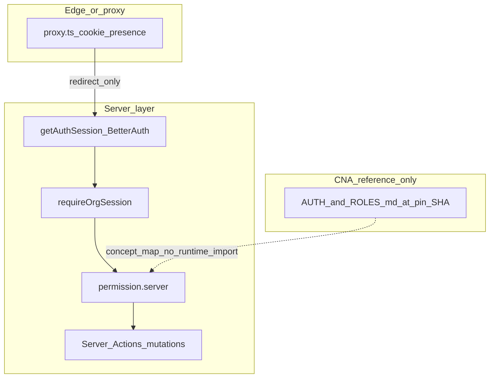

> **Superseded for maintenance:** use [auth-iam-roadmap-final.plan.md](auth-iam-roadmap-final.plan.md). This file remains a **CNA-only appendix** (pin, Next.js table, full concept mapping).

# CNA IAM learning track (normalized)

## Pin (immutable reference)

**Commit:** `ccbb30f6a4d79f0b9d37de9df0a17e7ac8b567f7`

**Tree:** [Create-Node-App/cna-templates — `templates/nextjs-saas-ai-starter`](https://github.com/Create-Node-App/cna-templates/tree/ccbb30f6a4d79f0b9d37de9df0a17e7ac8b567f7/templates/nextjs-saas-ai-starter)

**Primary CNA docs (textbook):**

- [README.md](https://github.com/Create-Node-App/cna-templates/blob/ccbb30f6a4d79f0b9d37de9df0a17e7ac8b567f7/templates/nextjs-saas-ai-starter/README.md) — stack summary (Auth.js + Auth0, PBAC, `/t/[tenant]`, AI)
- [docs/AUTHENTICATION.md](https://github.com/Create-Node-App/cna-templates/blob/ccbb30f6a4d79f0b9d37de9df0a17e7ac8b567f7/templates/nextjs-saas-ai-starter/docs/AUTHENTICATION.md)
- [docs/ROLES_AND_PERMISSIONS.md](https://github.com/Create-Node-App/cna-templates/blob/ccbb30f6a4d79f0b9d37de9df0a17e7ac8b567f7/templates/nextjs-saas-ai-starter/docs/ROLES_AND_PERMISSIONS.md)

## Next.js evaluation (Context7 — `/vercel/next.js` v16.1.x auth guide)

These points **validate** afenda’s existing layering and **constrain** how we borrow CNA patterns:

| Next.js guidance | Implication for this plan |
|------------------|---------------------------|
| **Proxy / edge-style gate** can use **cookie presence or lightweight session hints** for redirects; avoid heavy DB/auth logic at the edge | Matches narrow [`proxy.ts`](proxy.ts) (Better Auth session cookie presence → `/sign-in?callbackUrl=`). CNA Auth.js `middleware`/`authorized` is conceptually similar—not copied verbatim. |
| **Authorization for mutations** belongs in **Server Actions** (and server-side checks): verify role/session inside the action; UI hiding is insufficient | Aligns with CNA stating `session.user.permissions` is **UI-only** and **`hasPermission` is DB-backed**. afenda: enforce with [`requireOrgSession`](lib/tenant.ts), [`permission.server.ts`](lib/auth/permission.server.ts), Server Actions—not client-only. |
| Use **`forbidden()`** / early return when user lacks rights in server mutations | Future WP-05 actions should follow same pattern as [Next.js authentication guide](https://github.com/vercel/next.js/blob/v16.1.6/docs/01-app/02-guides/authentication.mdx). Already echoed in [AGENTS.md](AGENTS.md) Server Action checklist. |
| **`cookies()` / `headers()`** in Server Components → dynamic rendering | Accept when reading session in RSC; no change to plan scope. |

**Optimization:** Do **not** port CNA’s Auth.js `middleware` examples into root `middleware.ts` unless AGENTS/proxy strategy changes — keep **one** routing gate (`proxy.ts`) per repo contract.

## Deferred scope (explicit)

- **WP-05** ([auth-enrichment-from-legacy.plan.md](.cursor/plans/auth-enrichment-from-legacy.plan.md)): org invites, member/role management UI, **`org.*`** `writeIamAuditEvent` — **deferred** until product prioritizes.
- **Auth stack migration:** Auth.js / Auth0 — **out of scope** (would require AGENTS + full migration).

## Hard boundaries (stable — do not violate)

- IAM authority stays under [`lib/auth/`](lib/auth/); routes stay thin in [`app/`](app/).
- No **`services` / `helpers` / `utils` / `src/shared`** mirrors ([AGENTS.md](AGENTS.md)).
- No wholesale copy of CNA **`src/features` + `src/shared`** tree.
- API governance unchanged — AI/streaming routes only via allowed `app/api/*` families if a future AI slice lands.

## Concept mapping (CNA → afenda) — deliverable content

Single doc should contain this table (filled out with file pointers, not large pasted code):

| CNA concept | CNA location (idea) | afenda equivalent | Gap / note |
|-------------|---------------------|-------------------|------------|
| Tenant route `/t/[tenant]` | Dynamic segment | `activeOrganizationId` + [`requireOrgSession`](lib/tenant.ts) | Path shape differs; semantics align |
| Session | Auth.js `auth()` | Better Auth `auth.api.getSession` / [`getAuthSession`](lib/session-cache.ts) | Different API; same layer |
| PBAC `hasPermission(slug, key)` | DB-only | [`canActInOrganization`](lib/auth/permission.server.ts), org **role** strings | No arbitrary permission-key union in DB yet |
| UI permissions on session | Display only | Optional nav hints only — **never** sole authz | Same rule as CNA |
| Invitations + `roleId` | Tenant invitations | Better Auth **organization** plugin (deferred WP-05) | Map when implementing |

## Phases (optimized order)

1. **Documentation-only:** Add IAM mapping doc + refresh auth-enrichment plan table (no dependency installs, no contract checker changes).
2. **Resume WP-05 (optional):** Use phase 1 doc as checklist; implement under `lib/auth` + `app/account` per AGENTS.

## Verification

| Change type | Gate |
|-------------|------|
| Doc-only | Optional `pnpm run lint` if touching markdown governed by repo rules |
| Any code later | `pnpm lint` + `pnpm typecheck` per AGENTS |

## Mermaid (architecture intent)

## Out of scope for this track

- Replacing Vitest/Playwright with Jest/Storybook from CNA.
- Mega-linter / DevContainer adoption unless separately proposed.
- pgvector / AI SDK unless a separate ADR + AGENTS update.
