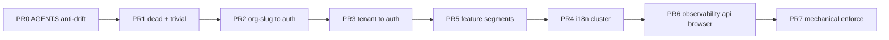

# Lib root nesting + strict anti-drift AGENTS.md

## Why this plan exists

`lib/` currently has **~30 loose `.ts` files at root** while AGENTS.md §6 only names subtrees (`auth/`, `db/`, `erp/`, …) and never defines an **exhaustive root allowlist**. That gap causes drift:

- Parallel IAM doors (`#lib/tenant` vs `#lib/auth`) — ~200 import sites
- Orphan ask-docs duplicates at root (`ask-docs-path.shared.ts`, etc.) with zero imports
- AGENTS.md still documents **deleted** `components/` paths (`components/ui`, `components/ai/search`) — agents follow stale docs
- “Banned category” `utils` conflicts with required `lib/utils.ts` (shadcn) without an explicit carve-out

**Execution:** phased PRs (your choice). **PR0 runs first** — contract text before mass moves.

---

## PR0 — AGENTS.md rewrite (anti-drift contract)

**Goal:** One authoritative, checkable `lib/` layout. Cursor rules mirror it; if they diverge, fix the rule in the same PR as AGENTS.

### 1. Add §6.1 — `lib/` root allowlist (exhaustive)

Only these files may exist directly under `lib/` (no other `lib/*.ts`):

| File | Import door | Layer |
|------|-------------|-------|
| `auth-client.ts` | `#lib/auth-client` | Client (`"use client"`) — browser IAM |
| `auth-client-neon-compat.ts` | `#lib/auth-client-neon-compat` | Client — Neon typings extension |
| `dashboard-module-paths.ts` | `#lib/dashboard-module-paths` | Shared — client-safe ERP path builders |
| `design-system.ts` | `#lib/design-system` | Shared — token/Zod contract |
| `logger.server.ts` | `#lib/logger.server` | Server (Node) — structured logs |
| `session-cache.ts` | `#lib/session-cache` | Server — React.cache session dedupe |
| `site.ts` | `#lib/site` | Shared — origin + brand constants |
| `utils.ts` | `#lib/utils` | Shared — shadcn `cn()` only |

```txt
FORBIDDEN without updating this table in the same PR:
  lib/<anything-else>.ts
  lib/<anything-else>.shared.ts
  “temporary” root files “until we nest later”
```

**Explicit carve-out:** `lib/utils.ts` is the **only** allowed `utils` filename at repo root; the banned category `utils/` still applies to new dump folders and feature innards.

### 2. Add §6.2 — Required `lib/` subtrees

| Directory | Owns | Public door |
|-----------|------|-------------|
| `lib/auth/` | IAM control plane, session guards, org slug, auth mail | `#lib/auth` (server barrel); deep `#lib/auth/*.shared` for edge/client |
| `lib/db/` | Drizzle schema + client | `#lib/db` |
| `lib/erp/` | Primitives only (temporal, CRUD-SAP, audit-7w1h, route envelope) | `#lib/erp/*` — no feature logic |
| `lib/portal/` | Portal slug, guards, paths | `#lib/portal` |
| `lib/features/<module>/` | ERP domain | `#features/<module>` only |
| `lib/i18n/` | Locale paths, searchParams helpers, org forward-path sanitization | `#lib/i18n/*` |
| `lib/ask-docs/` | Fumadocs loader, public Lynx helpers, LLM export | `#lib/ask-docs/*` |
| `lib/ai/` | Shared AI helpers (non–ERP Lynx) | `#lib/ai/*` |
| `lib/observability/` | OTEL spans, request-error telemetry (after PR6) | `#lib/observability/*` |
| `lib/api/` | Route handler JSON helpers (after PR6) | `#lib/api/*` |
| `lib/browser/` | Client-only cookie/preference helpers (after PR6) | `#lib/browser/*` |

**Retired paths (do not recreate):** `#lib/tenant` → use `#lib/auth` only; root `lib/ask-docs-*.ts` duplicates → use `lib/ask-docs/`.

### 3. Add §6.3 — Anti-drift doctrine

```txt
Authority order:  AGENTS.md  >  .cursor/rules/*.mdc  >  comments  >  old ADRs

When you move or delete a file:
  1. Update every import in the same PR (no re-export shims at old paths).
  2. Update AGENTS.md if the public door or allowlist changed.
  3. Update the matching .cursor/rules/*.mdc if it names the old path.
  4. Run targeted eslint on touched paths + pnpm typecheck.

When AGENTS.md and disk disagree:
  Trust disk for builds; fix AGENTS.md before declaring the task done.

Forbidden drift patterns:
  - New lib/*.ts at root not in §6.1 allowlist
  - Parallel import doors for the same concern (#lib/tenant vs #lib/auth)
  - Documenting components/ paths (directory is hard-deleted)
  - “Phase N will nest this” with no issue link after Phase N shipped
  - Compatibility redirects/aliases for deleted routes or moved modules
```

### 4. Fix stale `components/` references in AGENTS.md

Replace everywhere in AGENTS.md (at minimum):

| Stale | Current |
|-------|---------|
| `components/ui/**`, `#components/ui/*` | `components2/ui/**`, `#components2/ui/*` |
| `components/dev/` | `components2/dev/` |
| `components/ai/search.tsx` | `components2/ai/search.tsx` |
| `components/markdown.tsx` | locate actual path or `components2/…` |
| `components/feedback/*` | `components2/feedback/*` or actual path |
| `components/ask-docs-mermaid.tsx` | actual `components2/` path |
| `pnpm lint:public-lynx-contract # after … components/ai/search` | `components2/ai/search` |
| §5 “Components/nexus/” | `components2/` Nexus field (verify on disk) |

Ask-docs surface inventory table: paths must match **disk after** lib nesting PRs.

### 5. Tighten Non-negotiable boundaries table

Add rows:

| Boundary | Rule |
|----------|------|
| `lib/` root | Only §6.1 allowlist files — all other code lives in a named subtree |
| IAM session guards | `requireOrgSession`, `getOrgTenantContext`, etc. from `#lib/auth` only — not `#lib/tenant` |
| Doc accuracy | AGENTS.md path references must match disk in the same PR that moves files |

### 6. Update Quickstart + §5 Auth row

```txt
Auth / IAM  →  #lib/auth (server)  ·  #lib/auth-client (browser)
               Session guards: import from #lib/auth only
```

Remove any implication that `lib/tenant.ts` is a valid door.

### 7. Mirror in cursor rules (same PR)

- [`.cursor/rules/iam-directory.mdc`](.cursor/rules/iam-directory.mdc) — list `tenant-session.server.ts`, forbid `#lib/tenant`
- [`.cursor/rules/agents-md-mandatory.mdc`](.cursor/rules/agents-md-mandatory.mdc) — point to §6.1 allowlist
- [`.cursor/rules/design-system.mdc`](.cursor/rules/design-system.mdc) — `components2/ui` only (if still stale)

**PR0 gate:** `pnpm lint:agent-contract` + human review — no code moves required in PR0 except doc/rule edits.

---

## PR1–PR7 — Lib file nesting (unchanged sequence)

Dependency graph:



### PR1 — Dead weight + trivial moves

- Delete `lib/cn.ts` (1 caller → `#lib/utils`)
- Delete orphan root: `ask-docs-path.shared.ts`, `ask-docs-source.ts`, `ask-docs-og.shared.ts`
- `get-llm-text.ts` → `lib/ask-docs/get-llm-text.ts`
- `auth-mail.ts` → `lib/auth/auth-mail.server.ts`

### PR2 — Org slug → `lib/auth/`

Move `org-slug.{shared,server}.ts`, `org-slug-generate.shared.ts`; update ~25 sites.

### PR3 — `tenant.ts` → `lib/auth/tenant-session.server.ts`

- Re-export guards from [`lib/auth/index.ts`](lib/auth/index.ts)
- Codemod ~200 `#lib/tenant` → `#lib/auth`
- Delete `lib/tenant.ts` — **no shim**
- Update turbo generator templates

### PR4 — Locale cluster → `lib/i18n/`

After PR5: `dashboard-org-path.shared.ts`, `dashboard-org-redirect.server.ts`, `app-search-params.shared.ts`, `app-metadata-surface.shared.ts` → `private-surface-robots.shared.ts`

### PR5 — Feature segment registries

- `hrm-dashboard.shared.ts` → `lib/features/hrm/hrm-dashboard-path.shared.ts`
- `planner-dashboard.shared.ts` → `lib/features/planner/planner-dashboard-path.shared.ts`

### PR6 — New subtrees (AGENTS §6.2 already lists them from PR0)

- `lib/api/route-handler-json.shared.ts`
- `lib/observability/{otel-span,request-error-*}.ts`
- `lib/browser/client-cookie.shared.ts`
- `lib/erp/route-envelope.shared.ts`
- `components2/route-error/error-page-props.shared.ts`

### PR7 — Mechanical enforcement

Extend [`scripts/check-agent-contract.mjs`](scripts/check-agent-contract.mjs):

```js
// Pseudocode — fail CI if lib/*.ts exists outside LIB_ROOT_ALLOWLIST
const LIB_ROOT_ALLOWLIST = new Set([
  "auth-client.ts",
  "auth-client-neon-compat.ts",
  "dashboard-module-paths.ts",
  "design-system.ts",
  "logger.server.ts",
  "session-cache.ts",
  "site.ts",
  "utils.ts",
])
```

Optional: grep-based test that AGENTS.md §6.1 table filenames exist on disk.

**Final gate:** `pnpm verify:parallel`

---

## Per-file destination (reference)

| Current root | Target |
|--------------|--------|
| `auth-mail.ts` | `lib/auth/auth-mail.server.ts` |
| `org-slug.*` | `lib/auth/` |
| `tenant.ts` | `lib/auth/tenant-session.server.ts` + `#lib/auth` barrel |
| `dashboard-org-path.shared.ts` | `lib/i18n/` |
| `dashboard-org-redirect.server.ts` | `lib/i18n/` |
| `app-search-params.shared.ts` | `lib/i18n/` |
| `app-metadata-surface.shared.ts` | `lib/i18n/private-surface-robots.shared.ts` |
| `get-llm-text.ts` | `lib/ask-docs/` |
| `hrm-dashboard.shared.ts` | `lib/features/hrm/` |
| `planner-dashboard.shared.ts` | `lib/features/planner/` |
| `route-envelope.shared.ts` | `lib/erp/` |
| `route-handler-json.shared.ts` | `lib/api/` |
| `otel-span.server.ts` | `lib/observability/` |
| `request-error-*.ts` | `lib/observability/` |
| `client-cookie.shared.ts` | `lib/browser/` |
| `next-app-error-page-props.shared.ts` | `components2/route-error/` |
| `cn.ts` | **delete** |

**Stay at root:** §6.1 allowlist only.

---

## Close condition (whole initiative)

```txt
lib/ root contains exactly 8 allowlisted .ts files
AGENTS.md §6.1–6.3 matches disk and cursor rules
Zero #lib/tenant imports
Zero components/ path references in AGENTS.md
check-agent-contract.mjs enforces lib root allowlist
pnpm verify:parallel exits 0
```
