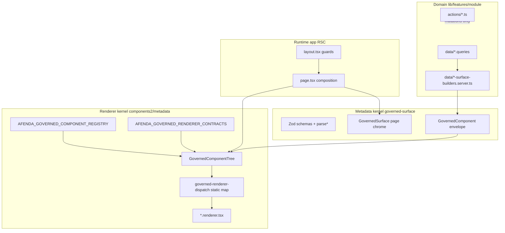
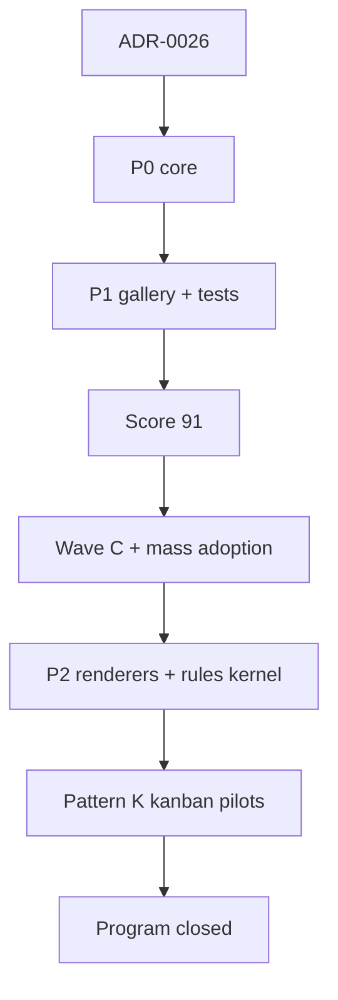

## Status (2026-05-18) — program closed; scores live in docs

| Source | Score / verdict |
| --- | --- |
| [`docs/architecture/metadata-maturity-score.md`](docs/architecture/metadata-maturity-score.md) | **91/100** — mature platform; **mass ERP default: Go** |
| [`docs/architecture/governed-section-composition-score.md`](docs/architecture/governed-section-composition-score.md) | Wave **C1–C6** + Pattern **K** pilots; ≥9.4/10 target per section |

**All plan phases (P0, P1, P2, Wave C, mass adoption, Pattern K) are complete.** Treat this file as the **historical playbook**. For day-to-day work, use ADR-0026, `metadata-eui-polish` skill, and the architecture score docs above.

### Disk truth (quick reference)

| Area | On disk today |
| --- | --- |
| **Renderers** | **13/13** `governed:*` types have `components2/metadata/renderers/*.renderer.tsx` + registry entries |
| **Kanban kernel** | `kanban-board-presentation.tsx` (shared geometry) · `kanban-board-view.tsx` (read-only + footer) · `kanban-board-drag-view.client.tsx` (drag-reorder) |
| **Pattern K shells** | `GovernedKanbanFooterSection` (+ `GovernedKanbanDragSection` alias) · `GovernedKanbanFooterBoard` · `GovernedKanbanDragBoard` |
| **Pattern K production** | `hrm:recruitment:pipeline` · `hrm:claims:kanban` |
| **Gallery** | **16** scenarios incl. four kanban: `kanban-recruitment`, `kanban-recruitment-footer`, `kanban-recruitment-drag`, `kanban-claims-footer` |
| **P2 foundations** | `form-rules.schema.ts` + `form-rules.evaluate.shared.ts` · `schema-version.shared.ts` + `migrateGovernedConfiguration` · `requiresErpPermission` on list/kanban/action-bar |
| **Draft inferencer** | `scripts/gen-surface-draft.mjs` (scaffold only — not wired to `pnpm gen` yet) |

### Maintenance-only (do not reopen as “active program”)

- HRM pages that are **chrome + bespoke forms only** (no list/kanban surface to migrate)
- **Benefit enrollment row workflow** (`benefit-enrollment-table.tsx` client forms — enrollments *list* is already Pattern C)
- **Skill matrix / leave calendar** — specialized layouts, not list-surface candidates
- **Figma Code Connect** per renderer
- **Production low-code** / stored layout JSON
- Second production **drag-reorder** module beyond gallery (claims uses **footer-actions** by design)

---

# Metadata-Driven UI — Architecture, Maturity, and Rollout Plan

## Deliverable: consolidated architecture document

**Action:** Create **[ADR-0026: Metadata-Driven UI Architecture](docs/decisions/0026-metadata-driven-ui-architecture.md)** (or `docs/architecture/metadata-driven-ui.md`) that **merges** the substance of:

- [ADR-0011](docs/decisions/0011-governed-surface-metadata-kernel.md) — schema kernel, layer contract, exclusions
- [ADR-0021](docs/decisions/0021-components2-metadata-renderer-registry.md) — renderer registry, import allowlist, public doors
- [ADR-0025](docs/decisions/0025-governed-renderer-placement-contract.md) — placement, `dataNature`, contracts, primitives

Keep ADR-0011/0021/0025 as **historical pointers** (“see ADR-0026 §N”)—do not delete until agents and `AGENTS.md` reference the consolidated doc.

---

## Part 1 — Unified architecture (merged ADR content)

### Prime directive

```txt
Metadata declares intent. Runtime owns authority. Renderers compose primitives. Domain owns truth.
No runtime JSON-to-JSX. No tenant/session in client metadata. No low-code in production ERP paths.
```

Afenda is **not** a low-code platform. It is a **governed, server-first declarative UI** system: Zod-validated configuration envelopes, static 1:1 renderer dispatch, and pure server builders—closest to **JSON Forms + react-admin** semantics without a client interpreter.

### Four layers (from ADR-0011)

| Layer        | Location                                        | Owns                                                              | Must not own                        |
| ------------ | ----------------------------------------------- | ----------------------------------------------------------------- | ----------------------------------- |
| **Metadata** | `lib/features/governed-surface/schemas/`        | Structure, semantics, `dataNature`, stability, action descriptors | Fetching, permissions, mutations    |
| **Runtime**  | `app/**/layout.tsx`, `page.tsx`, Server Actions | Session, org, locale, ERP RBAC, evidence, `RouteEnvelope`         | Arbitrary layout in leaf components |
| **Renderer** | `components2/metadata/renderers/`               | Presentation from approved `#components2/ui/*`                    | Domain queries, IAM decisions       |
| **Domain**   | `lib/features/<module>/`                        | Queries, mutations, audit, builders                               | React chrome, registry wiring       |



### Schema kernel (ADR-0011)

**Module:** [`lib/features/governed-surface/`](lib/features/governed-surface/)

**Public doors:**

- `#features/governed-surface` — schemas, parsers, `GovernedSurface`, `GovernedPatternCListSection`, `GovernedKanbanFooterSection` / `GovernedKanbanDragSection`, chrome
- `#features/governed-surface/client` — `GovernedTrailingActionSlot`, `GovernedKanbanFooterBoard`, `GovernedKanbanDragBoard`

**Envelope shape** ([`component.schema.ts`](lib/features/governed-surface/schemas/component.schema.ts)):

```ts
{ type: "governed:<variant>", serverType: string, configuration: <variantSchema> }
```

- `type` → `AFENDA_GOVERNED_COMPONENT_REGISTRY` → renderer id
- `serverType` → semantic intent for audit/telemetry (free string)
- `configuration` → per-variant Zod (strict objects, `SchemaStability` per schema)

**Kernel owns:** page headers, sections, empty states, list/audit/action metadata, `ActionResult` / form errors.

**Kernel does not own:** domain fetch, business rules, permissions, workflows, JSON-to-JSX.

**Handcrafted exclusions (permanent):** Nexus, Orbit, Lynx, specialized timelines—no forced migration.

### Renderer kernel (ADR-0021)

**Module:** [`components2/metadata/`](components2/metadata/)

**Public doors:**

- `#components2` — narrow: `GovernedComponentRenderer` + registry exports
- `#components2/metadata` — tree, skeleton, telemetry, detail-section adapter
- `#components2/ui/*` — shadcn shelf (renderers import only here)

**Dispatch pipeline:**

1. `GovernedComponentRenderer` → `GovernedComponentTree`
2. `parseGovernedComponentData` (Zod)
3. Registry lookup `governed:*` → `AfendaGovernedRendererId`
4. Pre-flight: `dataNature` vs `AFENDA_GOVERNED_RENDERER_CONTRACTS` (ADR-0025)
5. `renderGovernedRendererById` → static import map → `*.renderer.tsx`
6. Containers (`section`, `stack`) recurse children via tree

**Import allowlist** (ESLint `afenda/components2-metadata-renderer-imports` on `renderers/**`):

`#components2/ui/*`, `#features/governed-surface`, `#i18n/navigation`, `#lib/utils`, `react`, `lucide-react` — **forbidden:** `#app-shell`, `#components/ui`, `react-jsx-parser`, feature barrels with `server-only`.

**Parity gate:** `pnpm lint:components2-renderers` — registry-mapped ids ↔ `renderers/*.renderer.tsx`.

### Placement contract (ADR-0025)

| Rule                  | Requirement                                                                                          |
| --------------------- | ---------------------------------------------------------------------------------------------------- |
| **Container queries** | `@container` + `@sm:`/`@md:`/`@lg:` in renderers; no viewport `sm:`/`md:` in `renderers/**`          |
| **dataNature**        | Required on non-container configs; enum per schema; mirrored in `AFENDA_GOVERNED_RENDERER_CONTRACTS` |
| **Leaf primitives**   | Tiles/rows/chips use `#components2/ui/*`; no raw `<motion.div>`-style ad-hoc tiles                   |
| **Variant maps**      | `Record<SchemaEnum, string>` for density/tone—no inline ternaries on enums                           |
| **minContainerPx**    | Informational in contract map; operator diagnostics when layout fails                                |

**Shipped renderer ↔ dataNature map** ([`components2/metadata/registry.ts`](components2/metadata/registry.ts)):

| Renderer | dataNatures | minContainerPx | Notes |
| --- | --- | --- | --- |
| stat-card | kpi, snapshot-summary | 280 | Production |
| list-surface | table, document-lines | 480 | Production |
| action-bar | actions | 320 | `requiresErpPermission` optional |
| audit-panel | audit-trail | 360 | Production |
| detail-tabs | tabbed-detail | 480 | Production |
| chart | time-series, categorical | 360 | Shipped; gallery `chart-time-series` |
| approval-timeline | approval-flow | 320 | Shipped |
| kanban-board | kanban | 720 | `maturity: production`; bridges for footer-actions / drag-reorder |
| multi-step-form | wizard | 480 | Shipped; gallery `multi-step-onboarding` |
| scorecard-form | scoring | 360 | Shipped; gallery `scorecard-interview` |
| section / stack / empty | _(container)_ | 0 | Recurse children |

### Authoring conventions

| Artifact         | Location                                                           | Rule                                                                             |
| ---------------- | ------------------------------------------------------------------ | -------------------------------------------------------------------------------- |
| Surface builders | `lib/features/<module>/.../data/*-surface-builders.server.ts`      | Pure mappers; return `*ConfigurationInput`                                       |
| Page composition | `lib/features/<module>/components/*-page.tsx` or `app/**/page.tsx` | Thin; pass envelopes to `GovernedComponentRenderer`                              |
| List config only | `data/*-list-surface.server.ts`                                    | May feed builders; **no** direct `ListSurfaceTable` except approved escape hatch |

### Patterns (rollout)

| Pattern | When | Imports / primitives |
| --- | --- | --- |
| **A — Chrome only** | Forms, bespoke layouts, settings | `GovernedSurface`, `GovernedSection`, `ModulePageHeader` |
| **B — Full metadata tree** | KPI grids, tables without row forms | `GovernedComponentRenderer` + `*-surface-builders.server.ts` |
| **C — List + trailing** | Inbox tables with row actions/forms | `GovernedPatternCListSection` + `GovernedTrailingActionSlot` (`#features/governed-surface/client`) |
| **K — Kanban** | Stage columns + card footers or drag | `GovernedKanbanFooterSection` / `GovernedKanbanDragSection` + `GovernedKanbanFooterBoard` or `GovernedKanbanDragBoard` |

**Hybrid rule:** `ListSurfaceTable` is **only** imported from `lib/features/governed-surface/` (Pattern C kernel). Feature modules must not deep-import it.

---

## Part 2 — Low-code: deferred, playground-ready

### Production ERP (now)

- **No** stored app JSON, visual canvas, or runtime layout editor in `/o`, `/p`, `/admin`, `/operator`.
- **No** `dataProvider`, tester-priority renderers, or `className` in metadata records.
- Mutations **only** via Server Actions; authority **only** from layouts/guards.

### Deferred capability: **Governed Playground** (future additive feature)

Reuse the **same kernels** (Zod + registry + renderers)—do not fork a second UI stack.

| Playground feature          | Reuses                                        | Purpose                                             |
| --------------------------- | --------------------------------------------- | --------------------------------------------------- |
| Live fixture editor         | `gallery-scenarios.ts`, `gallery-fixtures.ts` | Edit JSON envelope → preview (dev only)             |
| Operator diagnostics        | `diagnostics: "operator"` on tree             | Show rendererId, dataNature, validation errors      |
| Width presets               | 280 / 480 / 720 / 960 px containers           | ADR-0025 placement QA                               |
| Scenario export             | Copy-paste builder output                     | Accelerate `*-surface-builders.server.ts` authoring |
| Optional JSON Schema export | Zod → JSON Schema (see tooling §5)            | External doc tools, not runtime dispatch            |

**Routes (existing foundation):**

- [`/dev/metadata-renderer-gallery`](<app/(main)/[locale]/dev/metadata-renderer-gallery/page.tsx>)
- [`/dev/hrm-metadata-preview`](<app/(main)/[locale]/dev/hrm-metadata-preview/page.tsx>)
- [`/dev/shell-preview`](<app/(main)/[locale]/dev/shell-preview/page.tsx>)

**Playground is not:**

- A Retool/Plasmic competitor for business users
- A persistence layer for production layouts
- A replacement for module-owned builders in `lib/features/`

**When to build playground (P2):** After P0 generator wiring and ≥72 maturity score—extends gallery with editable fixtures behind `NODE_ENV === "development"` gate only.

---

## Part 3 — ERP capability matrix (need vs status)

What a compliance-heavy ERP actually needs from metadata UI, and what we **enhance now** vs **defer**.

| ERP capability           | User need                         | Core (enhance now)                     | Shipped             | Deferred                            |
| ------------------------ | --------------------------------- | -------------------------------------- | ------------------- | ----------------------------------- |
| **Page chrome**          | Consistent headers, back, actions | `GovernedSurface` + `pageHeaderSchema` | Yes (broad)         | —                                   |
| **KPI / stat grids**     | Operational metrics in columns    | `governed:stat-card` + `dataNature`    | Yes                 | Runtime width enforcement           |
| **Data tables**          | Sortable directories, row links   | `governed:list-surface`                | Yes                 | Column resize, inline edit          |
| **Empty / error states** | Honest recovery                   | `governed:empty`, tree validation      | Yes                 | —                                   |
| **Audit trail panels**   | IAM/compliance history            | `governed:audit-panel`                 | Yes                 | —                                   |
| **Detail tabs**          | Record drill-down sections        | `governed:detail-tabs`                 | Yes                 | —                                   |
| **Action bars**          | Primary/secondary CTAs            | `governed:action-bar`                  | Yes                 | —                                   |
| **Layout composition**   | Section/stack nesting             | `governed:section`, `governed:stack`   | Yes                 | —                                   |
| **Charts / trends**      | Payroll, attendance analytics     | `governed:chart`                       | **Shipped**         | Production module adoption optional |
| **Multi-step forms**     | Wizards, onboarding               | `governed:multi-step-form`             | **Shipped**         | Wire rules layer on forms when needed |
| **Approval timelines**   | HRM claims, workflows             | `governed:approval-timeline`           | **Shipped**         | Gallery + module builders           |
| **Kanban**               | Pipeline / claims lifecycle       | `governed:kanban-board` + Pattern K    | **Shipped**         | Pilots: recruitment + claims        |
| **Conditional fields**   | SHOW/HIDE on form state           | `form-rules.schema.ts` + evaluate      | **Kernel shipped**  | Wire on multi-step/scorecard configs |
| **Permission-aware UI**  | Hide actions by ERP RBAC          | `requiresErpPermission` on list/kanban | **Partial**         | Layout/guards + builder fields      |
| **Schema versioning**    | Cached/stored metadata            | `migrateGovernedConfiguration`         | **Kernel shipped**  | Not persisted in prod               |
| **CRUD inferencer**      | Fast scaffold from Drizzle        | `scripts/gen-surface-draft.mjs`        | **Draft script**    | Not in `pnpm gen` yet               |
| **Low-code editor**      | Non-dev authoring                 | —                                      | **Refused in prod** | Playground only (Part 2)            |

**Enhance core (P0–P1):** stat-card, list-surface, tree dispatch integrity, generator, display strings, tests, gallery/playground foundation.

**Defer (P2+):** rules engine, versioning, component-level permissions, inferencer, chart/kanban unless a module blocks on them.

---

## Part 4 — Maturity scoring and per-dimension Definition of Done

### Scoring model (weights unchanged — scores synced to docs)

**Authoritative score: 91/100** — see [`metadata-maturity-score.md`](docs/architecture/metadata-maturity-score.md). Original gate was **≥72** (passed at P1 re-score); score-90 gate passed with chart + approval-timeline + gallery.

| Dimension                 | Weight | Score (2026-05-18) | Notes |
| ------------------------- | ------ | ------------------ | ----- |
| Architecture & boundaries | 15%    | 10                 | ADR-0026; Pattern C allowlist; four-layer ESLint |
| Schema kernel             | 12%    | 9                  | 13-type union; kanban interaction modes; form-rules kernel |
| Renderer coverage         | 10%    | 9                  | **13/13** renderer files on disk; mass default uses 10 most often |
| Automation & CI           | 12%    | 10                 | Full `lint:renderer-*` + `lint:list-surface-table-imports` |
| Generator & DX            | 10%    | 9                  | `pnpm gen governed-renderer` + gallery fixture editor |
| Testing                   | 12%    | 9                  | Renderer/kanban unit tests; gallery E2E smoke (280/480/720) |
| Documentation             | 8%     | 10                 | ADR-0026 + AGENTS + composition score doc |
| Production adoption       | 10%    | 8                  | Contacts B; HRM C waves; org/platform-admin C; Pattern K pilots |
| Feature completeness      | 6%     | 8                  | `requiresErpPermission`; OTEL dispatch; rules/version helpers |
| Design enforcement        | 5%     | 9                  | Container-query lint; `@container` in presentation layer |

### Maturity bands

| Score  | Label                      | Mass ERP default?                   |
| ------ | -------------------------- | ----------------------------------- |
| 0–40   | Experimental               | No                                  |
| 41–55  | Early beta                 | Pilot modules only                  |
| 56–70  | Controlled beta            | Module-by-module                    |
| 71–85  | Production-ready (bounded) | Yes for list/KPI/audit/detail       |
| 86–100 | Mature platform            | **Current (91)** — default for repeatable surfaces |

### Go / no-go checklist (mass rollout — **all passed**)

| Gate | Status |
| --- | --- |
| Weighted score ≥ **90** (plan originally ≥72) | **Pass (91)** |
| **0** unapproved `ListSurfaceTable` bypasses in features | **Pass** |
| Reserve renderers shipped or blocked from emit | **Pass (13/13 shipped)** |
| `pnpm gen governed-renderer` → green `lint:renderer-*` | **Pass** |
| Renderer unit tests + gallery visual smoke | **Pass** |
| ≥3 modules on Pattern B/C | **Pass** (contacts, HRM, org-admin, platform-admin) |

---

## Part 5 — Adopt competitor strengths (without breaking boundaries)

Map **what to steal** from OSS, **how**, and **what stays forbidden**.

| Competitor strength                  | Source                                                                                                                     | Afenda adoption                                                                                                                                        | Boundary preserved                                |
| ------------------------------------ | -------------------------------------------------------------------------------------------------------------------------- | ------------------------------------------------------------------------------------------------------------------------------------------------------ | ------------------------------------------------- |
| **UI schema / data schema split**    | JSON Forms                                                                                                                 | Already have Zod config + envelope                                                                                                                     | No JSON Schema runtime interpreter in prod        |
| **Declarative field lists**          | react-admin                                                                                                                | Extend `list-surface` column schema; builder helpers                                                                                                   | No `<Resource>` client graph                      |
| **Rules (SHOW/HIDE/ENABLE/DISABLE)** | JSON Forms `rule.effect` + `LeafCondition` / `SchemaBasedCondition` / composite AND/OR on **control elements**             | P2: `governedRuleSchema` on **form renderer configs** (e.g. `multi-step-form`), mirroring uischema `rule` — not on KPI/list envelopes                  | No client `useEffect`; no global Redux form store |
| **accessControl hooks**              | react-admin `authProvider.canAccess({ resource, action })` + field keys like `products.thumbnail` (`@react-admin/ra-rbac`) | P2: `requiresErpPermission` on envelope **or** column-level keys in `list-surface` schema; evaluated in **RSC builders/layouts**, never `localStorage` | `#features/erp-rbac/server` is source of truth    |
| **Inferencer velocity**              | Refine `@refinedev/inferencer` (client CRUD via `dataProvider`)                                                            | P2: `pnpm gen surface-draft --module` → draft **server** `*-surface-builders.server.ts`, human PR — not `HeadlessInferencer` routes                    | No `dataProvider`; no auto-merge                  |
| **DevTools / preview**               | JSON Forms Editor, Storybook                                                                                               | **P1:** extend metadata-renderer-gallery (Part 2)                                                                                                      | Dev routes only, no persistence                   |
| **Tester → renderer**                | JSON Forms                                                                                                                 | **Reject** — keep static 1:1 registry                                                                                                                  | Analyzability > flexibility                       |
| **dataProvider**                     | Refine                                                                                                                     | **Reject** — module `data/` + RSC                                                                                                                      | Server truth                                      |
| **Visual canvas + stored JSON**      | Retool, Plasmic                                                                                                            | **Reject prod**; playground fixtures only                                                                                                              | Server Actions only                               |
| **Design tokens in components**      | Plasmic                                                                                                                    | Already: `#components2/ui` + `pnpm lint:design-contract`                                                                                               | No token authoring in metadata                    |
| **Schema documentation**             | JSON Schema ecosystem                                                                                                      | P1: Zod 4 `z.toJSONSchema()` export for ask-docs / playground (dev only)                                                                               | Not used for dispatch                             |
| **E2E stability**                    | Mature OSS libs                                                                                                            | P1: Playwright visual matrix                                                                                                                           | —                                                 |

**Expected maturity lift from adoption row:**

| Adoption item            | Dimension boost                   | Effort |
| ------------------------ | --------------------------------- | ------ |
| Full generator wiring    | Generator + Automation (+3–4 pts) | M      |
| Rules layer (forms only) | Feature completeness (+2 pts)     | L      |
| Playground gallery       | Generator + Testing (+2 pts)      | M      |
| `requiresErpPermission`  | Feature + Architecture (+1–2 pts) | M      |
| Visual regression        | Testing (+3–4 pts)                | M      |
| Draft inferencer         | Generator (+1 pt, P2)             | L      |

---

## Part 6 — Reusable in-repo materials and tools

### Metadata-ui toolchain (first-class)

| Tool                        | Command / path                         | Role                                        |
| --------------------------- | -------------------------------------- | ------------------------------------------- |
| Governed renderer generator | `pnpm gen governed-renderer`           | Schema + renderer + unit test scaffold      |
| Renderer file parity        | `pnpm lint:components2-renderers`      | Registry ↔ `*.renderer.tsx`                 |
| Contract parity             | `pnpm lint:renderer-contracts`         | Zod dataNature ↔ registry ↔ cursor rule     |
| Container query lint        | `pnpm lint:renderer-container-queries` | No viewport breakpoints in renderers        |
| Skeleton parity             | `pnpm lint:renderer-skeleton-parity`   | All `AfendaGovernedRendererId` cases        |
| Fixture parity              | `pnpm lint:renderer-fixtures`          | Gallery fixture coverage                    |
| Capability generator        | `pnpm gen capability`                  | Full ERP module slice (includes components) |
| Agent contract              | `pnpm lint:agent-contract`             | Module shape, import boundaries             |

### Types and schemas to reuse (do not duplicate)

| Symbol / module                                   | Import                                        | Use in                                       |
| ------------------------------------------------- | --------------------------------------------- | -------------------------------------------- |
| `GovernedComponent`, `parseGovernedComponentData` | `#features/governed-surface`                  | Pages, builders, tests                       |
| `*ConfigurationInput` / `*Configuration`          | Per-schema in `governed-surface/schemas/`     | Builders return Input; tree parses           |
| `SchemaStability`                                 | `_stability.shared.ts`                        | Every new schema                             |
| `ActionResult`, `ActionDescriptor`                | `action-result.shared.ts`, `action.schema.ts` | Server Actions                               |
| `PageHeader`                                      | `page-header.schema.ts`                       | `GovernedSurface`, `build*PageHeader`        |
| `ListSurfaceRendererConfiguration`                | `list-surface-renderer.schema.ts`             | All table builders                           |
| `StatCardConfigurationInput`                      | `stat-card.schema.ts`                         | KPI builders                                 |
| `AfendaGovernedRendererId`                        | `#components2/metadata` registry              | Skeleton, dispatch, tests                    |
| `assertGovernedSurfaceInput`                      | `dev-assert.shared.ts`                        | Builder unit tests, dev fixtures             |
| `mergeGovernedRegistries`                         | `governed-registry.shared.ts`                 | Module-specific registry extensions (future) |

### UI and shell reuse

| Asset                                     | Import                                           | Metadata UI use                |
| ----------------------------------------- | ------------------------------------------------ | ------------------------------ |
| shadcn shelf                              | `#components2/ui/*`                              | All renderer leaves            |
| `GovernedListSurface`, `GovernedEmpty`, … | `#features/governed-surface`                     | Renderer composers             |
| `cn`                                      | `#lib/utils`                                     | Renderer class merging         |
| Locale links                              | `#i18n/navigation`                               | List row hrefs                 |
| Design tokens                             | `app/globals.css` + `pnpm lint:design-contract`  | No hardcoded hex in renderers  |
| ERP display formatting                    | `#lib/erp/format-display.shared.ts` (if present) | Display-string validation (P0) |

### Dev / preview reuse (playground foundation)

| Asset                | Path                                                                                                                               |
| -------------------- | ---------------------------------------------------------------------------------------------------------------------------------- |
| Gallery scenarios    | [`components2/dev/metadata-renderer-gallery/gallery-scenarios.ts`](components2/dev/metadata-renderer-gallery/gallery-scenarios.ts) |
| Gallery fixtures     | [`components2/dev/metadata-renderer-gallery/gallery-fixtures.ts`](components2/dev/metadata-renderer-gallery/gallery-fixtures.ts)   |
| HRM payslip preview  | [`components2/dev/hrm-metadata-preview/`](components2/dev/hrm-metadata-preview/)                                                   |
| Shell + KPI preview  | [`components2/dev/app-shell-preview/`](components2/dev/app-shell-preview/)                                                         |
| List surface fixture | [`components2/dev/fixtures/list-surface.fixture.ts`](components2/dev/fixtures/list-surface.fixture.ts)                             |

### Cross-system reuse (adjacent, not metadata core)

| System                                              | Reuse for metadata UI                                             | Notes                                                                            |
| --------------------------------------------------- | ----------------------------------------------------------------- | -------------------------------------------------------------------------------- |
| **Fumadocs** (`content/ask-docs/`, `lib/ask-docs/`) | Document renderer contracts, `dataNature` tables, builder how-tos | Same “schema + static render” philosophy; `pnpm gen ask-doc` for docs            |
| **Zod 4** (`zod@^4.4.3`)                            | Playground / ask-docs export via `z.toJSONSchema()` (dev only)    | `source.config.ts` fumadocs `jsonSchema` plugin is adjacent pattern—not dispatch |
| **Turbo generators**                                | Extend `turbo/generators/config.ts` GENERATOR 7                   | Wire full registry patches                                                       |
| **Vitest**                                          | `tests/unit/components2/metadata/`                                | Template from `governed-renderer` gen                                            |
| **Playwright**                                      | Port 3001 E2E                                                     | Visual matrix for renderers                                                      |
| **Figma Code Connect**                              | Deferred per-renderer `.figma.ts`                                  | Post program closure                                                             |
| **shadcn MCP / registry**                           | `components2/registry.json`, `pnpm gen:registry`                  | New primitives into `#components2/ui` before renderer uses them                  |
| **OpenTelemetry**                                   | `lib/otel-span.server.ts`                                         | Dispatch spans in tree (P1)                                                      |

### External libraries (evaluate, do not adopt blindly)

| Library                  | Use case                       | Verdict                                        |
| ------------------------ | ------------------------------ | ---------------------------------------------- |
| `@jsonforms/core`        | Rules/runtime dispatch         | **No** — conflicts with static registry        |
| Zod 4 `z.toJSONSchema()` | Playground + docs export       | **Yes** (dev/docs only; repo already on Zod 4) |
| `@tanstack/react-table`  | Already in list-surface cells? | Reuse via existing `list-surface-table` path   |
| `react-hook-form` + Zod  | `multi-step-form` / `scorecard-form` renderers | **Shipped** — wire rules when product needs SHOW/HIDE |

---

## Part 7 — Execution phases (historical — **complete**)



| Phase | Status | Delivered (disk) |
| --- | --- | --- |
| **P0** | Done | ADR-0026; hybrid ESLint; generator; display strings |
| **P1** | Done | Gallery playground; Playwright smoke; OTEL dispatch |
| **Wave C** | Done | HRM/org-admin/platform-admin Pattern C sections |
| **Score 90** | Done | chart + approval-timeline renderers |
| **P2 renderers** | Done | kanban-board, multi-step-form, scorecard-form |
| **P2 kernel** | Done | form-rules; schema version migrate; `requiresErpPermission` |
| **Mass adoption** | Done | Workforce, recruitment lists, benefits, compliance, etc. |
| **Pattern K** | Done | Kanban kernel + recruitment pipeline + claims kanban |

### Post-closure maintenance (optional, low priority)

- Wire `pnpm gen surface-draft` from `scripts/gen-surface-draft.mjs`
- Figma Code Connect per stable renderer
- Additional **drag-reorder** production module (only gallery + kernel today)
- Form **rules** wired into first production multi-step/scorecard route
- HRM chrome-only pages and bespoke enrollment workflow UIs

---

## Part 8 — Context7 validation (2026-05-17)

**Sources queried:** Context7 `/eclipsesource/jsonforms`, `/refinedev/refine`, `/marmelab/react-admin` (library IDs resolved 2026-05-17). Tailwind/Zod resolves performed; Zod/Tailwind query slots deferred (3-query limit)—Zod 4 path inferred from repo `zod@^4.4.3`.

### Validation matrix

| Plan claim                                                      | Context7 result                                                                                                            | Verdict                                                                                                                               |
| --------------------------------------------------------------- | -------------------------------------------------------------------------------------------------------------------------- | ------------------------------------------------------------------------------------------------------------------------------------- |
| Afenda ≈ JSON Forms + react-admin, server-first                 | JSON Forms splits JSON Schema + UI schema; react-admin uses declarative `<Resource>` / `<Datagrid>` fields                 | **Confirmed** — Afenda merges into single Zod envelope (valid simplification)                                                         |
| Reject tester-priority dispatch (`rankWith`, highest rank wins) | JSON Forms: `rankWith(3, and(uiTypeIs, schemaTypeIs))`; “renderer with highest rank takes precedence”                      | **Confirmed correct refusal** — static `AFENDA_GOVERNED_COMPONENT_REGISTRY` is the right tradeoff for lint/CI                         |
| P2 rules layer (SHOW/HIDE/ENABLE)                               | JSON Forms: `rule.effect` = `SHOW` \| `DISABLE`; `LeafCondition`, `SchemaBasedCondition`, composite `OR`/`AND` on controls | **Confirmed** — attach rules to **form control configs**, not list/stat envelopes                                                     |
| Reject `dataProvider`                                           | Refine core: `dataProvider={dataProvider(API_URL)}` required for Inferencer; generates client list/create/show/edit        | **Confirmed** — Afenda `lib/features/<module>/data/` + RSC builders is the intentional alternative                                    |
| P2 draft inferencer                                             | Refine `HeadlessInferencer` / `MuiInferencer` scaffolds **client** views from API shape                                    | **Refine plan** — generate `*-surface-builders.server.ts` drafts from Drizzle/types, not client inferencer components                 |
| P2 `requiresErpPermission`                                      | react-admin: `canAccess({ action, resource, record })` with granular `resource.field` keys; `ra-rbac` hides columns        | **Confirmed pattern** — map to ERP RBAC keys; enforce server-side in builders (do **not** copy docs’ `localStorage` permission cache) |
| Reject runtime JSON-to-JSX                                      | JSON Forms dispatches to registered React renderers (typed), not string JSX                                                | **Aligned** — same renderer registry idea, different dispatch mechanism                                                               |
| ADR-0025 container queries                                      | Tailwind v4 documents `@container` + `@sm:` (repo rule cites v4 core); v3 plugin was separate package                      | **Confirmed in principle** — keep `lint:renderer-container-queries` as enforcement                                                    |
| Playground JSON export                                          | Zod 4 project; prefer native `z.toJSONSchema()` over extra package                                                         | **Refined** — update P1 tooling (see Part 6)                                                                                          |
| Low-code deferred; playground only                              | Neither JSON Forms, react-admin, nor Refine ship production visual layout persistence in core OSS docs queried             | **Confirmed** — Retool/Plasmic are the right “refused” comparators (not in this query batch)                                          |
| Mass rollout ≥72, P0 hybrid/generator                           | Not OSS-validated (internal gates)                                                                                         | **N/A** — remains engineering judgment                                                                                                |

### Plan corrections applied from Context7

1. **Inferencer (P2):** Must target **server builders**, not Refine-style client `HeadlessInferencer` + `dataProvider`.
2. **RBAC (P2):** Model after react-admin `canAccess` **granularity** (`resource.action`, field-level keys), but authority stays in **RSC** + `#features/erp-rbac/server` — never client permission storage.
3. **Rules (P2):** Scope to **form renderer** configuration (JSON Forms uischema `rule` on controls), not the generic `GovernedComponent` envelope.
4. **Playground export (P1):** Use **Zod 4** `z.toJSONSchema()` (verify API in Zod 4 docs during implementation) instead of assuming `zod-to-json-schema` package.
5. **Comparison table:** JSON Forms effects include **DISABLE** explicitly; plan wording updated to SHOW/HIDE/ENABLE/DISABLE.

### Overall Context7 verdict on the plan

| Aspect                                                    | Assessment                                                           |
| --------------------------------------------------------- | -------------------------------------------------------------------- |
| Architectural positioning                                 | **Sound** — validated against JSON Forms + react-admin + Refine docs |
| Competitor adoption map (Part 5)                          | **Sound** with refinements above                                     |
| Deliberate refusals (tester, dataProvider, prod low-code) | **Well justified** by upstream docs                                  |
| Maturity score / go-no-go thresholds                      | **Not falsifiable via OSS docs** — internal; keep as-is              |
| Execution order (ADR-0026 → P0 → P1 → mass)               | **Unchanged**                                                        |

**Recommendation:** Proceed with plan execution after ADR-0026; no structural rewrite required. During P2 ADRs, cite JSON Forms `rule` types and react-admin `canAccess` field keys as **reference shapes**, not dependencies.

---

## Part 9 — Pattern K production pilots (codebase inventory)

| `surfaceKey` | Route / module | Interaction | Key files |
| --- | --- | --- | --- |
| `hrm:recruitment:pipeline` | HRM recruitment page | `footer-actions` | `recruitment-pipeline-kanban-section.tsx`, `recruitment-pipeline-kanban.client.tsx`, `recruitment-pipeline-card-actions.client.tsx`, `recruitment-surface-builders.server.ts` |
| `hrm:claims:kanban` | `/dashboard/hrm/claims` | `footer-actions` | `claim-kanban-section.tsx`, `claim-kanban-board.client.tsx`, `claim-kanban-card-footer.client.tsx`, `claim-kanban-surface.server.ts`, `moveClaimKanbanAction` |

**Gallery validation:** `/{locale}/dev/metadata-renderer-gallery` — kanban scenarios above plus `kanban-claims-footer` (preview modes `kanban-footer-actions`, `kanban-drag-reorder`).

**Renderer entry points:** `KanbanBoardRenderer` serves **read-only** only; `footer-actions` and `drag-reorder` must use domain bridges (`GovernedKanbanFooterBoard` / `GovernedKanbanDragBoard`) — enforced with muted `GovernedEmpty` on the static renderer path.

---

## Summary

| Topic | Decision |
| --- | --- |
| **Architecture** | **ADR-0026**; metadata + renderer kernels; Patterns A/B/C/K |
| **Low-code** | **Refused in prod**; dev gallery + fixture editor only |
| **Score** | **91/100 — Go** ([`metadata-maturity-score.md`](docs/architecture/metadata-maturity-score.md)) |
| **Renderers** | **13/13 shipped** on disk; all in gallery or production pilots |
| **Pattern C** | Wave C1–C6 + org/platform-admin; see composition score doc |
| **Pattern K** | Recruitment + claims kanban in production |
| **Maintenance** | Bespoke forms, Figma, surface-draft CLI wiring, optional drag adopters |

**Verdict:** Program **closed**. New ERP lists → use Pattern C recipe; new stage boards → Pattern K recipe + `metadata-eui-polish` skill. Do not re-open P0/P1 unless a lint gate or ADR change requires kernel work.
