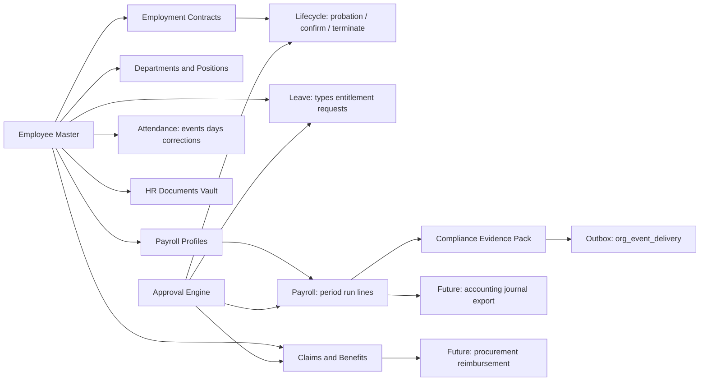
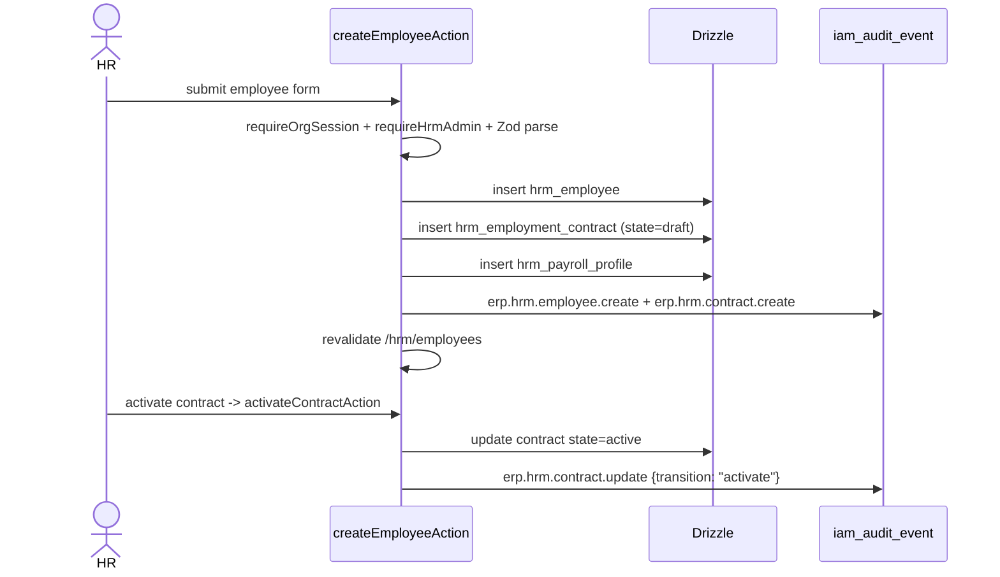
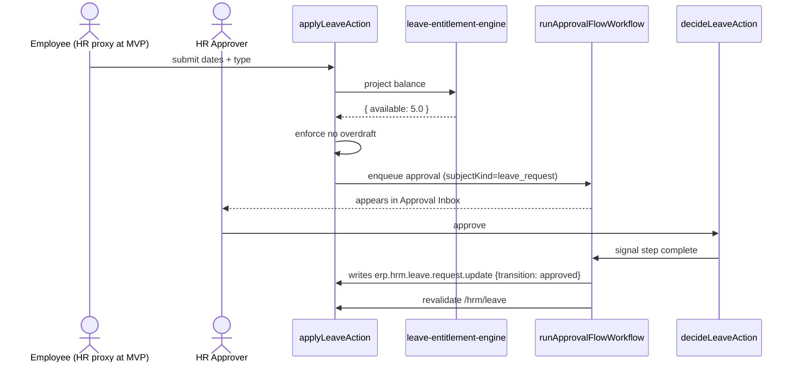

# Afenda HRM — Senior Engineering Architecture Proposal (v2)

> **v2 reconciles `hrm-draft-v1.md` (truth-engine framing, domain ontology, statutory citations, dense ERP UX, end-to-end workflow tables) with the architecture plan grounded in Afenda's actual codebase (single `lib/features/hrm/` module, capability registry, `iam_audit_event`, Workflow DevKit, `org_event_delivery`, Orbit / Nexus operational pressure, locale-first routing). v1's tRPC/`services`/`pgEnum`/`tenant_id`/RLS-by-default patterns are replaced with Afenda's Server Actions, `data/*.server.ts` files, `text` columns + Zod, `organizationId`, and app-level guards — but every conceptual asset is preserved.**

### v2.2 Codebase + doc alignment (2026-05-13)

- Status ledger §8 refreshed against `lib/db/schema.ts`, `lib/features/hrm/**`, and `package.json` (Next 16.2.x).
- Removed implied **`hrm_holiday`** deployment: holidays remain in rule-pack modules until an org-calendar table ships.
- Added **Next.js DevTools MCP** doc path map for enterprise-quality HRM follow-ups (`nextjs_docs` + `nextjs-docs://llms-index`).

### v2.1 Reviewer revisions absorbed (2026-05-11)

This document was tightened after expert review before any code lands. **Six concrete revisions** apply throughout:

1. **Malaysia rule-pack versioning is dated, not generic** — split into per-statutory effective periods (SOCSO `2024-10` RM6,000 ceiling, EPF `2025-10` per KWSP Third Schedule, PCB/MTD `2026-01` per LHDN spec, holidays `2026`) composed under a single `MY-2026-01` payroll rule-pack manifest. See §4.2–§4.3.
2. **Two vertical slices ship before anything else** — *Employee truth* and *Leave truth*. The phased delivery in §8 now expands Phases 1–3 into sub-phases (1A/1B/1C, 2A/2B/2C, 3A/3B/3C) so each PR is end-to-end and reviewable. See §8.
3. **Payroll = evidence first, payment second** — the payroll console answers seven traceability questions before any disbursement / journal / bank-file capability is even considered. Bank files / GL posting / payslip PDFs are out of MVP. See §5.3.
4. **Approval state stays minimal at MVP** — single `hrm_approval` table only; `hrm_approval_step` / `hrm_approval_action` are deferred until the first real multi-step route. See §3.2 Q.
5. **Golden statutory tests are mandatory before Phase 3 ships** — explicit test list in §5.11; `pnpm test:ci` must include EPF / SOCSO / EIS / PCB-2026 snapshots vs IRBM/KWSP examples.
6. **Frontend order: NOT dashboard first** — Employees → Detail → Leave → Attendance → Payroll → Compliance → Dashboard. The dashboard is a projection of real workflows, not a place to invent metrics. See §6.0.

Plus targeted schema simplifications (actor columns standardised; `currentApprovalRunId` only where Workflow DevKit is actually wired in that phase; `currentEmploymentContractId` is a cached pointer, not source of truth). See §3.1 and §3.2 A / Q.

---

## Operating frame

### North star

Afenda HRM is **not** a lightweight HR SaaS bolted on. It is a **workforce truth sub-ledger** inside Afenda's ERP truth engine. Every HRM decision follows this chain:

```txt
Proposed workforce fact
→ validation
→ policy evaluation (rule pack + permissions)
→ approval route
→ evidence capture
→ immutable audit event
→ canonical record update
→ downstream ERP event (statutory delivery / accounting handoff)
```

HRM owns **workforce truth**: who works for the organisation, under what terms, from which effective date, governed by which rule-pack version, approved by whom, supported by which evidence, and reflected in which payroll, compliance, and document records.

The benchmark: a tired HR controller can finalise the monthly payroll, generate statutory packs, and route the LHDN PCB submission in under 30 minutes — with every figure traceable to a rule-pack version and every state change auditable.

### Decision recap (confirmed)

| Decision | Choice | Implication |
|---|---|---|
| **Self-service scope** | HR-team-only at MVP. Employee/supplier/customer/investor self-service ships later as a single cross-cutting **Portals** surface, not as HRM-internal. | `hrm_employee.linkedUserId text` (nullable, no FK) is the future Portals link; no employee login UI in HRM at MVP. |
| **Payroll boundary** | Hybrid in-app gross-to-net behind a versioned `PayrollRulePack` interface; per-org override to import external bureau figures, fully audited. | One pure engine + immutable rule-pack files per country/version + bureau-import path. |
| **Tenancy model** | Single `organizationId` per row (matches existing schema). Defer multi-`legalEntityId` until a real customer needs it; add as nullable column without migration when needed. | KISS at MVP. Rule packs already accept `countryCode` per profile, so per-employee jurisdiction works without `legal_entity_id`. |

### Non-goals (out of scope until Phases 5+)

Employee self-service UI · payslip self-download · chat/messaging · recruitment/ATS · learning management · biometric device integrations · accounting journal posting · bank file generation.

---

## 0. How HRM fits Afenda's existing primitives

Treat HRM as a **standard ERP feature module** under [`lib/features/hrm/`](lib/features/hrm/), governed by the same contracts as [`lib/features/contacts/`](lib/features/contacts/) and [`lib/features/org-admin/`](lib/features/org-admin/). **No new architectural categories.**

| Afenda primitive | HRM use |
|---|---|
| **Module shape** ([AGENTS.md §6](AGENTS.md)) | Single `lib/features/hrm/` with `actions/ data/ components/ schemas/ constants.ts types.ts index.ts server.ts client.ts` only |
| **Capability registry** (mirrors [`ORG_ADMIN_CAPABILITIES`](lib/features/org-admin/constants.ts)) | `HRM_CAPABILITIES` drives nav, allowed segments, audit prefix, contract test |
| **Tenant guard** ([`lib/tenant.ts`](lib/tenant.ts)) | Every action calls `requireOrgSession()`; admin-tier mutations add `canActInOrganization(..., "admin")`; Tier S adds `requireRecentAuthStepUp` |
| **CRUD-SAP audit grammar** ([`lib/erp/crud-sap.shared.ts`](lib/erp/crud-sap.shared.ts)) | All audit strings via `buildCrudSapAuditAction({ area: "erp", module: "hrm", object, verb })` |
| **7W1H + row cache** ([`lib/erp/audit-7w1h.server.ts`](lib/erp/audit-7w1h.server.ts)) | Used on heavy resolutions: probation outcome, payroll finalize, termination, salary change |
| **Temporal spine** ([`lib/erp/temporal-spine.shared.ts`](lib/erp/temporal-spine.shared.ts)) | Persisted JSONB on long-lived entities: `hrm_employment_contract`, `hrm_payroll_run`, `hrm_termination` |
| **IAM audit ledger** ([`lib/auth/audit.server.ts`](lib/auth/audit.server.ts)) | All HR mutations write `iam_audit_event` rows after successful commit (single source of truth — no parallel `hr_audit_events` table) |
| **Workflow DevKit** (existing pattern in [`import-job-run.workflow.ts`](lib/features/org-admin/data/import-job-run.workflow.ts)) | Durable runs for payroll finalization, leave accrual, approval flows; entries re-exported via `lib/features/execution/data/<run>-entry.ts` |
| **Outbound delivery** ([`integrations-delivery.server.ts`](lib/features/org-admin/data/integrations-delivery.server.ts)) | **The ERP outbox pattern.** Reused for signed statutory submissions (LHDN PCB, KWSP EPF, PERKESO SOCSO/EIS) — no parallel delivery layer |
| **CSV ingestion** ([`OrgImportAdapter`](lib/features/org-admin/data/import-adapter.server.ts)) | Shipped adapters: `hrm_employee_hire`, `hrm_payroll_profile_import`, `hrm_attendance_import`. Deferred: `hrm_opening_balance_import` when manual balance migration needs a CSV path. |
| **Locale-first routing** ([`.cursor/rules/i18n-directory.mdc`](.cursor/rules/i18n-directory.mdc)) | All UI under `/[locale]/o/[orgSlug]/dashboard/hrm/{capability}`; revalidate via `toLocaleOrgDashboardRevalidatePattern("/hrm")` |
| **Nexus snapshot** ([`nexus-snapshot.queries.server.ts`](lib/features/nexus/data/nexus-snapshot.queries.server.ts)) | HRM exports `listHrmHighPressureForNexus(organizationId, limit)`; consumed by the Nexus Field pressure merge alongside other module producers |
| **Orbit / planner pressure** | Critical HR consequences (statutory deadline, contract expiring, leave backlog, probation window) surface as **`planner_signal`** rows with ERP links (`createPlannerSignalFromErpProducer`, `createPlannerSignalLink`) so they ride the governed Orbit queue — not a parallel “HR inbox” product |

---

## 1. Product architecture

### 1.1 Core HRM domains (organised around canonical HR facts, not UI features)

The flagship value is **audit-ready workforce truth**, not "employee profile pages".

| Domain | What it owns | Canonical records |
|---|---|---|
| **Workforce Master** | Employee identity, employee number, status, manager, lifecycle state | `hrm_employee` |
| **Organisation Structure** | Departments, positions, grades, reporting hierarchy | `hrm_department`, `hrm_position`, `hrm_job_grade` |
| **Employment Lifecycle** | Hiring, contracts, probation, confirmation, salary changes, transfers, resignation, termination | `hrm_employment_contract` (versioned) |
| **Leave & Absence** | Entitlement, accrual, requests, approvals, balance evidence | `hrm_leave_type`, `hrm_leave_entitlement`, `hrm_leave_request`, `hrm_leave_balance` (cache). **Public holidays:** versioned data in each `PayrollRulePack` (`publicHolidays` / `data/rule-packs/<cc>/…/holidays/*`) — there is **no** `hrm_holiday` table in schema yet; §3.2 J remains a **future** org-calendar override, not current storage. |
| **Attendance & Time** | Raw clock events, daily summaries, corrections | `hrm_attendance_event` (immutable), `hrm_attendance_day` (computed) |
| **Payroll Preparation** | Statutory profile, pay inputs, gross-to-net runs, statutory evidence | `hrm_payroll_profile`, `hrm_payroll_period`, `hrm_payroll_run`, `hrm_payroll_line` |
| **Claims & Benefits** | Reimbursement evidence, benefits eligibility | `hrm_claim_type`, `hrm_claim` (Phase 4: `hrm_benefit`, `hrm_benefit_enrollment`) |
| **Documents Vault** | Contracts, letters, medical certs, statutory packs | `hrm_document` (links to Vercel Blob with `payloadHash`) |
| **Approvals** | Workflow routing, approval decisions, escalation | `hrm_approval` (single generic table; `subjectKind` discriminates) |
| **Compliance Rules** | Country rules, state holidays, statutory rates, policy versions | `hrm_country_rule_pack` (registry); rule **logic** lives in versioned TS files in `data/rule-packs/<country>/v{YYYY-MM}.rule-pack.ts` |
| **Audit & Evidence** | Immutable HR events, calculation traces | `iam_audit_event` (cross-cutting; HRM uses `erp.hrm.*` namespace), `hrm_compliance_evidence` |

### 1.2 Truth-engine classification (every HRM record falls in one of five buckets)

| Truth type | HRM example | Storage pattern |
|---|---|---|
| **Canonical fact** | Employee hired on 2026-06-01 | Effective-dated row (`hrm_employment_contract`) |
| **Decision** | Leave approved by manager | `hrm_approval` row + `iam_audit_event` |
| **Evidence** | Medical certificate attached | `hrm_document` (Vercel Blob + `payloadHash`) |
| **Derived fact** | Annual leave balance | `hrm_leave_entitlement` snapshot, recomputed from base + accrual + usage |
| **External compliance fact** | EPF contribution evidence for payroll month | `hrm_compliance_evidence` + outbound delivery row |
| **Projection** | HR Nexus pressure list | Computed in [`hrm-nexus-pressure.queries.server.ts`](lib/features/hrm/data/hrm-nexus-pressure.queries.server.ts) (`listHrmHighPressureForNexus`), merged in Nexus snapshot — never persisted as truth |

**Rule:** Only canonical facts, decisions, evidence, and external compliance facts are durable truth. Dashboards are projections — rebuildable from the four truths above.

### 1.3 Module boundaries (HRM owns / does not own)



| Area | Owner | HRM relationship |
|---|---|---|
| Employee master, contracts, leave, attendance, payroll prep, claims-side evidence, HR documents, HR audit timeline | **HRM** | Owned end-to-end |
| **General ledger** | Future `accounting` module | HRM emits `erp.hrm.payroll.run.posted` + `PayrollJournalDraft` DTO when accounting lands |
| **Cash disbursement** | Future `finance` module | HRM produces payable evidence; finance pays |
| **Procurement vendors** (benefits providers) | Future `procurement` module | HRM references vendor IDs only |
| **Document storage primitives** | Existing [Vercel Blob](app/api/upload/blob/route.ts) | HRM stores blob URL + `payloadHash` |
| **Generic approvals** | **Workflow DevKit** (no separate "approval module") | HRM creates `hrm_approval` rows + enqueues `runApprovalFlowWorkflow` |
| **Generic notifications** | Existing [`org_event_delivery`](lib/db/schema.ts) (the outbox) | HRM emits typed events; receivers verify HMAC signature |
| **Global audit ledger** | Existing `iam_audit_event` | HRM writes `erp.hrm.*` rows; **no parallel `hr_audit_events` table** |

### 1.4 ERP outbox pattern

```txt
HRM transaction commits
→ iam_audit_event written (after successful commit, via after())
→ hrm_compliance_evidence written for statutory packs
→ org_event_delivery enqueued for org-subscribed event types
→ background dispatcher (deliverNow + Workflow DevKit) sends signed envelope to LHDN/KWSP/PERKESO/finance/etc.
```

Failures in delivery never corrupt HR truth — `org_event_delivery.state` records the attempt independently, surfaced in the Compliance UI for retry.

### 1.5 MVP vs enterprise scope

#### 1.5.a MVP scope ceiling (the actual cut for v1.0)

**MVP includes** (everything below must ship in Phases 1–3 to call it v1.0):

```txt
Employee master
Employment contract (effective-dated, single active per employee)
Department / position / job grade
Payroll profile (statutory identifiers + bank token)
HR documents (Vercel Blob + payloadHash)
Leave request + manager approval
Leave entitlement (engine-projected)
Attendance manual entry + CSV import + daily aggregate
Payroll preparation preview (MY rule pack v2026-01)
Malaysia statutory evidence preview (EPF / SOCSO / EIS / PCB)
Audit timeline (powered by iam_audit_event)
Orbit HR pressure (probation / leave backlog / payroll cutoff / document expiry)
```

**MVP does NOT include** (explicitly deferred to keep Afenda from drifting into a generic HRMS):

```txt
Full payroll disbursement
Bank file generation
Accounting journal posting
Employee self-service (Portals)
Biometric / device attendance
Full benefits + insurance enrollment
Complex claim reimbursement batching
Multi-legal-entity
Postgres RLS (opt-in defense, not MVP default)
Visual rule editor
Multi-stage approval routes (single-step manager approval at MVP)
Carry-over policy editor / encashment / time-in-lieu
Auditor export tools
```

The line between included and excluded is the difference between **proving Afenda is a truth engine** and **shipping a feature-parity HRMS**. v1.0 is the former.

#### 1.5.b Capability matrix (full MVP-to-enterprise spectrum, per capability)

| Capability | MVP (Phases 1–3) | Enterprise (Phases 4–5+) |
|---|---|---|
| Workforce | Master record CRUD, contract versioning, dept/position catalog | Org chart visualisation, position requisition, headcount budget, multi-legal-entity, secondments, rehire history |
| Leave | Types, entitlement, request + manager approval, MY public holidays | Multi-stage approvals, time-in-lieu, carry-over policy editor, encashment, replacement leave |
| Attendance | Manual + CSV import, daily aggregate, correction with audit | Geofence/biometric ingestion, shift roster, overtime engine, device adapters |
| Payroll | Period prep, gross-to-net via MY rule pack, finalize, statutory pack | External bureau import, multi-country runs, GL journal export, bank file generation, payslip PDFs |
| Claims | Submit, approve, attach evidence | Multi-currency, mileage, per diem, OCR, reimbursement batches, procurement integration |
| Benefits | (Phase 4 stub: `hrm_benefit`, `hrm_benefit_enrollment`) | Insurance, medical, allowance plans, eligibility rules, vendor integration |
| Compliance | EA form, EPF/SOCSO/EIS/PCB monthly evidence pack, statutory pack delivery via outbox | HRDF levy, IRBM e-Filing API, e-PCB submission, retention policies, auditor export |
| Documents | Upload to Vercel Blob, link to employee, expiry tracking | E-signature workflow, retention policy, access redaction, document templates |
| Policies | Per-org leave type config; holiday calendar and statutory-rate inspectors remain reserved panels | Visual rule editor, what-if simulator, custom approval routes |
| Security | App-level `requireOrgSession` + `canActInOrganization` + `requireRecentAuthStepUp` for Tier S | Field-level permissions, salary privacy projections, optional Postgres RLS |

### 1.6 Capability registry (sub-screens, drives sidebar + audit prefixes + contract test)

Mirror the [`ORG_ADMIN_CAPABILITIES`](lib/features/org-admin/constants.ts) pattern. **Authoritative shipped registry:** [`HRM_CAPABILITIES`](lib/features/hrm/constants.ts) — excerpt below (add `minimumOrgRole` in code; keep `#lib/hrm-dashboard.shared` segment allowlist in lockstep):

```ts
export const HRM_CAPABILITIES = [
  { id: "workforce", segments: ["employees"], auditPrefix: "erp.hrm.employee", nav: { navKey: "employees", order: 10, primarySegment: "employees" }, minimumOrgRole: "member" },
  { id: "organization", segments: ["organization"], auditPrefix: "erp.hrm.organization", nav: { navKey: "organization", order: 15, primarySegment: "organization" }, minimumOrgRole: "admin" },
  { id: "leave", segments: ["leave"], auditPrefix: "erp.hrm.leave", nav: { navKey: "leave", order: 20, primarySegment: "leave" }, minimumOrgRole: "member" },
  { id: "attendance", segments: ["attendance"], auditPrefix: "erp.hrm.attendance", nav: { navKey: "attendance", order: 30, primarySegment: "attendance" }, minimumOrgRole: "member" },
  { id: "claims", segments: ["claims"], auditPrefix: "erp.hrm.claim", nav: { navKey: "claims", order: 35, primarySegment: "claims" }, minimumOrgRole: "member" },
  { id: "payroll", segments: ["payroll"], auditPrefix: "erp.hrm.payroll", nav: { navKey: "payroll", order: 40, primarySegment: "payroll" }, minimumOrgRole: "admin" },
  { id: "compliance", segments: ["compliance"], auditPrefix: "erp.hrm.compliance", nav: { navKey: "compliance", order: 50, primarySegment: "compliance" }, minimumOrgRole: "admin" },
  { id: "documents", segments: ["documents"], auditPrefix: "erp.hrm.document", nav: { navKey: "documents", order: 60, primarySegment: "documents" }, minimumOrgRole: "member" },
  { id: "policies", segments: ["policies"], auditPrefix: "erp.hrm.policy", nav: { navKey: "policies", order: 70, primarySegment: "policies" }, minimumOrgRole: "admin" },
  { id: "snapshot", segments: ["snapshot"], auditPrefix: "erp.hrm.snapshot", nav: { navKey: "snapshot", order: 80, primarySegment: "snapshot" }, minimumOrgRole: "member" },
] as const satisfies readonly HrmCapability[]
```

Adding a sub-screen = registering one capability + creating one component file + one test snapshot. `tests/unit/hrm-contract.test.ts` enforces parity for capability ↔ nav i18n key ↔ allowed segments ↔ audit prefix ↔ path-builder, mirroring [`tests/unit/org-admin-contract.test.ts`](tests/unit/org-admin-contract.test.ts).

### 1.7 Truth-engine fit (HRM facts vs Orbit operational consequences)

HRM owns the **fact** tables. **Orbit** (`lib/features/planner/`) owns the **operational consequence** surface (`planner_signal` / `planner_item`) with ERP-grounded links — see [ADR-0006](docs/decisions/0006-orbit-operational-execution-substrate.md).

| HR situation | Stored as | Surfaced via |
|---|---|---|
| Probation ending within 14 days (unconfirmed) | `hrm_employment_contract` + IAM `erp.hrm.contract.probation_review_due` | Orbit signal (`hrm.probation_watch` producer) + Nexus pressure |
| Statutory deadline approaching | compliance evidence + IAM aging audits | Orbit signal on critical tier + Compliance UI |
| Leave overdraft attempt | rejected at action layer (`{ ok: false, code: "overdraft" }`) | Inline form error |
| Payroll cutoff | payroll period state + execution audits | Nexus HR pressure + Payroll console |

---

## 2. Technical architecture

### 2.1 Folder structure (mirrors contacts ceiling and org-admin filename-prefix discipline)

```text
lib/features/hrm/
  index.ts                              -- public door (server-component-safe; full barrel)
  server.ts                             -- "server-only" queries + finalize helpers
  client.ts                             -- minimal client-safe (Server Actions + DTO types only)
  constants.ts                          -- HRM_CAPABILITIES, hrmDashboardPath helpers, audit prefix lookups
  types.ts                              -- module DTOs (EmployeeRow, LeaveRequestRow, PayrollRunRow ...)

  actions/
    employee-master.actions.ts          -- create/update/archive employee
    employment-contract.actions.ts      -- new contract version, confirm, terminate
    leave-type.actions.ts               -- per-org leave type config (admin)
    leave-request.actions.ts            -- apply/cancel/approve/reject
    leave-entitlement.actions.ts        -- adjust opening balance, manual accrual
    attendance-correction.actions.ts    -- correct event, regenerate day
    payroll-period.actions.ts           -- open/close/lock period
    payroll-prepare.actions.ts          -- compute draft (idempotent via inputDigest)
    payroll-finalize.actions.ts         -- enqueue PayrollFinalizationWorkflow
    payroll-bureau-import.actions.ts    -- override path: import external figures
    claim.actions.ts                    -- submit/approve/reject claim
    document.actions.ts                 -- attach/replace/expire HR document
    policy.actions.ts                   -- holiday calendar, working pattern updates

  data/
    employee.queries.server.ts
    employment-contract.queries.server.ts
    department.queries.server.ts
    position.queries.server.ts
    leave.queries.server.ts
    attendance.queries.server.ts
    payroll.queries.server.ts
    claim.queries.server.ts
    document.queries.server.ts
    hrm-nexus-pressure.queries.server.ts -- listHrmHighPressureForNexus
    permission.server.ts                -- requireHrmAdmin / requireHrmOwnerWithStepUp (compose primitives)
    payroll-engine.server.ts            -- pure functions: gross-to-net (deterministic, no IO)
    payroll-rule-pack.server.ts         -- PayrollRulePack interface + RULE_PACK_REGISTRY + resolveRulePack()
    rule-packs/
      malaysia/
        my-2026-01.rule-pack.ts         -- composite payroll pack manifest (the file that gets pinned to a period)
        epf/
          v2025-10.table.ts             -- KWSP Third Schedule effective from Oct 2025 wage
          v2024-01.table.ts             -- prior schedule (kept for re-runnable history)
        socso/
          v2024-10.table.ts             -- PERKESO Cat 1/2 with RM6,000 ceiling effective 1 Oct 2024
        eis/
          v2024-10.table.ts             -- PERKESO EIS schedule
        pcb/
          v2026-01.bands.ts             -- LHDN MTD 2026 spec (computerised method)
          v2025-01.bands.ts             -- prior year MTD bands (re-runnable history)
        holidays/
          v2026.holidays.ts             -- per state: KUL, SGR, JHR, ... federal + state
          v2025.holidays.ts
        ea-leave/
          v2023-01.tiers.ts             -- EA 1955 amended (Jan 2023): annual 8/12/16, sick 14/18/22, hospital 60, paternity 7, maternity 98
      singapore/                        -- Phase 5
      indonesia/                        -- Phase 5
    leave-entitlement-engine.server.ts  -- pure: accrual + balance projection
    attendance-aggregator.server.ts     -- pure: daily aggregate from raw events
    statutory-pack.server.ts            -- pure: canonical bundle builder, deterministic
    approval-flow.workflow.ts           -- Workflow DevKit entry; re-exported from #features/execution
    payroll-finalize.workflow.ts        -- Workflow DevKit entry
    leave-accrual.workflow.ts           -- Workflow DevKit entry (cron-triggered)
    confirmation-due.workflow.ts        -- Workflow DevKit entry (cron sweep -> Orbit signal)
    document-expiry.workflow.ts         -- Workflow DevKit entry (cron sweep -> Orbit signal)
    (Org-admin module) hrm-employee-hire.adapter.server.ts -- `hrm_employee_hire` OrgImportAdapter (bulk hire CSV)
    attendance-import.adapter.server.ts -- `hrm_attendance_import` under `lib/features/hrm/data/`; registered from org-admin `IMPORT_ADAPTERS`

  schemas/
    employee.schema.ts
    employment-contract.schema.ts
    department-position.schema.ts
    payroll-profile.schema.ts
    leave-type.schema.ts
    leave-request.schema.ts
    leave-entitlement.schema.ts
    attendance-event.schema.ts
    attendance-correction.schema.ts
    payroll-period.schema.ts
    payroll-bureau-import.schema.ts
    claim.schema.ts
    document.schema.ts
    holiday.schema.ts

  components/
    workforce-page.tsx                  -- async RSC: master list + side rail
    employee-detail-page.tsx            -- async RSC: timeline + facets
    employee-form.tsx                   -- client: useActionState
    leave-page.tsx                      -- async RSC: kanban (pending / approved / rejected)
    leave-request-drawer.tsx            -- client
    attendance-page.tsx                 -- async RSC: day grid
    attendance-correction-dialog.tsx    -- client
    payroll-page.tsx                    -- async RSC: period selector + run table
    payroll-prepare-console.tsx         -- async RSC: per-employee recompute, locked badges
    payroll-line-inspector.tsx          -- client: drill-down on each statutory line with rule-pack provenance
    claims-page.tsx
    compliance-page.tsx                 -- async RSC: per-period statutory packs + delivery state
    documents-page.tsx
    policies-page.tsx
    approval-inbox-page.tsx             -- async RSC: cross-domain HR approvals
    hr-dashboard-page.tsx               -- async RSC: KPI strip + exception queues
    hrm-page-header.tsx                 -- shared
    hrm-status-badge.tsx                -- shared
    hrm-nav-sidebar.tsx                 -- driven by HRM_CAPABILITIES
```

**Banned vocabulary** (per [AGENTS.md §6](AGENTS.md), enforced by [`scripts/check-agent-contract.mjs`](scripts/check-agent-contract.mjs)): `services/`, `repositories/`, `controllers/`, `helpers/`, `utils/`, `engines/` (as a folder; `engine.server.ts` as a filename suffix is fine), `factories/`, `managers/`, `processors/`. "Domain service" in HRM means a `.server.ts` file inside `data/` whose top of file is `import "server-only"`.

**Boundary rules** (enforced by ESLint + agent-contract script):

- Cross-module imports go through `#features/hrm`, `#features/hrm/server`, or `#features/hrm/client` only.
- `payroll-engine.server.ts`, `leave-entitlement-engine.server.ts`, `attendance-aggregator.server.ts`, `statutory-pack.server.ts` are **pure** (no `db`, no `next/headers`); only `actions/` and `*.workflow.ts` orchestrate them. Pure engines unit-tested in `tests/unit/`.
- `rule-packs/<country>/v{YYYY-MM}.rule-pack.ts` is **append-only**. New statutory rates create a new file (`v2025-07.rule-pack.ts`), never mutate a shipped pack — past payroll runs must continue to recompute identically.

### 2.2 Server Actions vs Workflow DevKit boundary

Afenda has **no tRPC**. ERP dashboard mutations use **Server Actions** (`"use server"`); long-running batches use **Workflow DevKit**. Route Handlers under `app/api/*` only when an external HTTP contract is genuinely required (webhooks, uploads, cron triggers).

| Concern | Server Action | Workflow DevKit |
|---|---|---|
| Validation, single-row CRUD, draft computation | ✅ in `actions/*` | — |
| Long-running per-period batch (e.g. compute payroll for 500 employees) | Triggers enqueue | ✅ `payroll-finalize.workflow.ts` |
| Multi-step durable approval (manager → HR → finance) | Triggers enqueue | ✅ `approval-flow.workflow.ts` |
| Periodic accrual (monthly leave grant) | Cron triggers via [`app/api/cron/erp-jobs/route.ts`](app/api/cron/erp-jobs/route.ts) | ✅ `leave-accrual.workflow.ts` |
| Probation / contract expiry sweeps | Cron triggers | ✅ `confirmation-due.workflow.ts`, `document-expiry.workflow.ts` |
| Outbound statutory delivery | Triggers `enqueueDelivery` | ✅ existing `org_event_delivery` lifecycle |
| Public mobile / 3rd-party API | Optional Route Handler under `app/api/erp/hrm/*` | — |

Workflow entrypoints live next to domain (`lib/features/hrm/data/*.workflow.ts`) and are re-exported via thin `lib/features/execution/data/<run>-entry.ts` files — same trick as [`import-job-run-entry.ts`](lib/features/execution/data/import-job-run-entry.ts).

**No business logic in route files.** `app/[locale]/o/[orgSlug]/dashboard/hrm/<capability>/page.tsx` is two lines: import the RSC from `#features/hrm`, render it.

### 2.3 Permission tiers (composes existing `canActInOrganization`)

Three Better Auth org roles already exist (`member`, `admin`, `owner`). HRM does **not** introduce a parallel RBAC tree. Instead, action-level gates compose them:

| Action class | Gate | Tier | Rationale |
|---|---|---|---|
| Read own employee facets (when Portals ships) | `requireOrgSession` + future `assertHrmSelf(employeeId, userId)` | — | Self-service path, deferred |
| Standard HR CRUD (employee, contract, claim) | `requireOrgSession` + `canActInOrganization(..., "admin")` | B | All HR ops are admin-tier at MVP |
| Approve leave / claim | Same | B (MVP) → policy-driven later | MVP keeps HR admin as approver |
| Payroll prepare | Same | B | Recomputable, idempotent |
| Payroll finalize / lock period | `requireOrgSession` + `canActInOrganization(..., "owner")` | A | Tier A irreversible |
| Termination, ownership of master rotation | `canActInOrganization(..., "owner")` + `requireRecentAuthStepUp` | S | Tier S security-sensitive; step-up required |
| Activate statutory rule version (rare; PR-gated) | `requireRecentAuthStepUp` (or PR-only via append-only files — preferred) | S | Past payroll runs depend on stable rule packs |

A small server-only module `lib/features/hrm/data/permission.server.ts` exposes named gates (`requireHrmAdmin`, `requireHrmOwnerWithStepUp`) so action files stay readable; both compose existing primitives — **no new permission storage**.

### 2.4 Multi-tenant safety

Every HRM table includes `organizationId text not null` (matches [`customers`](lib/db/schema.ts), [`planner_signal`](lib/db/schema.ts), [`import_job`](lib/db/schema.ts) convention). Every query and mutation filters by `organizationId` resolved from `requireOrgSession()` — **never trusted from `FormData` or query string**.

**Postgres RLS** is **not** enabled at MVP (matching current Afenda code). It remains an opt-in defense layer per [AGENTS.md §5 — *Postgres row-level security (RLS) — optional compliance layer*](AGENTS.md). When a regulated customer requires it, RLS is added via a SQL migration on `hrm_*` tables with policies keyed on `current_setting('app.organization_id')`, set at request start in the same connection that runs the query.

For HRM specifically, accidental cross-tenant leakage is catastrophic (salary, identity, tax, attendance). MVP guard rails:

- ESLint rule (project-wide already): no raw `from(table)` reads in `actions/` without a `where(eq(table.organizationId, organizationId))` clause within 5 lines (dynamic check via `scripts/check-design-contract.mjs` extension).
- Required code review checklist for every HRM PR: "Does every Drizzle write include `organizationId` from `requireOrgSession()`?"
- E2E spec `tests/e2e/hrm-cross-tenant-isolation.spec.ts`: signed-in user A cannot read org B's employee list.

---

## 3. Database schema (Drizzle, public schema, all org-scoped)

### 3.1 Conventions (match [`lib/db/schema.ts`](lib/db/schema.ts))

| Concern | Convention |
|---|---|
| Primary key | `id text` with `.$defaultFn(() => crypto.randomUUID())` |
| Tenant column | `organizationId text not null` (matches existing tables) |
| Enums | `text` columns + Zod validation (no `pgEnum` — repo-wide convention) |
| Timestamps | `timestamp(..., { mode: "date" }).notNull().defaultNow()`. **Not** `withTimezone: true` (matches existing schema) |
| Money | `numeric(15, 2)` (Postgres `numeric` is exact arbitrary precision — no minor-unit gymnastics needed) |
| Currency | `text` column, default `'MYR'` |
| Flexible facets | `jsonb` for `temporalPast/Now/Next`, `audit7w1h`, `metadata`, address, predictions |
| Soft delete | `archivedAt timestamp` nullable; never hard-delete tenant data |
| Effective dating | `effectiveFrom date not null`, `effectiveTo date` nullable; uniqueness enforced via partial indexes |
| Foreign keys | Use FKs within HRM (`hrm_*` tables); **no FKs to `neon_auth.*`** (managed by Neon) |
| Audit | All mutations write to existing `iam_audit_event` — no parallel `hr_audit_events` table |
| **Actor columns** (standard on every HRM row) | `createdAt`, `createdByUserId text` (nullable), `updatedAt`, `updatedByUserId text` (nullable), `archivedAt`, `archivedByUserId text` (nullable) when the table is soft-deletable. Even though `iam_audit_event` is the real ledger, these inline actor columns make dense ERP tables and timeline drawers readable without a join. |
| **Workflow run pointers (conditional)** | `currentApprovalId text` (FK → `hrm_approval`) is the cross-domain MVP norm. `currentApprovalRunId text` (Workflow DevKit run id) is added **only on tables whose actions actually enqueue a workflow in that phase** (Phase 2: leave / claim approval; Phase 3: payroll finalize). Do **not** preemptively add it everywhere. |
| Simulation | Reuse `auditOrigin`, `simulationRunId`, `scenarioId`, `scenarioVersion`, `simulationSeed` columns on long-lived rows that can participate in operational simulation (matches planner-native rows pattern) |
| Indexes | Composite indexes match read paths; first column always `organizationId` for tenant-scoped tables |

### 3.2 Production tables

> Each table below: **Purpose · Key fields · Relationships · Indexes · Audit/compliance considerations**.

#### A. `hrm_employee` — workforce master record

- **Purpose:** Single source of truth per person per org. Stable across contract versions, terminations, rehires.
- **Key fields:** `id`, `organizationId`, `employeeNumber` (org-scoped unique), `legalName`, `preferredName`, `dateOfBirth`, `gender`, `nationality`, `idDocumentType` (`my_ic`/`passport`), `idDocumentNumber`, `email`, `phone`, `address` (jsonb), `countryCode` (`MY`/`SG`/...), `workStateCode` (`MY-SGR`/`MY-JHR`/...), `currentEmploymentContractId` (FK → `hrm_employment_contract`, nullable, `set null` — **cached pointer only, see note below**), `currentDepartmentId`, `currentPositionId`, `currentJobGradeId`, `managerEmployeeId`, `archivedAt`, `archivedByUserId`, `archivedReason`, `audit7w1h jsonb`, plus standard actor columns.
- **`currentEmploymentContractId` is a cached pointer, not source of truth.** The authoritative query for "who is on what contract right now" is always `hrm_employment_contract WHERE employeeId = ? AND state = 'active' AND effectiveFrom <= CURRENT_DATE AND (effectiveTo IS NULL OR effectiveTo >= CURRENT_DATE)`. The cached column exists purely for index-friendly joins on the Workforce table (avoid a sub-select on every row). It is updated by the same Server Action that activates a new contract version, inside the same DB transaction.
- **Future Portals link:** `linkedUserId text` (nullable, no FK; matches `neon_auth.user.id`); enforced via app gate when Portals ships.
- **Relationships:** Department, position, grade, manager (self-ref), contracts, payroll profile, documents, audit events.
- **Indexes:** `(organizationId, employeeNumber)` unique; `(organizationId, archivedAt)`; `(organizationId, email)`; `(organizationId, currentDepartmentId)`; `(organizationId, managerEmployeeId)`.
- **Audit/compliance:** No hard delete. PII (`idDocumentNumber`, address) **never logged in audit `metadata`** — only `hash` or absence flag. Every mutation writes `erp.hrm.employee.{create|update|archive|restore}`.

#### B. `hrm_employment_contract` — versioned employment relationship

- **Purpose:** A contract is the **employment fact** — start date, base pay, position, working pattern, probation. New contract row on **any** material change (renewal, promotion, salary change, transfer). Past rows are immutable evidence.
- **Key fields:** `id`, `organizationId`, `employeeId` (FK → `hrm_employee`), `versionNumber` (per employee), `contractType` (`permanent`/`fixed_term`/`probation`/`contractor`/`intern`), `state` (`draft`/`pending_approval`/`active`/`superseded`/`terminated`/`voided`), `effectiveFrom date not null`, `effectiveTo date`, `probationEndDate`, `confirmationDate`, `terminationDate`, `terminationReason`, `terminationNoticeDays int`, `positionId`, `departmentId`, `jobGradeId`, `workingPatternId text`, `baseSalaryAmount numeric(15,2)`, `baseSalaryCurrency text default 'MYR'`, `payFrequency` (`monthly`/`bi_weekly`/`weekly`), `normalWorkingHoursPerWeek numeric(5,2)`, `signedDocumentId` (FK → `hrm_document` nullable), `currentApprovalId text` (FK → `hrm_approval`, nullable — populated only when an out-of-band salary change requires approval; MVP contract activation is a direct Server Action), `temporalPast/Now/Next jsonb`, `predictions jsonb` (e.g. probation-at-risk), `audit7w1h jsonb`, simulation provenance columns, plus standard actor columns. **No `currentApprovalRunId` at MVP** — Workflow DevKit run pointer is added later only if salary-change approval moves to a multi-step route (deferred per §3.2 Q).
- **Indexes:** `(organizationId, employeeId, versionNumber)` unique; `(organizationId, state)`; `(organizationId, probationEndDate)` for confirmation reminders; `(organizationId, employeeId, effectiveFrom desc)`; `(organizationId, currentApprovalId)` (sparse — only populated rows).
- **Audit/compliance:** Immutable past rows — Malaysia EA Section 60E requires retention for 6 years. Deletes forbidden; only `terminate` transitions add `terminationDate`/`reason`. **Add a Drizzle SQL migration with an exclusion constraint preventing overlapping `state = 'active'` periods per `(organizationId, employeeId)`**.

#### C. `hrm_department`, `hrm_position`, `hrm_job_grade` — organisational scaffolding

- **`hrm_department`:** `id`, `organizationId`, `code` (unique within org), `name`, `parentDepartmentId` (self-ref nullable), `headEmployeeId`, `costCenterCode text` (free-form for now; FK in Phase 4 when accounting lands), `archivedAt`.
- **`hrm_position`:** `id`, `organizationId`, `code`, `title`, `departmentId`, `defaultGradeId`, `reportsToPositionId` (self-ref nullable), `employmentType` (`permanent`/`contractor`/...), `headcountBudget int`, `archivedAt`.
- **`hrm_job_grade`:** `id`, `organizationId`, `code`, `name`, `ordinal int`, `minSalaryAmount numeric(15,2)`, `maxSalaryAmount numeric(15,2)`, `currency text default 'MYR'`, `benefitTierCode text`, `archivedAt`.
- **Indexes:** `(organizationId, code)` unique on each.
- **Audit/compliance:** `erp.hrm.{department|position|grade}.{create|update|archive}`. Maintain historical names — past contracts continue to reference old position titles by id, even if renamed.

#### D. `hrm_payroll_profile` — per-employee statutory profile

- **Purpose:** Identifiers, bank info, tax residency. Separated from `hrm_employee` because some fields rotate (bank account) and rules depend on it.
- **Key fields:** `id`, `organizationId`, `employeeId` (FK), `countryCode text default 'MY'`, `taxResidencyCountry text`, `taxIdentifierType` (`my_pcb_no`/`sg_nric`/...), `taxIdentifierNumber`, `epfNumber`, `socsoNumber`, `eisEligible boolean`, `pcbCategory text` (e.g. K0–K15 for Malaysia), `hrdfApplicable boolean default false` (org/legal-entity policy override), `bankCode`, `bankAccountTokenized text` (envelope-encrypted, never plaintext), `bankAccountHolderName`, `paySchedule` (`monthly`/`bi_weekly`/`weekly`), `payCurrency text default 'MYR'`, `payrollGroupCode text`, `effectiveFrom date not null`, `effectiveTo date`, `statutoryProfileExtras jsonb` (country-specific extras).
- **Indexes:** `(organizationId, employeeId, effectiveFrom desc)`; partial unique `(organizationId, employeeId)` where `effectiveTo IS NULL` (current profile per employee).
- **Audit/compliance:** Profile changes are versioned (effective-dated rows). `taxIdentifierNumber` and `bankAccountTokenized` are PII — never in audit `metadata` (only hash or absence). Bank account encryption uses an envelope key from the existing `knowledge_org_credential` BYOK pattern, or KMS when available.

#### E. `hrm_attendance_event` — raw attendance event stream (immutable)

- **Purpose:** Append-only stream of clock-in/out, breaks, manual entries, device imports, corrections. Raw events are **never updated** — corrections create new rows pointing back via `correctionOfEventId`.
- **Key fields:** `id`, `organizationId`, `employeeId`, `eventType` (`clock_in`/`clock_out`/`break_start`/`break_end`/`correction`), `occurredAt timestamp`, `source` (`manual`/`csv_import`/`mobile`/`device`), `sourceRef text` (e.g. import job row id), `correctionOfEventId` (self-ref nullable), `correctionReason text`, `latitude/longitude numeric` (nullable), `deviceId text` (nullable), `importBatchId text` (nullable, FK-style → `import_job.id`), `rawPayloadHash text`, `metadata jsonb`.
- **Indexes:** `(organizationId, employeeId, occurredAt desc)`; `(organizationId, source, importBatchId)`; `(organizationId, correctionOfEventId)` partial where not null.
- **Audit/compliance:** Raw event hash preserved. `correctionOfEventId` preserves the audit trail. Audit emits `erp.hrm.attendance.event.create` (with `metadata.kind: "correction"` when applicable).

#### F. `hrm_attendance_day` — computed daily aggregate

- **Purpose:** Derived daily summary for payroll prep and exception review. Rebuildable from raw events + approved corrections.
- **Key fields:** `id`, `organizationId`, `employeeId`, `attendanceDate date not null`, `firstClockInAt`, `lastClockOutAt`, `scheduledMinutes int`, `workedMinutes int`, `breakMinutes int`, `lateMinutes int`, `earlyOutMinutes int`, `overtimeMinutes int`, `absenceCode text` (nullable; from leave engine), `state` (`open`/`computed`/`locked`), `lockedByPayrollPeriodId` (FK → `hrm_payroll_period`, nullable), `derivedFromEventChecksum text` (sha-256 of contributing event ids — re-aggregation idempotency), `calculationSnapshot jsonb` (preserved for payroll evidence).
- **Indexes:** `(organizationId, employeeId, attendanceDate)` unique; `(organizationId, attendanceDate, state)`.
- **Audit/compliance:** `erp.hrm.attendance.day.update`. Day rows lock when their period locks; locked days reject further regeneration unless period is reopened (Tier A).

#### G. `hrm_leave_type` — per-org leave type configuration

- **Purpose:** Leave types catalogue per org. Seeded per country from rule pack on org HRM bootstrap.
- **Key fields:** `id`, `organizationId`, `code text` (e.g. `annual`/`sick`/`maternity`/`paternity`/`unpaid`/`hospital`), `name`, `accrualMethod` (`annual_grant`/`monthly_accrual`/`unlimited`), `defaultEntitlementDays numeric(5,2)`, `paid boolean`, `requiresEvidence boolean`, `carryOverPolicy jsonb` (max days, expiry months), `archivedAt`.
- **Indexes:** `(organizationId, code)` unique.
- **Audit:** `erp.hrm.leave.type.{create|update|archive}` (Tier B; admin-gated).

#### H. `hrm_leave_entitlement` — projected balance snapshot

- **Purpose:** Computed projection per employee per leave type per leave year. Recomputed by `leave-entitlement-engine.server.ts` on each request submission.
- **Key fields:** `id`, `organizationId`, `employeeId`, `leaveTypeId`, `leaveYear int`, `openingDays numeric(6,2)`, `accruedDays numeric(6,2)`, `usedDays numeric(6,2)`, `pendingDays numeric(6,2)` (encumbered by submitted-but-not-decided requests), `adjustedDays numeric(6,2)` (manual HR adjustment), `carriedForwardDays numeric(6,2)`, `expiryDate date` nullable, `policyVersion text` (which rule pack `v{YYYY-MM}` produced this), `lastRecomputedAt timestamp`.
- **Balance formula** (`available = opening + accrued + carried + adjusted − used − pending`).
- **Indexes:** `(organizationId, employeeId, leaveTypeId, leaveYear)` unique.
- **Audit/compliance:** Balance changes traceable to policy evaluation, approved leave, manual adjustment, or migration opening balance.

#### I. `hrm_leave_request` — application + approval lifecycle

- **Purpose:** Employee leave application with state machine.
- **Key fields:** `id`, `organizationId`, `employeeId`, `leaveTypeId`, `requestedAt`, `startDate date`, `endDate date`, `durationDays numeric(5,2)`, `halfDay text` (`none`/`morning`/`afternoon`), `reason text`, `evidenceDocumentId` (FK → `hrm_document` nullable), `state` (`draft`/`submitted`/`approved`/`rejected`/`cancelled`/`taken`), `currentApprovalId` (FK → `hrm_approval`), `currentApprovalRunId text` (workflow run), `approvedByUserId`, `approvedAt`, `rejectedReason`, `policyVersion text` (rule pack version active at submit), `temporalPast/Now/Next jsonb`, `audit7w1h jsonb`.
- **Indexes:** `(organizationId, employeeId, state)`; `(organizationId, state, startDate)`; `(organizationId, leaveTypeId)`.
- **Audit/compliance:** Approved leave generates audit + `hrm_leave_entitlement` recomputation. Cancellations write reversal events.

#### J. `hrm_holiday` — country/state holiday calendar (**not in `lib/db/schema.ts` as of 2026-05 — deferred**)

- **Purpose (target state):** Used by leave calculation, attendance, and payroll when org-specific calendar overrides outgrow rule-pack files.
- **Key fields:** `id`, `organizationId text` nullable (NULL for global packs imported from rule pack), `countryCode`, `stateCodes jsonb` (array of e.g. `["MY-SGR", "MY-KUL"]`), `holidayDate date`, `name`, `holidayType` (`federal`/`state`/`org_custom`), `recurring boolean`, `source text`, `sourceVersion text`, `isWorkingDayOverride boolean default false`.
- **Indexes:** `(organizationId, countryCode, holidayDate)`; `(countryCode, holidayDate)` for global queries.
- **Audit/compliance:** Imported from rule pack with source version. Never silently rewrite past calendars — new entries with new `sourceVersion`.

#### K. `hrm_payroll_period` — monthly payroll cycle

- **Purpose:** Period-level lifecycle envelope. Snapshots `rulePackVersion` at lock so past periods recompute identically.
- **Key fields:** `id`, `organizationId`, `periodStart date`, `periodEnd date`, `paymentDate date`, `currency text default 'MYR'`, `state` (`open`/`preparing`/`locked`/`finalized`/`posted`), `lockedByUserId`, `lockedAt`, `finalizedRunId text` (Workflow DevKit run id), `rulePackVersion text` (snapshot at lock time — past periods re-run identically), `temporalPast/Now/Next jsonb`.
- **Indexes:** `(organizationId, periodStart desc)`; `(organizationId, state)`; partial unique `(organizationId, periodStart)` (one period per start date).
- **Audit/compliance:** `erp.hrm.payroll.period.{open|prepare|lock|finalize|post}`. Tier A. Reopening a finalized period requires `requireRecentAuthStepUp` + owner role + reversal audit.

#### L. `hrm_payroll_run` — per-period per-employee computation

- **Purpose:** One run per (period, employee). Idempotent via `inputDigest`.
- **Key fields:** `id`, `organizationId`, `periodId` (FK), `employeeId`, `contractId` (FK → contract version active at period end), `profileId` (FK → payroll profile active at period end), `state` (`draft`/`computed`/`locked`/`overridden`), `grossPay numeric(15,2)`, `netPay numeric(15,2)`, `employerCost numeric(15,2)`, `inputDigest text` (sha-256 of inputs — recompute only on digest change), `computedAt`, `computedByUserId`, `overriddenFromBureau boolean default false`, `bureauReference text`, `validationIssues jsonb` (when rule pack `validateProfile` returns issues), `temporalPast/Now/Next jsonb`, `audit7w1h jsonb`.
- **Indexes:** `(organizationId, periodId, employeeId)` unique; `(organizationId, state)`.
- **Audit/compliance:** `erp.hrm.payroll.run.{create|update|recompute|posted}`. Locked runs cannot be edited; only the period's reversal workflow can produce a new run.

#### M. `hrm_payroll_line` — granular earning/deduction line item

- **Purpose:** Per-line traceability with rule-pack provenance — critical for auditability.
- **Key fields:** `id`, `runId` (FK cascade), `lineKind` (`earning`/`employee_deduction`/`employer_contribution`/`tax`/`adjustment`/`validation_issue`), `code text` (e.g. `BASIC`, `EPF_EE`, `EPF_ER`, `SOCSO_EE`, `SOCSO_ER`, `EIS_EE`, `EIS_ER`, `PCB`, `HRDF`, `OT_HOURS`, `UNPAID_LEAVE_DEDUCT`), `description text`, `amount numeric(15,2)`, `rulePackProvenance jsonb` (which composite manifest + per-statutory sub-version + table row produced this line — e.g. `{ "compositePack": "MY-2026-01", "subVersion": "MY-EPF-2025-10", "table": "epf/v2025-10", "rowId": 7, "categoryCode": "MY-A-U60-LE5K" }`), `metadata jsonb`.
- **Indexes:** `(runId, lineKind)`; `(runId, code)`.
- **Audit/compliance:** Lines are recreated on each recompute — provenance JSON is the audit trail. Past locked runs preserve their lines unchanged.

#### N. `hrm_claim_type`, `hrm_claim` — claims

- **`hrm_claim_type`:** `id`, `organizationId`, `code`, `name`, `requiresEvidence boolean`, `monthlyCapAmount numeric(15,2)`, `yearlyCapAmount numeric(15,2)`, `taxableTreatment text`, `archivedAt`.
- **`hrm_claim`:** `id`, `organizationId`, `employeeId`, `claimNumber text` (org-scoped unique), `claimTypeId`, `incurredOn date`, `submittedAt`, `currency text default 'MYR'`, `requestedAmount numeric(15,2)`, `approvedAmount numeric(15,2)`, `evidenceDocumentId`, `state` (same lifecycle as `hrm_leave_request`), `currentApprovalId`, `currentApprovalRunId`, `approvedByUserId`, `approvedAt`, `rejectedReason`, `paidByPayrollRunId` (FK → `hrm_payroll_run`, nullable — links when reimbursed via payroll), `costCenterCode text`, `audit7w1h jsonb`.
- **Indexes:** `(organizationId, claimNumber)` unique; `(organizationId, employeeId, state)`; `(organizationId, claimTypeId, incurredOn)`.
- **Audit:** `erp.hrm.claim.{submit|approve|reject|cancel|pay}`.

#### O. `hrm_document` — HR documents vault

- **Purpose:** All HR documents in one vault, linked to employee/contract/leave/claim/period.
- **Key fields:** `id`, `organizationId`, `employeeId text` nullable (NULL for org-wide policies), `documentType text` (`offer_letter`/`contract`/`ic`/`passport`/`certification`/`medical_cert`/`statutory_pack`/`payslip`/`other`), `subjectKind text` nullable (`contract`/`leave_request`/`claim`/`payroll_period`), `subjectId text` nullable (back-reference), `title`, `blobUrl text` (Vercel Blob), `payloadHash text` (sha-256), `mimeType`, `sizeBytes int`, `classification text` (`public`/`internal`/`confidential`/`restricted`), `retentionPolicyCode text`, `effectiveFrom date`, `effectiveTo date` (nullable — for expiry sweeps), `signedByUserId`, `signedAt`, `replacedByDocumentId text` (self-ref nullable; new document replaces old), `uploadedByUserId`, `uploadedAt`.
- **Indexes:** `(organizationId, employeeId, documentType)`; `(organizationId, subjectKind, subjectId)`; `(organizationId, effectiveTo)` partial where not null (expiry sweeps).
- **Audit/compliance:** `erp.hrm.document.{create|replace|expire|sign}`. Restricted documents enforce read gates at the action layer.

#### P. `hrm_compliance_evidence` — generated statutory packs

- **Purpose:** One row per (period, country, packType). Output of `buildStatutoryPack` from the rule pack.
- **Key fields:** `id`, `organizationId`, `periodId` (FK nullable for non-period packs e.g. annual EA), `countryCode`, `packType text` (`epf_monthly`/`socso_monthly`/`eis_monthly`/`pcb_monthly`/`hrdf_monthly`/`ea_annual`/`borang_e_annual`), `inputHash text` (sha-256 of inputs that produced the pack), `outputHash text` (sha-256 of generated payload), `payloadDocumentId` (FK → `hrm_document`), `rulePackVersion text`, `generatedAt`, `generatedByRunId text` (Workflow DevKit run id), `submissionState text` (`draft`/`queued`/`submitted`/`acknowledged`/`failed`), `submissionDeliveryId text` (FK → `org_event_delivery`), `externalReference text` (e.g. KWSP submission receipt id).
- **Indexes:** `(organizationId, periodId, countryCode, packType)` unique; `(organizationId, submissionState, generatedAt)`.
- **Audit/compliance:** `erp.hrm.compliance.pack.{generate|submit|acknowledge|fail}`. Reproducible from `inputHash` and pinned `rulePackVersion`.

#### Q. `hrm_approval` — generic HR approval state (intentionally minimal at MVP)

- **Purpose:** One row per approval request across all HR domains; `subjectKind + subjectId` discriminates. Mirrors approval semantics already used by `import_job`.
- **MVP key fields (deliberately small — single-step manager approval is the only flow shipped in Phase 2):** `id`, `organizationId`, `subjectKind text` (`leave_request`/`claim`/`payroll_finalize`/`termination`/`contract_change`/`statutory_pack_submission`), `subjectId text`, `state text` (`pending`/`approved`/`rejected`/`cancelled`/`expired`), `requestedByUserId`, `requestedAt`, `currentApproverUserId`, `decisionByUserId`, `decisionAt`, `decisionNote text`, `snapshot jsonb` (what the approver saw at request time — preserved even if the underlying record changes), `auditOrigin text default 'production'`, plus standard actor columns.
- **Indexes:** `(organizationId, state, currentApproverUserId)` for inbox queries; `(organizationId, subjectKind, subjectId)` for back-references.
- **Audit:** `erp.hrm.approval.{request|approve|reject|cancel|expire}`. The `snapshot` field is critical — approvers approve what they saw, not a mutable live record.
- **Deferred fields (add only when the first real multi-step route ships, no earlier):** `routeCode text`, `routeVersion int`, `currentStep int`, `totalSteps int`, `currentRunId text` (Workflow DevKit run id). These three columns plus the related `hrm_approval_step` and `hrm_approval_action` tables are **explicitly out of MVP**. Single-step manager approval only at v1.0.

```json
{
  "objectType": "leave_request",
  "employeeNumber": "MY-00042",
  "employeeName": "Aminah Binti Rahman",
  "leaveType": "annual",
  "startDate": "2026-06-10",
  "endDate": "2026-06-12",
  "totalDays": 3,
  "balanceBefore": 10,
  "balanceAfter": 7,
  "policyVersion": "MY-2026-01",
  "epfTableVersion": "MY-EPF-2025-10",
  "pcbBandsVersion": "MY-PCB-2026-01"
}
```

#### R. `hrm_country_rule_pack` — registry of rule pack versions (not the rules themselves)

- **Purpose:** Discoverability index for which composite rule-pack manifests exist. The actual rule code is **TypeScript** in `data/rule-packs/<country>/<country>-{YYYY-MM}.rule-pack.ts` (composite manifest) referencing per-statutory tables in `data/rule-packs/<country>/{epf|socso|eis|pcb|holidays|ea-leave}/v{YYYY-MM}.{table|bands|holidays|tiers}.ts`. They all participate in PR review and `pnpm test:ci`.
- **Key fields:** `id`, `countryCode`, `version text` (e.g. `2026-01` for the composite pack), `effectiveFrom date`, `effectiveTo date` nullable, `manifest jsonb` (per-statutory sub-versions, e.g. `{ epfVersion: "MY-EPF-2025-10", socsoVersion: "MY-SOCSO-2024-10", eisVersion: "MY-EIS-2024-10", pcbVersion: "MY-PCB-2026-01", holidayVersion: "MY-HOLIDAY-2026", eaLeaveVersion: "MY-EA-2023-01" }`), `publishedByUserId`, `publishedAt`. **No `organizationId`** — global registry.
- **Indexes:** `(countryCode, effectiveFrom desc)`; unique `(countryCode, version)`.
- **Audit:** `erp.hrm.policy.rule_pack.publish` (Tier S; publish is PR + admin step-up gated; production override almost never).

### 3.3 Migration plan (mapped to journal discipline)

Add these in order, each with a SQL file under [`drizzle/`](drizzle) and a journal entry per [`.cursor/rules/drizzle-migration-ledger.mdc`](.cursor/rules/drizzle-migration-ledger.mdc):

```text
# Illustrative ordering only — the real journal is under drizzle/meta/_journal.json (e.g. 0006 workforce, 0010 contract/profile/document, 0012 leave, 0014 attendance, 0015 payroll, …).
0009_hrm_workforce.sql           -- employee, employment_contract, department, position, job_grade, payroll_profile
0010_hrm_attendance.sql          -- attendance_event, attendance_day
0011_hrm_leave.sql               -- leave_type, leave_entitlement, leave_request, holiday
0012_hrm_payroll.sql             -- payroll_period, payroll_run, payroll_line
0013_hrm_claim_doc.sql           -- claim_type, claim, document
0014_hrm_approval_compliance.sql -- approval, compliance_evidence
0015_hrm_country_rule_pack.sql   -- country_rule_pack
```

Each migration runs `pnpm lint:drizzle-journal` and `pnpm lint:fixtures-parity` post-apply (existing CI gates).

### 3.4 What we deliberately did NOT add to the schema

| Considered | Decision | Rationale |
|---|---|---|
| `hrm_legal_entity` table | Defer to Phase 5+ | Most Malaysian SMEs are single-legal-entity. Add as nullable `legalEntityId` columns when first multi-entity tenant arrives — non-breaking. |
| `hr_audit_events` table | Reject | Use existing `iam_audit_event` with `erp.hrm.*` namespace. Single audit ledger for the whole platform. |
| Audit hash chain (`previous_hash`/`event_hash`) | Defer | Cross-cutting IAM enhancement, not HRM-specific. Current `iam_audit_event` is append-only with composite indexes; tamper detection is operational (DB privilege management + Postgres logical replication). Revisit when a customer requires it. |
| Postgres RLS on `hrm_*` | Defer | App-level guards are the current Afenda pattern. RLS remains an opt-in defense for regulated customers ([AGENTS.md §5](AGENTS.md)). |
| Full benefits / enrollment tables | Phase 4 | Out of MVP. Stub interfaces only at MVP. |
| Statutory rate rows in DB (`statutory_rate_rows`) | Reject | Rule packs are **TypeScript** files in `data/rule-packs/<country>/`. PR-reviewable, type-checked, unit-tested. DB rate rows would be a hidden config layer outside the test harness. |

---

## 4. Malaysia-first compliance model

Malaysia is the first production statutory pack, but the schema and engine treat Malaysia as **one country rule package**, not as hardcoded application behavior.

### 4.1 Statutory anchors (Malaysia-specific facts and design implications)

#### EPF / KWSP

KWSP shows common contribution categories such as Malaysian/PR employees below 60 with employee share 11% and employer share 13% for wages RM5,000 and below, and employer share 12% for more than RM5,000. KWSP states employers should refer to the **Third Schedule** and not simply calculate exact percentages except for certain high-wage cases; total contributions including cents are rounded up to the next ringgit. ([KWSP][7])

**Architecture implication:**

```txt
Do not implement EPF as salary * percentage only.
Implement EPF as:
  employee category
  + age band
  + wage band schedule (KWSP Third Schedule)
  + contribution month
  + rounding rule
  + rule version
```

→ `data/rule-packs/malaysia/epf-table.shared.ts` ships per-row table; `computeEmployeeContributions` looks up by `(grossBand, ageBand, employeeCategory)`.

#### SOCSO / PERKESO

PERKESO contribution ceiling increased from RM5,000 to RM6,000 effective 1 October 2024; employees above RM6,000 are subject to the RM6,000 wage ceiling. ([PERKESO][8])

**Architecture implication:** SOCSO calculator input includes employee age, citizenship/foreign-worker category, first-contribution age, assumed monthly wage, contribution month, and Act/category. → `data/rule-packs/malaysia/socso-eis-table.shared.ts`.

#### EIS

PERKESO states EIS contribution is 0.4% of assumed monthly salary, split 0.2% employer and 0.2% employee, with rates set out in the applicable schedule. ([PERKESO][9])

**Architecture implication:** EIS is its own statutory rule. **Do not** merge SOCSO and EIS into one deduction field — they share PERKESO context but have distinct evidence outputs.

#### PCB / MTD income tax

HASiL describes MTD/PCB as monthly salary deduction for employee income tax, determined either through the computerized payroll calculation method or e-Jadual PCB via e-CP39. ([Hasil][10]) Employer responsibility: MTD remitted to IRBM on or before the 15th of the following month, submit Form E with C.P.8D by 31 March, provide EA/EC statements by the last day of February, retain records for 7 years. ([Hasil][11]) HASiL publishes annual MTD payroll data specifications, TP1, TP3, and testing materials. ([Hasil][12])

**Architecture implication:** PCB requires employee tax profile, monthly remuneration snapshot, relief/rebate declaration evidence, previous employment TP3 evidence, calculation version, submission evidence, record retention evidence. → `data/rule-packs/malaysia/pcb-bands.shared.ts` (bracket function + relief constants); evidence pack types include `pcb_monthly` and `ea_annual`.

#### HRDF / HRD Corp levy

HRD Corp: employers with 10 or more Malaysian employees are compulsory to register, with a monthly levy of 1% of monthly wages; employers with 5–9 may register optionally at 0.5%. ([HRD Corp][13][HRD Corp][14])

**Architecture implication:** HRDF is **legal-entity-level**, not employee-only. Inputs: legal entity industry/coverage, number of Malaysian employees, monthly wage base, registration status, effective period. → org-level toggle on `hrm_payroll_profile.hrdfApplicable` plus rule-pack `validateProfile` flag.

#### Public holidays by state

Malaysia public holidays are state-aware (Federal + per-state e.g. KUL, SGR, JHR).

**Architecture implication:** Holiday input includes `countryCode = MY`, `jurisdictionCode = MY-SGR / MY-JHR / MY-KUL / ...`, work-location state, holiday source version, date. **As shipped:** `PayrollRulePack.publicHolidays(year, stateCodes)` + versioned modules under `data/rule-packs/<country>/…/holidays/` supply holidays for payroll/leave engines; **optional future** persistence into `hrm_holiday` only when product needs per-org calendar edits audited separately from pack releases.

#### Employment Act leave and coverage

JTKSM's FAQ for the Employment Act amendments: amendments effective **1 January 2023** apply to Peninsular Malaysia and Federal Territory of Labuan; Sabah and Sarawak continue under their respective Labour Ordinances until amended. Private-sector employees receive protections under the amended Act regardless of wage limit, while certain wage-above-RM4,000 claims are excluded for overtime/rest day/public holiday/termination benefits except manual employees.

The Employment Act text provides annual leave tiers of **8, 12, and 16 days** depending on length of service, with proration; sick leave tiers of **14, 18, 22 days** where hospitalization is not necessary, and **60 days** where hospitalization is necessary; **7 consecutive days** of paid paternity leave subject to conditions; maternity leave **98 days** post-2023. ([JTK Semenanjung Malaysia][15])

**Architecture implication:** Do **not** store "Malaysia annual leave = 8/12/16" as app constants. Store: `country = MY`, region scope (Peninsular/Labuan vs Sabah/Sarawak), leave type, service-length bands, effective date, source reference, calculation function version. → `defaultLeaveTypes()` on the rule pack returns versioned seeds with per-tenure bands.

### 4.2 `PayrollRulePack` interface (composite manifest + per-statutory sub-versions)

The interface deliberately separates the **composite payroll pack** (one per country per period generation) from the **per-statutory rule versions** it references. Each statutory rule has its own real-world effective date — they do not all change in lockstep — so the composite pack is just a manifest pointing at the right combination.

`lib/features/hrm/data/payroll-rule-pack.server.ts`:

```ts
import "server-only"

/** Per-statutory versioned tables — each has its own effective period grounded in regulator publications. */
export interface StatutoryRuleVersion<T> {
  code: string                    // e.g. "MY-EPF-2025-10"
  effectiveFrom: Date
  effectiveTo: Date | null
  data: T
}

/** Composite payroll rule pack — one per country per generation, pinned onto a payroll period at lock time. */
export interface PayrollRulePack {
  countryCode: "MY" | "SG" | "ID" | "TH" | "VN" | "PH"
  version: string                                  // composite version, e.g. "MY-2026-01"
  effectiveFrom: Date
  effectiveTo: Date | null

  /** Per-statutory sub-versions, snapshotted onto period.rulePackVersion + run.lineProvenance for re-runnable history. */
  manifest: {
    epfVersion: string            // e.g. "MY-EPF-2025-10"
    socsoVersion: string          // e.g. "MY-SOCSO-2024-10"
    eisVersion: string            // e.g. "MY-EIS-2024-10"
    pcbVersion: string            // e.g. "MY-PCB-2026-01"
    hrdfVersion: string | null    // null when not applicable
    holidayVersion: string        // e.g. "MY-HOLIDAY-2026"
    eaLeaveVersion: string        // e.g. "MY-EA-2023-01"
  }

  // Pure deterministic calculators — no IO, fully unit-testable.
  computeEmployeeContributions(input: PayrollComputeInput): ContributionResult[]
  computeEmployerContributions(input: PayrollComputeInput): ContributionResult[]
  computeIncomeTax(input: PayrollComputeInput): TaxResult
  validateProfile(profile: HrmPayrollProfile): ValidationIssue[]

  // Catalogues (seed data, returned as plain objects):
  defaultLeaveTypes(): LeaveTypeSeed[]
  defaultClaimTypes(): ClaimTypeSeed[]
  defaultStatutoryPackTypes(): StatutoryPackType[]   // EPF, SOCSO, EIS, PCB monthly + EA annual
  publicHolidays(year: number, stateCodes: string[]): HrmHolidaySeed[]

  // Reporting templates (deterministic builder):
  buildStatutoryPack(packType: StatutoryPackType, runs: PayrollRun[]): StatutoryPackPayload
}

export const RULE_PACK_REGISTRY: readonly PayrollRulePack[] = [
  indonesia2026_01RulePack,
  malaysia2026_01RulePack,
  singapore2026_01RulePack,
]

export function resolveRulePack(countryCode: string, atDate: Date): PayrollRulePack {
  const candidate = RULE_PACK_REGISTRY
    .filter((p) => p.countryCode === countryCode)
    .filter((p) => p.effectiveFrom <= atDate && (p.effectiveTo === null || p.effectiveTo > atDate))
    .at(-1)
  if (!candidate) throw new Error(`No PayrollRulePack for ${countryCode} at ${atDate.toISOString()}`)
  return candidate
}
```

**Why this split (vs v1's single rule pack file):** in 2026 the SOCSO RM6,000 ceiling change took effect Oct 2024, the EPF Third Schedule revision took effect Oct 2025 wage, and the LHDN MTD 2026 specification published its own dated update. Pinning a single `v2026-01.rule-pack.ts` to all of them blurs which regulator change drives any given payroll line. Per-statutory versions make every line in `hrm_payroll_line.rulePackProvenance` cite the exact regulator publication.

### 4.3 Malaysia composite rule pack `MY-2026-01` — what it ships

Composite manifest located at `lib/features/hrm/data/rule-packs/malaysia/my-2026-01.rule-pack.ts`. The manifest itself is a thin file: it pins the per-statutory sub-versions and wires them into the `PayrollRulePack` interface. The actual statutory data lives in **append-only sub-files** under `data/rule-packs/malaysia/{epf|socso|eis|pcb|holidays|ea-leave}/`. New regulator publications create new sub-files (and a new composite manifest if the combination changes); shipped files are never mutated.

| Statutory item | Sub-version (current) | Real-world effective | Source | Where it lives |
|---|---|---|---|---|
| **EPF (KWSP)** employee 11% / employer 13% (≤ RM5,000) or 12% (> RM5,000), age-based reductions, voluntary top-up cap; total contributions rounded up to next ringgit per Third Schedule | `MY-EPF-2025-10` | KWSP Third Schedule effective from Oct 2025 wage ([KWSP][7]) | KWSP Third Schedule | `epf/v2025-10.table.ts` — per-row table, looked up by gross band × age band × employee category |
| **SOCSO (PERKESO Cat 1/2)** with **RM6,000 wage ceiling** | `MY-SOCSO-2024-10` | Effective 1 Oct 2024 ([PERKESO][8]) | PERKESO contribution table | `socso/v2024-10.table.ts` — categorical brackets |
| **EIS** 0.4% total (0.2% employer + 0.2% employee), insured-wage capped | `MY-EIS-2024-10` | Effective 1 Oct 2024 ([PERKESO][9]) | PERKESO EIS schedule | `eis/v2024-10.table.ts` |
| **PCB / MTD (Income Tax)** monthly tax deduction via computerised method, TP1/TP3 evidence, 15th-of-following-month remittance | `MY-PCB-2026-01` | LHDN MTD 2026 spec, dated 2026 publication ([Hasil][10][Hasil][12]) | LHDN MTD computerised payroll spec | `pcb/v2026-01.bands.ts` — bracket function + relief constants + TP1/TP3 inputs |
| **HRDF / HRD Corp levy** 1% (compulsory ≥10 Malaysian employees) or 0.5% (optional 5–9), org-toggle | `MY-HRDF-2024-01` | HRD Corp Act / FAQ ([HRD Corp][13][HRD Corp][14]) | HRD Corp Act | `hrdf/v2024-01.rules.ts`; rule-pack `validateProfile` flags eligibility; computed only when org enables `hrdfApplicable` |
| **Public holidays** Federal + per-state (KUL, SGR, JHR, …) | `MY-HOLIDAY-2026` | JPN gazette 2026 | JPN gazette | `holidays/v2026.holidays.ts` — `(year, stateCodes[]) → date[]` |
| **EA 1955 leave tiers** annual (8/12/16), sick (14/18/22), hospitalization (60), maternity (98 post-2023), paternity (7); Peninsular + Labuan only (Sabah/Sarawak under separate Labour Ordinances) | `MY-EA-2023-01` | Employment (Amendment) Act 2022, effective 1 Jan 2023 ([JTK Semenanjung Malaysia][15]) | EA 1955 amended | `ea-leave/v2023-01.tiers.ts` via `defaultLeaveTypes()` |
| **Notice & termination** statutory minimum (4/6/8 weeks by tenure) | included in `MY-EA-2023-01` | EA Sec 12 | EA 1955 | rule-pack `validateProfile` against `terminationNoticeDays` |
| **Probation** typical 3–6 months; `confirmationReminderDaysBefore = 30` default | composite manifest constant | Custom contract | — | `validateProfile` |
| **EA form (annual)** | composite builder | LHDN Form EA template | LHDN | `buildStatutoryPack("ea_annual", runs)` returns payload |
| **Borang E** | composite builder | LHDN | LHDN | `buildStatutoryPack("borang_e_annual", ...)` |

**Shipping new regulator changes** (the operational ritual):

1. Add a new sub-file under the affected statutory folder (e.g. `epf/v2026-04.table.ts`). Past sub-files are never modified.
2. Add a new composite manifest file (e.g. `my-2026-04.rule-pack.ts`) that points at the new sub-version.
3. Register the new composite in `RULE_PACK_REGISTRY` with `effectiveFrom` = the regulator's effective date.
4. Add a new row to the `hrm_country_rule_pack` registry (PR-gated; admin step-up at runtime).
5. Add golden tests for the new sub-file vs the regulator's published examples (see §5.11).
6. Past payroll periods continue to resolve to their pinned composite version — re-running them yields identical bytes.

### 4.4 How country rules stay un-hardcoded

| Problem | Bad approach | Afenda approach |
|---|---|---|
| EPF rates | `if country === "MY" salary * 0.11` | Versioned EPF rule pack + wage band table + employee category lookup |
| Public holidays | Hardcoded dates in app | **Shipped:** versioned holiday modules in each rule pack (`holidays/vYYYY.holidays.ts`). **Future:** import overrides into `hrm_holiday` with `sourceVersion` when org-edited calendars are required |
| Leave rules | Constants in module code | `defaultLeaveTypes()` from rule pack; `hrm_leave_type` rows seeded per tenant on bootstrap |
| PCB | App-level formula only | Versioned `pcb-bands.shared.ts` with official spec version + golden test cases |
| HRDF | One global boolean | Org-level toggle on payroll profile + rule-pack eligibility check by employee count |
| SEA expansion | Massive generic DSL now | Start with typed MY rule pack; extract abstractions only when SG/ID/TH/VN/PH reuse is proven |

**Five concrete guarantees:**

1. **No country code in `actions/`, `components/`, or `app/`.** Only `data/payroll-engine.server.ts` and `data/payroll-rule-pack.server.ts` know about `countryCode`, and they delegate to `resolveRulePack(profile.countryCode, period.periodEnd)`.
2. **Holiday / leave-type seeding** runs through `defaultLeaveTypes()` at org HRM bootstrap; a new country needs only a new file in `data/rule-packs/<country>/`.
3. **UI strings** for statutory items resolve through `messages/<locale>.json` (`HRM.payroll.line.<code>`). Rule packs declare `code` strings; translations are purely UI.
4. **Per-org overrides** live in policy tables (`hrm_leave_type` rows the org adjusted, etc.) and **never** mutate the rule pack file — past payroll runs always re-resolve to the pinned `rulePackVersion` snapshot on the period.
5. **Versioning guarantees re-runnable history.** A 2024 payroll run pinned to `v2024-01` continues to compute identically when SOCSO rates change in 2026.

### 4.5 Statutory submission delivery (uses `org_event_delivery` — the outbox)

When a period locks, `payroll-finalize.workflow.ts` calls `buildStatutoryPack` for each `StatutoryPackType`, writes the binary to Vercel Blob, inserts a `hrm_compliance_evidence` row, and (if the org has subscribed an `org_event_endpoint` for the event type) calls `enqueueDelivery` from [`integrations-delivery.server.ts`](lib/features/org-admin/data/integrations-delivery.server.ts) with a canonical envelope. Receivers verify the existing **HMAC `v1`** signature header (`x-afenda-signature: v1=<hex-hmac-sha256>`) — no new signing code in HRM.

New event types registered in `ORG_EVENT_TYPES`:

```txt
erp.hrm.statutory.epf.submitted
erp.hrm.statutory.socso.submitted
erp.hrm.statutory.eis.submitted
erp.hrm.statutory.pcb.submitted
erp.hrm.statutory.hrdf.submitted
erp.hrm.statutory.ea.published
erp.hrm.payroll.run.posted
erp.hrm.payroll.period.finalized
```

---

## 5. Backend architecture

### 5.1 Domain logic placement

Per [AGENTS.md §6](AGENTS.md), `services`, `helpers`, `utils`, `repositories`, `engines` (as folder names) are **forbidden**. "Domain service" in HRM means a `.server.ts` file inside `data/` whose top of file is `import "server-only"`, exposes pure deterministic functions where possible, and is consumed only by `actions/` and `*.workflow.ts`. Examples:

| File | Shape | Tested in |
|---|---|---|
| `payroll-engine.server.ts` | `(input: PayrollComputeInput) => PayrollComputeResult` — no DB | `tests/unit/hrm-payroll-engine.test.ts` |
| `attendance-aggregator.server.ts` | `(events: HrmAttendanceEvent[]) => HrmAttendanceDayDraft` | `tests/unit/hrm-attendance-aggregator.test.ts` |
| `leave-entitlement-engine.server.ts` | `(contract, leaveType, asOf) => HrmLeaveEntitlementProjection` | `tests/unit/hrm-leave-entitlement.test.ts` |
| `statutory-pack.server.ts` | `(rulePack, runs) => StatutoryPackPayload` | `tests/unit/hrm-statutory-pack.test.ts` |
| `permission.server.ts` | `requireHrmAdmin()`, `requireHrmOwnerWithStepUp()` | composes `requireOrgSession` + `canActInOrganization` + `requireRecentAuthStepUp` |

### 5.2 Validation layers

Every Server Action follows this layered shape (Zod parse → permission → invariant → policy → DB → audit):

```txt
Server Action receives FormData / args
→ Zod parse (schemas/*.schema.ts) — failures = return values, not throws
→ requireOrgSession() / requireHrmAdmin() — gate
→ Domain invariant (employee active, period not locked, etc.) — return value if violated
→ Policy evaluation (rule pack validateProfile, entitlement check) — return value if denied
→ db.transaction { mutate row + create approval/evidence references }
→ after(() => writeIamAuditEventFromNextHeaders(...))
→ revalidatePath(...)
→ return { ok: true, ...data }
```

**Concrete leave example:**

```txt
Input validation (Zod):
  date range valid
  leaveTypeId exists for org
  employeeId belongs to org

Permission:
  requireHrmAdmin (MVP) OR future self-service: actor.employeeId === input.employeeId

Domain invariant:
  employee active (state != 'terminated')
  payroll period covering range is not locked
  no overlapping approved leave

Policy (rule pack + entitlement engine):
  available balance >= durationDays
  medical cert required for sick leave > 2 days
  public holidays excluded/included per rule

Approval:
  manager route resolved via approvalRoute('hrm.leave.standard', input)
  approver is not same as applicant unless policy allows

DB transaction:
  insert hrm_leave_request (state=submitted, pendingDays added to entitlement)
  insert hrm_approval (subjectKind=leave_request, snapshot)
  enqueue runApprovalFlowWorkflow

Audit:
  erp.hrm.leave.request.create
  metadata: { leaveTypeId, durationDays, requireEvidence }
```

### 5.3 Payroll calculation boundary — **evidence first, payment second**

The MVP payroll console is a **preparation and evidence console**, not a payment engine. Bank file generation, GL journal posting, and payslip PDF disbursement are all **out of MVP** (§1.5.a) — they are deferred to Phase 4+ once the prep + evidence + audit + finance handoff loop is proven.

The first payroll console must answer these seven traceability questions for any locked period — and only these:

```txt
1. Who is included?              -> hrm_payroll_run rows scoped by period
2. What contract was used?       -> run.contractId snapshot at period end
3. What salary was used?         -> run.profileId snapshot at period end
4. What attendance/leave hit pay? -> linked attendance_day + leave_request rows in period window
5. Which rule pack calculated each line? -> line.rulePackProvenance + period.rulePackVersion + manifest sub-versions
6. What blockers remain before lock? -> validation issues from rule-pack validateProfile() + missing attendance + open approvals
7. Who approved the period?      -> approval snapshot for subjectKind="payroll_finalize"
```

**Out of scope for MVP — what the payroll console intentionally does NOT do yet:**

```txt
Bank file generation (BIBD / Maybank2u Biz)
GL journal posting to accounting
Disbursement workflow / payment status
Payslip PDF generation + employee delivery
Direct LHDN / KWSP / PERKESO API submission
Multi-bank batching
```

These belong in subsequent phases or in the future Finance module — not in HRM v1.0.

**State machine:**

```txt
period.state:  open → preparing → locked → finalized
run.state:           draft → computed → locked
                                       └── overridden (bureau import path, Phase 4+)
```

Each run snapshot pins:

- `contractId` active at period end
- `profileId` active at period end
- `attendanceDay` rows in the period
- `leave_request` taken-state in the period
- approved `claim` rows linked via `paidByPayrollRunId`
- `rulePackVersion` (snapshot from `period.rulePackVersion`) **plus the per-statutory sub-versions (`epfVersion`, `socsoVersion`, `eisVersion`, `pcbVersion`, `holidayVersion`, `eaLeaveVersion`)** captured in `line.rulePackProvenance` for re-runnable history
- pure engine outputs as `hrm_payroll_line` rows

**Never recompute payroll from live employee data after the run is locked.** The `inputDigest` makes recomputation idempotent during the `preparing` phase; locking forbids further changes. Re-runs against an old period must resolve the same composite manifest version that was pinned at lock time and yield identical bytes — this is enforced by golden tests (§5.11).

### 5.4 Attendance calculation boundary

```txt
Raw clock events (immutable; corrections are new rows pointing to originals)
→ pure attendance-aggregator.server.ts
→ hrm_attendance_day write (state=computed; derivedFromEventChecksum recorded)
→ exception detection (late, missing clock-out, OT)
→ correction workflow if needed
→ approved correction creates new event (correctionOfEventId)
→ regenerate day (idempotent — same checksum = no-op)
→ payroll period lock → day rows lock (state=locked, lockedByPayrollPeriodId)
```

**Rules:**

```txt
Raw attendance event is immutable.
Correction creates a new event referencing the original.
Daily summary is derived but snapshotted (calculationSnapshot) for payroll evidence.
Payroll-locked attendance cannot be changed without explicit reversal workflow.
```

### 5.5 Leave entitlement engine

Pure formula in `leave-entitlement-engine.server.ts`:

```txt
available =
    openingDays
  + accruedDays
  + carriedForwardDays
  + adjustedDays
  − usedDays
  − pendingDays
```

Lifecycle effects:

| Action | Effect |
|---|---|
| Submit request | `pendingDays += durationDays` |
| Approve request | `pendingDays -= durationDays`; `usedDays += durationDays` |
| Reject request | `pendingDays -= durationDays` |
| Cancel after approval | `usedDays -= durationDays` (or reversal adjustment row, if period locked) |
| Monthly accrual cron | `accruedDays += monthlyAccrualRate(rulePack, leaveType)` |
| Carry-over at year end | `carriedForwardDays = capByPolicy(rulePack, currentBalance)` |

### 5.6 Approval workflow engine (compose Workflow DevKit; do not wrap)

HRM does **not** ship its own workflow framework. It uses Workflow DevKit (`runApprovalFlowWorkflow`) with HR-specific route resolution.

Example route rules:

```txt
Leave:
  employee → reporting manager → HR if special leave (maternity, hospitalization)

Attendance correction:
  employee → manager → HR if payroll period affected

Salary change:
  HR → manager/director → payroll approver → finance controller (when accounting lands)

Termination:
  HR → department head → payroll → finance → final HR confirmation (Tier S)

Payroll finalize:
  payroll preparer → payroll approver (org owner)

Statutory pack submission:
  auto if successful build; HR review only on validation issues
```

Approvers approve the **`hrm_approval.snapshot`** they saw, not a mutable live record.

### 5.7 Document/evidence service

```txt
Evidence Pack = a pattern, not a separate table.
For HRM, the evidence pack is materialised as:
  ├── hrm_document rows (Vercel Blob URL + payloadHash)
  ├── hrm_compliance_evidence rows (inputHash + outputHash + rulePackVersion)
  ├── hrm_approval.snapshot (approver decision context)
  ├── hrm_payroll_line.rulePackProvenance (per-line rule trace)
  └── iam_audit_event rows (decision metadata)
```

Document upload flow: client → existing [`/api/upload/blob`](app/api/upload/blob/route.ts) → returns `{ url, payloadHash, mimeType, sizeBytes }` → `attachEmployeeDocumentAction` ([`hrm-document.actions.ts`](lib/features/hrm/actions/hrm-document.actions.ts)) writes `hrm_document` row + audit. Replacement creates a new row; old row's `replacedByDocumentId` points forward.

### 5.8 Audit writing pattern (consistent across HRM)

```ts
"use server"
import { after } from "next/server"
import { writeIamAuditEventFromNextHeaders, writeAuditEvent7W1H } from "#lib/auth"
import { buildCrudSapAuditAction } from "#lib/erp/crud-sap.shared"

// Inside Server Action, after successful db.update / db.insert returning row:
after(() =>
  writeIamAuditEventFromNextHeaders({
    action: buildCrudSapAuditAction({
      area: "erp", module: "hrm", object: "leave_request", verb: "update",
    }),
    organizationId,
    actorUserId: userId,
    actorSessionId: sessionId,
    resourceType: "hrm.leave_request",
    resourceId: row.id,
    metadata: { transition: "approve", leaveTypeId, durationDays, balanceAfter },
  }),
)
```

For heavy operational events (payroll finalize, termination, salary change, probation outcome), use `writeAuditEvent7W1H` with `audit7w1h` row cache via the same closure pattern as other ERP modules (see `lib/erp/audit-7w1h.server.ts` and HRM contract writers).

### 5.9 Revalidation strategy

| Scope | Pattern |
|---|---|
| Whole HRM segment | `revalidatePath(toLocaleOrgDashboardRevalidatePattern("/hrm"), "page")` |
| Single capability | `revalidatePath(toLocaleOrgDashboardRevalidatePattern("/hrm/leave"), "page")` |
| Read-your-own-writes (employee detail after edit) | `updateTag` per [`.cursor/rules/nextjs-best-practices.mdc`](.cursor/rules/nextjs-best-practices.mdc) §6 |
| Approval inbox | `updateTag(`hrm:approvals:${userId}`)` after each decision |
| Public holiday or rule-pack version flip | `revalidateTag("hrm:rule-pack")` (background dispatcher) |

### 5.10 Error handling — typed return values, not throws

Expected business failures are **return values** per [AGENTS.md §8](AGENTS.md). HRM standardises a discriminated union:

```ts
export type HrmActionResult<TOk = void> =
  | { ok: true; data?: TOk }
  | { ok: false; code: HrmErrorCode; field?: string; message: string; details?: Record<string, unknown> }

export type HrmErrorCode =
  | "validation"
  | "permission_denied"
  | "employee_not_active"
  | "leave_balance_insufficient"
  | "overlapping_leave"
  | "payroll_period_locked"
  | "policy_version_inactive"
  | "rule_pack_validation_failed"
  | "approval_required"
  | "conflict"
  | "external_service_error"
```

UI mapping (used by `useActionState` consumers):

| Code | UI response |
|---|---|
| `leave_balance_insufficient` | Show entitlement drawer with full balance math |
| `payroll_period_locked` | Show locked period banner + reversal CTA (Tier A) |
| `permission_denied` | Show required role + "request access" link |
| `policy_version_inactive` | Show rule-pack version mismatch + reload prompt |
| `approval_required` | Submit as `pending_approval` instead of failing |
| `rule_pack_validation_failed` | Show per-field issues from `validateProfile` |
| `overlapping_leave` | Surface the overlapping request's date range and approver |

**Throws** are reserved for genuine ops bugs (rule pack missing for `(countryCode, date)`; corrupted `inputDigest`; database connectivity). They surface in `instrumentation.ts onRequestError` and to Sentry.

### 5.11 Testing strategy — golden tests are non-negotiable before Phase 3

| Tier | Where | Coverage target |
|---|---|---|
| **Unit (Vitest, Node)** | `tests/unit/hrm-payroll-engine.test.ts`, `tests/unit/hrm-leave-entitlement-malaysia.test.ts`, `tests/unit/hrm-attendance-aggregator.test.ts`, `tests/unit/hrm-statutory-pack.test.ts` | ≥ 90% on `data/payroll-engine.server.ts`, `data/leave-entitlement-engine.server.ts`, `data/attendance-aggregator.server.ts` |
| **Golden tests — per-statutory rule pack (mandatory before Phase 3 ships)** | `tests/unit/hrm-rule-pack-malaysia-epf.test.ts` (vs KWSP Third Schedule examples), `tests/unit/hrm-rule-pack-malaysia-socso.test.ts` (PERKESO Cat 1/2 ceiling), `tests/unit/hrm-rule-pack-malaysia-eis.test.ts`, `tests/unit/hrm-rule-pack-malaysia-pcb-2026.test.ts` (LHDN MTD 2026 worked examples), `tests/unit/hrm-rule-pack-malaysia-holidays.test.ts` (federal + per-state count assertions) | One snapshot per regulator-published worked example; failing snapshot blocks merge. Re-running an old period must produce **byte-identical** payroll lines. |
| **Composite manifest test** | `tests/unit/hrm-rule-pack-malaysia-manifest.test.ts` | `MY-2026-01` composite resolves to expected sub-versions; `RULE_PACK_REGISTRY` ordering is monotonic by `effectiveFrom`; `resolveRulePack(MY, anyDateInPeriod)` returns the right composite |
| **Contract** (Vitest) | `tests/unit/hrm-contract.test.ts` | Parity for `HRM_CAPABILITIES` ↔ nav i18n keys ↔ allowed segments ↔ audit prefixes; barrel export shape |
| **Cross-tenant isolation** | `tests/unit/hrm-tenant-isolation.test.ts` (mocked) **and** `tests/e2e/hrm-cross-tenant-isolation.spec.ts` (real) | Cross-tenant queries return zero rows; required `organizationId` filter present in every `data/` query path |
| **Approval / workflow** | Vitest with mocked `db` | Idempotency of `payroll-finalize.workflow.ts` (re-running yields same `inputDigest`); approval snapshot immutability after approve/reject |
| **E2E (Playwright)** | `tests/e2e/hrm-employee-onboarding.spec.ts`, `tests/e2e/hrm-leave-request.spec.ts`, `tests/e2e/hrm-payroll-prepare.spec.ts`, `tests/e2e/hrm-cross-tenant-isolation.spec.ts` | Tagged `@hrm`; opt-in via `E2E_ORG_ADMIN_*` |
| **Migration** | `tests/unit/drizzle-journal.test.ts` (existing) | `0009`–`0015` registered, contiguous, applied to fresh DB |

**Mandatory ordering rule:** Phase 3A (payroll preparation) **may not merge** until the EPF / SOCSO / EIS golden tests are green; Phase 3B (rule pack + golden tests) is the explicit gate. Phase 3C (compliance evidence center) requires the PCB-2026 golden test to be green.

**Why "golden" not "approximate":** Malaysia statutory calculations are bit-exact at the regulator's worked examples. KWSP's Third Schedule, LHDN's MTD computerised method, and PERKESO's contribution table all publish reference values. Any drift between Afenda's engine output and these published values is a compliance defect — not a rounding issue.

---

## 6. Frontend architecture

### 6.0 Design principles — dense ERP, not generic SaaS cards (and **not dashboard-first**)

Afenda HRM uses **ERP workspaces**: dense tables, split panes, command bars, saved filters, bulk actions, inline status chips, effective-dated timelines, audit side panels, evidence drawers, approval context panels, period-lock badges, exportable views.

**Build order — workflow screens first, dashboard last.** The HR dashboard is a *projection* of real workflow truth, not an inventory of metrics. Building the dashboard before the workflows exist invites fake KPIs and weak product logic. Order is non-negotiable:

```txt
1. Workforce table (employees list)
2. Employee detail + timeline      ← Slice 1 lands here
3. Leave management workspace      ← Slice 2 lands here
4. Attendance console
5. Payroll preparation console
6. Compliance evidence center
7. HR Nexus pressure (rendered into the existing Nexus Field — not a new route)
8. HR Dashboard                     ← built last, as a projection
```

All HRM screens live under [`app/[locale]/o/[orgSlug]/dashboard/hrm/{capability}/page.tsx`](app/[locale]/o/[orgSlug]/dashboard/hrm/) and are **two-line** route files that render `<HrmXxxPage />` async RSCs from `#features/hrm` — same as the contacts route file.

**Layer ownership** per [`.cursor/rules/frontend-quality-contract.mdc`](.cursor/rules/frontend-quality-contract.mdc) §11: `NexusShell` owns utility bar / dock / command; the dashboard layout owns `RouteEnvelope`; page composes `HrmPageHeader` + `HrmNavSidebar` (driven by `HRM_CAPABILITIES`) + content. Tables use stable `key={row.id}` (never `key={index}`), keyboard navigation, sortable headers, and inline status badges via `hrm-status-badge.tsx` (semantic tokens only — no raw palette per [`.cursor/rules/design-system-enforcement.mdc`](.cursor/rules/design-system-enforcement.mdc)).

### 6.1 HR Nexus pressure (rendered inside Nexus Field, not a separate route)

| Aspect | Design |
|---|---|
| Primary intent | "What needs me today?" — top operational HR consequences |
| Layout | Item rows in the Nexus `pressure` band |
| Data source | `listHrmHighPressureForNexus(organizationId, limit)` from `#features/hrm` |
| Items | Probation expiring in 14 days · Leave awaiting approval · Payroll cutoff · Statutory submission deadline · Document expiring |
| Empty state | "All clear" |
| Audit visibility | Each row links to source record (employee, leave request, period) |

### 6.2 HR Dashboard

| Aspect | Design |
|---|---|
| Primary intent | See workforce operational exceptions and pending decisions in one place |
| Layout | Top command bar · KPI strip · exception queues · upcoming events · compliance alerts |
| Data tables | Probation ending · pending approvals · missing documents · attendance exceptions · payroll readiness blockers |
| Filters | Country, department, month, status |
| Bulk actions | Send reminders · assign HR owner · export exception list |
| Drawers | Exception detail · approval drawer · evidence drawer |
| Empty | "No payroll blockers for this period" / "No probation confirmations due" |
| Audit visibility | Every exception links to source record + audit timeline |

### 6.3 Workforce → Employees

| Aspect | Design |
|---|---|
| Primary intent | Find / drill into a person; maintain canonical master |
| Layout | Three-pane: filters · table · detail rail |
| Table columns (pinned) | `employeeNumber` · name · status · department · position · manager · hire date · payroll readiness |
| Filters | Status · department · position · country · manager · payroll group · missing documents · search |
| Bulk actions | Assign department · assign manager · export · request document · archive draft employees |
| Drawers | Add-employee dialog · edit master drawer · transfer drawer · salary change drawer (creates new contract version) |
| Empty | "No employees yet — create employee or import workforce file" |
| Audit visibility | Inline "Last update" + "Open audit" link per row |

### 6.4 Employee detail / timeline

| Aspect | Design |
|---|---|
| Primary intent | Understand everything that happened to one employee |
| Layout | Header (identity + status) · left tab nav · centre effective-dated facts · right audit/evidence panel |
| Tabs | Overview · Contracts · Pay profile · Leave · Attendance · Claims · Documents · Audit |
| Filters | Timeline event type · period · approval status · evidence type |
| Bulk actions | Request document · generate letter · export employee file |
| Drawers | Contract detail · approval decision · evidence pack · document preview · new contract version |
| Empty | "Probation pending — set probation end date" / "No leave history" |
| Audit visibility | Audit tab queries `iam_audit_event` for `resourceType='hrm.employee'` + `resourceType='hrm.contract'` etc.; each row shows action, actor, before→after metadata |

### 6.5 Leave management

| Aspect | Design |
|---|---|
| Primary intent | Approve / reject backlog; reconcile entitlement |
| Layout | Kanban (Pending / Approved / Rejected) + period filter; right rail shows selected request + balance math |
| Tables | Leave requests · entitlement balances · team calendar |
| Filters | Employee · department · leave type · status · date range · approver · insufficient evidence |
| Bulk actions | Approve · reject · cancel · export leave report · recalculate entitlement |
| Drawers | Apply leave · approval decision (with policy + balance preview) · entitlement adjustment · medical cert upload |
| Empty | "No pending leave requests" |
| Audit visibility | Per-card audit chip; decision drawer shows balance before/after, policy version, approval path, attached documents |

### 6.6 Attendance console

| Aspect | Design |
|---|---|
| Primary intent | Spot anomalies and correct before payroll |
| Layout | Calendar grid (employee × day) · month picker; right drawer shows raw events + correction history |
| Tables | Daily attendance summary · raw events · correction requests |
| Filters | Date · department · employee · late · absent · missing clock-out · pending correction · payroll locked |
| Bulk actions | Mark reviewed · request correction · approve corrections · export timesheet · bulk regenerate days |
| Drawers | Correction dialog (reason required) · raw event drawer · device import batch drawer |
| Empty | "No attendance exceptions for selected period" |
| Audit visibility | Every correction shows linked original event hash + recalculation snapshot |

### 6.7 Payroll preparation console

| Aspect | Design |
|---|---|
| Primary intent | Prepare → review → finalize monthly payroll |
| Layout | Period selector · readiness checklist · employee payroll grid · exception panel · statutory preview |
| Tables | Payroll runs (per employee) · missing profiles · unpaid leave impact · attendance exceptions · statutory calculation preview |
| Filters | Payroll group · department · run state · validation issues · variance vs prev month |
| Bulk actions | Recompute selected · lock inputs · send for approval · export payroll evidence · post to finance (Phase 4+) |
| Drawers | Per-line inspector (rule-pack provenance) · employee payroll snapshot · exception resolver |
| Empty | "Period not opened" + open-period CTA |
| Audit visibility | Locked badge + finalize-run id; each line shows `rulePackVersion` + `rulePackProvenance` JSON |

### 6.8 Approval inbox

| Aspect | Design |
|---|---|
| Primary intent | Approve cross-domain HR decisions with full snapshot context |
| Layout | Inbox table left · decision detail right · audit/evidence below |
| Tables | Pending approvals · delegated approvals · completed approvals |
| Filters | `subjectKind` · requester · due date · risk level |
| Bulk actions | Approve low-risk · reject · delegate · request more info |
| Drawers | Approval decision drawer · evidence drawer · policy trace drawer |
| Empty | "No approvals pending" |
| Audit visibility | Drawer shows `hrm_approval.snapshot` (what the approver sees), not mutable live data — preserved across record edits |

### 6.9 Compliance evidence center

| Aspect | Design |
|---|---|
| Primary intent | Generate, review, and submit statutory packs |
| Layout | Compliance period selector · evidence register · statutory category tabs |
| Tables | EPF · SOCSO · EIS · PCB · HRDF readiness · EA / Borang E annual · custom packs |
| Filters | Country · period · pack type · submission state · rule pack version · external reference |
| Bulk actions | Generate evidence pack · export · mark submitted · attach external receipt |
| Drawers | Evidence pack detail (canonical inputs/outputs hashes) · calculation trace · source rule version · delivery state |
| Empty | "Finalize a period to generate evidence" |
| Audit visibility | Every pack links to the `org_event_delivery` row that delivered it; HMAC signature visible for receiver verification |

### 6.10 HR documents vault

| Aspect | Design |
|---|---|
| Primary intent | Find and manage employee documents securely |
| Layout | Library grid + employee filter; preview drawer |
| Tables | Documents · document requests · expiring documents |
| Filters | Document type · classification · expiry · missing required docs |
| Bulk actions | Request documents · upload batch · classify · export allowed documents (signed urls) |
| Drawers | Upload · preview · link to object · retention policy |
| Empty | "No documents — upload offer letter to start" |
| Audit visibility | Upload audit + replace audit; checksum visible; restricted documents enforce read gates |

### 6.11 Policy / rule configuration

| Aspect | Design |
|---|---|
| Primary intent | Configure HR policies and view active statutory rule pack version |
| Layout | Tabbed config panel: Leave types · Holidays · Working pattern · Statutory rates (read-only view of active rule pack) |
| Tables | Leave policies · approval routes · rule pack versions · holiday imports |
| Filters | Country · rule type · active/draft/retired · effective date |
| Bulk actions | Import holidays · clone rule version (Phase 5) · activate version (PR-gated; restricted) |
| Drawers | Leave type form · holiday year copy · rule version inspector |
| Empty | "Use defaults from rule pack" |
| Audit visibility | Each save audited as `erp.hrm.policy.{leave_type|holiday|working_pattern}.{create|update|archive}` |

---

## 7. End-to-end workflows

> **Audit names.** All discrete CRUD via `buildCrudSapAuditAction({ area: "erp", module: "hrm", object, verb })`. Long-running runs use `EXECUTION_AUDIT_ACTIONS.*` from [`lib/features/execution/execution.contract.ts`](lib/features/execution/execution.contract.ts).

### 7.1 Hire employee

| Aspect | Design |
|---|---|
| Actor | HR Officer |
| Trigger | New hire approved (offer letter signed externally or in Afenda) |
| Data touched | `hrm_employee`, `hrm_employment_contract`, `hrm_payroll_profile`, `hrm_document`, `hrm_approval`, `iam_audit_event` |
| Approval path | HR Officer → HR Admin (or department head if salary > grade band threshold) |
| Audit events | `erp.hrm.employee.create`, `erp.hrm.contract.create`, `erp.hrm.profile.create` |
| Evidence | Hiring evidence pack: contract draft / signed contract, offer approval, payroll profile checklist |
| Failure states | Duplicate employee number, missing payroll profile fields per rule pack `validateProfile`, unresolved approval |



### 7.2 Confirm employee after probation

| Aspect | Design |
|---|---|
| Actor | Manager or HR |
| Trigger | `hrm-probation-watch` cron finds contracts with `probationEndDate` in the 14-day UTC window and no `confirmationDate`; emits `erp.hrm.contract.probation_review_due` + Orbit `planner_signal` via `createPlannerSignalFromErpProducer` |
| Data touched | `hrm_employment_contract`, `hrm_approval`, `hrm_document` (confirmation letter), `iam_audit_event`, `planner_signal` / `planner_link` |
| Approval path | Manager → HR |
| Audit events | `erp.hrm.contract.update {transition: "confirm"}` (writes 7W1H to `audit7w1h` cache); `erp.planner.signal.*` lifecycle from Orbit |
| Evidence | Confirmation letter, approval snapshot, probation review notes |
| Failure states | Confirmation skipped past `probationEndDate + rulePack.gracePeriod` → Orbit signal severity escalates to `critical` |

### 7.3 Apply and approve leave

| Aspect | Design |
|---|---|
| Actor | Employee (HR proxy at MVP); Manager approves |
| Trigger | Apply form submitted |
| Data touched | `hrm_leave_request`, `hrm_leave_entitlement`, `hrm_approval`, `hrm_document` (medical cert if required), `iam_audit_event`, `hrm_attendance_day` (when leave is taken) |
| Approval path | Employee → Manager → HR for special leave (maternity, hospital) |
| Audit events | `erp.hrm.leave.request.create`, `erp.hrm.leave.request.update {transition: "approved"}` |
| Evidence | Balance before/after, policy version, medical cert if applicable, approval snapshot |
| Failure states | `leave_balance_insufficient`, `overlapping_leave`, `payroll_period_locked`, missing evidence |



### 7.4 Clock-in / attendance correction

| Aspect | Design |
|---|---|
| Actor | Employee, manager, or HR |
| Trigger | Clock event recorded (CSV import or future device adapter) or exception detected |
| Data touched | `hrm_attendance_event` (immutable), `hrm_attendance_day`, `hrm_approval` (when payroll period affected), `iam_audit_event` |
| Approval path | Employee correction → Manager → HR if payroll period affected |
| Audit events | `erp.hrm.attendance.event.create` (with `metadata.kind: "correction"` for corrections), `erp.hrm.attendance.day.update` |
| Evidence | Raw event hash, correction reason, approval snapshot, recalculated daily summary |
| Failure states | Locked day (period locked) → `{ ok: false, code: "payroll_period_locked" }`; missing reason |

### 7.5 Prepare monthly payroll

| Aspect | Design |
|---|---|
| Actor | Payroll Preparer (HR Admin) |
| Trigger | Period opened (`openPayrollPeriodAction`); then `preparePayrollAction(periodId)` |
| Data touched | `hrm_payroll_period`, `hrm_payroll_run`, `hrm_payroll_line`, `hrm_payroll_profile`, `hrm_employment_contract`, `hrm_attendance_day`, `hrm_leave_request`, `iam_audit_event` |
| Approval path | None at prepare; finalize requires owner |
| Audit events | `erp.hrm.payroll.run.create` / `.update` (per employee, only when `inputDigest` changed) |
| Evidence | `rulePackVersion`, `inputDigest`, per-line `rulePackProvenance` |
| Failure states | Rule pack `validateProfile` issues → run row created in `state=draft` with `lineKind=validation_issue` rows so HR can fix profile and re-prepare |

### 7.6 Generate statutory contribution evidence

| Aspect | Design |
|---|---|
| Actor | Owner role + step-up auth (`finalizePayrollAction`) |
| Trigger | All runs in period are `state=computed` and validation-clean |
| Data touched | `hrm_payroll_period` (state=locked), `hrm_payroll_run` (state=locked), `hrm_compliance_evidence`, `hrm_document`, `org_event_delivery` (when subscribed), `iam_audit_event` |
| Approval path | Tier A: owner + step-up |
| Audit events | `erp.execution.payroll_finalize.run.started`, `erp.hrm.payroll.run.posted`, `erp.hrm.compliance.pack.generate`, `erp.execution.payroll_finalize.run.completed`; per-pack `erp.hrm.statutory.{epf|socso|eis|pcb|hrdf}.submitted` if delivery succeeds |
| Evidence | Per-pack `payloadHash` + `outputHash`; rule-pack version snapshot pinned to period |
| Failure states | Delivery failure → `submissionState=failed`; pack stays in compliance UI for retry; audit `erp.execution.statutory_submission.delivery.failed`. Workflow short-circuits if period already finalized and pack hashes match (idempotent). |

### 7.7 Submit claim

| Aspect | Design |
|---|---|
| Actor | Employee submits (HR proxy at MVP); Manager approves |
| Data touched | `hrm_claim`, `hrm_document`, `hrm_approval`, `iam_audit_event`; on payment, `paidByPayrollRunId` linked |
| Approval path | Employee → Manager → HR if over policy threshold |
| Audit events | `erp.hrm.claim.submit`, `erp.hrm.claim.approve`, `erp.hrm.claim.pay` (when bundled into payroll) |
| Evidence | Receipts, claim policy evaluation, approval snapshot |
| Failure states | Missing receipt, amount over policy, duplicate `payloadHash`, invalid cost center |

### 7.8 Change salary

| Aspect | Design |
|---|---|
| Actor | HR Admin |
| Trigger | Promotion, increment, correction |
| Data touched | New `hrm_employment_contract` version (`versionNumber++`); never edit a past contract. `effectiveFrom` snapped to next pay period start |
| Approval path | HR → Department Head → Payroll Approver |
| Audit events | `erp.hrm.contract.create` with `metadata: { transition: "salary_change", deltaPct }`; 7W1H written to `audit7w1h` cache on contract row |
| Evidence | Salary change letter, approval snapshot, effective-date record |
| Failure states | Effective date overlaps locked payroll period → `payroll_period_locked`; salary outside grade band → `validation`; duplicate active contract → exclusion constraint rejects |
| Side effect | Inserts Orbit `planner_signal` if next payroll variance > 20% (pressure surface) |

### 7.9 Resignation / termination

| Aspect | Design |
|---|---|
| Actor | Employee resigns or HR initiates |
| Trigger | Resignation letter or termination decision (`terminateEmployeeAction` — Tier S) |
| Data touched | `hrm_employee`, `hrm_employment_contract` (state=terminated), `hrm_document`, `hrm_leave_entitlement` (encashment), `iam_audit_event` |
| Approval path | HR → Department Head → Payroll → Finance (when accounting lands) |
| Audit events | `erp.hrm.contract.update {transition: "terminate"}`, 7W1H on contract row |
| Evidence | Resignation letter, termination letter, final-pay checklist, leave encashment calculation |
| Failure states | Statutory notice (rule pack) violated → `validation`; unreturned assets / unresolved claims → `conflict` |
| Gate | `canActInOrganization(..., "owner")` + `requireRecentAuthStepUp` |

### 7.10 Employee document update

| Aspect | Design |
|---|---|
| Actor | Employee (future Portals) or HR |
| Trigger | Upload via [`/api/upload/blob`](app/api/upload/blob/route.ts) → `attachEmployeeDocumentAction` |
| Data touched | `hrm_document` (new row); old row gets `replacedByDocumentId`; optional `hrm_compliance_evidence` link |
| Approval path | Optional HR verification |
| Audit events | `erp.hrm.document.create`, `erp.hrm.document.replace`, `erp.hrm.document.sign` (when signed) |
| Evidence | `payloadHash` (sha-256), uploader, classification, retention policy |
| Failure states | Unsupported file type, duplicate `payloadHash`, missing classification |

---

## 8. Engineering delivery plan — vertical slices over horizontal layers

The plan is organised so **every PR ships a vertical slice you can use end-to-end**. Phases 1–3 are split into A/B/C sub-PRs; each sub-PR is a single reviewable, deployable unit. Two slices come first: **Slice 1 — Employee truth** (Phases 1A–1C) and **Slice 2 — Leave truth** (Phases 2A–2C). Payroll prep follows once both slices are stable.

### Current implementation status (2026-05-13, codebase sync)

This document is now both the original HRM architecture proposal and the live status ledger. Treat the rows below as the canonical "what remains" view before opening another HRM implementation PR.

**Codebase sync (this edit):** Reconciled §1.1 / §3.2 J / §4.4 with `lib/db/schema.ts` — **`hrm_holiday` is not deployed**; holidays ship via `PayrollRulePack` + `data/rule-packs/**/holidays/*`. Corrected doc-only drift: Nexus pressure query file is [`hrm-nexus-pressure.queries.server.ts`](lib/features/hrm/data/hrm-nexus-pressure.queries.server.ts); document attach action is **`attachEmployeeDocumentAction`**; bulk hire CSV adapter lives under **`#features/org-admin`** (`hrm_employee_hire`); `RULE_PACK_REGISTRY` order matches code (`indonesia2026_01RulePack`, `malaysia2026_01RulePack`, `singapore2026_01RulePack`). App ships **Next.js 16.2.x** App Router (see `package.json`); use the **Next.js DevTools MCP** `nextjs_docs` tool (resource `nextjs-docs://llms-index`) before changing caching, Server Actions security, or special files.

**Latest closed slices:** SG manifest parity is complete. `drizzle/0026_hrm_sg_rule_pack_registry_seed.sql` now matches `singapore2026_01RulePack.manifest`, and `tests/unit/hrm-rule-pack-singapore-manifest.test.ts` guards the seed-to-TypeScript contract. Payroll workflow verification now covers preview idempotency in `tests/unit/hrm-payroll-finalize-workflow.test.ts`: computed reruns do not duplicate lines, draft recompute replaces existing lines before insert, and non-preparing periods stop without line mutation. SG statutory-pack depth is complete in `tests/unit/hrm-statutory-pack-singapore.test.ts`: CPF, SDL, and IRAS no-monthly-withholding payloads now have country-shaped evidence and deterministic hashes. Payroll UI smoke is covered by `tests/e2e/hrm-payroll-flow.spec.ts`: the route renders under the org shell, exposes period creation affordances, and preserves unknown-org not-found behavior. Indonesia baseline is now registered as `ID-2026-01`: the pack includes BPJS/JHT-style contribution calculations, 2026 national holidays, employment leave seeds, a matching registry seed in `drizzle/0027_hrm_id_rule_pack_registry_seed.sql`, and manifest/computation coverage in `tests/unit/hrm-rule-pack-indonesia-manifest.test.ts`. Payroll full-flow E2E is now closed: `tests/e2e/utils/hrm-payroll-fixtures.ts` seeds one deterministic employee, active contract, and MY payroll profile, and `tests/e2e/hrm-payroll-flow.spec.ts` drives create → prepare → certify → lock through the browser. That slice also fixed the lock mutation for the Neon HTTP Drizzle driver by replacing the unsupported `db.transaction` call in `lockPayrollPeriodAndRunsMutation` with ordered tenant-guarded updates.

| Area | Status | Evidence | Remaining to apply |
|---|---|---|---|
| Phase 0 governance | Shipped | `HRM_CAPABILITIES`, path helpers, barrels, route shell, contract tests | Keep registry, allowed segments, nav i18n, and audit prefixes in lockstep for any new surface. |
| Phase 1 employee truth | Shipped | Workforce CRUD, contract lifecycle, payroll profile, documents, employee timeline, org structure routes | Decide separately whether employee detail should grow into the full tabbed surface from §6.4; current implementation is a dense single-scroll page. |
| Phase 2 leave / approval / attendance | Shipped | Leave policy/actions, single-step approvals, balance recompute, attendance event/day aggregation, CSV attendance import | Manual opening-balance adjustment/import remains unimplemented; add only when migration onboarding needs a CSV path. |
| Phase 3 payroll / MY rule pack / compliance | Shipped | Payroll preview/lock, `MY-2026-01`, payroll-finalize workflow idempotency tests, payroll UI smoke, full browser create → prepare → certify → lock E2E, statutory evidence, compliance drill-down, retry, aging watch, bureau reliability, fanout | Keep additional payroll browser coverage scoped to real regressions; the current deterministic fixture covers the core happy path. |
| Phase 4 claims / documents / Nexus pressure | Shipped | Claims lifecycle, claim payroll settlement bridge, document expiry watch, HR Nexus pressure aggregation | Benefits tables are schema stubs only; no `HRM_CAPABILITIES` benefits surface should be added until a real customer pull exists. |
| Phase 5 Singapore | Shipped baseline | `SG-2026-01` is registered with CPF, SDL, 2026 holidays, Employment Act leave seeds, a matching rule-pack registry seed, CPF/SDL/IRAS statutory evidence payloads, and unit tests | Defer further SG depth to customer-triggered needs such as age-tier CPF categories, IR8A/AIS exports, or additional payroll profile fields. |
| Phase 5 SEA expansion | In progress | `ID-2026-01` is registered with BPJS/JHT-style contributions, 2026 national holidays, employment leave seeds, matching registry seed parity, and unit tests. `PayrollRulePack.countryCode` still reserves `TH`, `VN`, `PH`. | **Next:** first of TH / VN / PH only when justified; deepen ID only on customer pull (BPJS tiers, regional rules). |
| Phase 5+ enterprise upgrades | Deferred | Explicit non-goals in §1.5 and §8 Phase 5+ | Portals, bank files, GL export, multi-legal-entity, RLS, biometric attendance, multi-stage approvals, and full benefits stay out until customer-triggered. |

### Pending HRM work × Next.js 16 production patterns (verify with MCP `nextjs_docs`)

When implementing the backlog below, pull the exact doc path from the MCP index first (do not guess URLs). High-signal paths for this module:

| Topic | Official path (MCP `nextjs_docs`) | HRM application |
|---|---|---|
| Production checklist | `/docs/app/guides/production-checklist` | Layouts + `loading.tsx` + Suspense for heavy HRM pages; `Link` from `#i18n/navigation`; bundle boundaries for client islands. |
| Data security / Server Actions | `/docs/app/guides/data-security` | Every HRM action already re-checks `requireOrgSession` + tenant; keep mutations thin, DTOs minimal on return; never trust `organizationId` from FormData alone. |
| Forms + Server Actions | `/docs/app/guides/forms` | Prefer progressive enhancement; keep `useActionState` / submit buttons in child components per React 19 rules. |
| Mutating data | `/docs/app/getting-started/mutating-data` | Align `revalidatePath` with `toLocaleOrgDashboardRevalidatePattern` (all locales + org slug pattern). |
| Error handling | `/docs/app/getting-started/error-handling` | Expected HR validation → typed return values; uncaught → route `error.tsx` only at shell boundaries per Afenda rules. |
| Multi-tenant | `/docs/app/guides/multi-tenant` | Org slug in URL is not authority — always scope queries with `requireOrgSession().organizationId`. |

**Product / domain backlog (not yet code):**

1. **`hrm_holiday` table + import pipeline** — only when org-edited calendars must diverge from rule-pack files with audited `sourceVersion`.
2. **Manual leave opening-balance CSV / action** — deferred until migration onboarding demands it (status row unchanged).
3. **Typed shared expected-error surface for HRM actions** — optional cleanup when duplication is proven (see §8 "Remaining to apply").
4. **Employee detail / snapshot UX** — tabbed vs dense scroll (product decision).
5. **TH / VN / PH rule packs** — follow ID/SG folder + seed + manifest test pattern.
6. **Enterprise items** — Portals, bank files, GL, RLS, multi-stage approvals, full benefits (explicit non-goals until pull).

#### Remaining to apply before the next major HRM slice

1. **Typed action result cleanup:** consider a shared HRM expected-error union only if it reduces real duplication across actions; do not introduce a broad framework. Current actions use local `{ ok: false, ... }` return shapes.
2. **UI-depth decision:** choose whether `employee-detail-page.tsx` and `hrm-snapshot-page.tsx` should remain compact operational surfaces or move toward the richer §6.2 / §6.4 designs. Treat this as product scope, not residue.
3. **Country expansion discipline:** for ID / TH / VN / PH, follow the SG pattern and keep changes inside `data/rule-packs/<country>/`, registry seed SQL, tests, and message catalogs. Do not touch actions, routes, or components for a new country unless the existing `PayrollRulePack` contract proves insufficient.

#### Next recommended HRM PRs

1. **PR C — Typed action result cleanup:** consider a shared expected-error union only if the next HRM action slice creates real duplication pressure.
2. **PR D — Next country after Indonesia:** choose TH / VN / PH only when a customer or demo need justifies the next pack; follow the SG/ID folder/test/seed pattern.

#### Proposed next development slice

**Build next:** PR C — Typed action result cleanup.

**Why this is next:** The highest payroll browser verification gap is now closed. The next low-risk cleanup is to look for actual duplication pressure in HRM expected-error action results, without introducing a broad framework prematurely.

**Suggested implementation shape:**

1. Audit HRM Server Action return types and identify only repeated `{ ok: false, errors: ... }` shapes with shared semantics.
2. Extract a narrow type alias or helper only where it removes meaningful duplication across two or more actions.
3. Avoid a generic action framework; this is cleanup, not a new architecture category.

**Acceptance:** targeted type checks and lint pass, no HRM action behavior changes except type narrowing, existing payroll full-flow E2E remains green with configured credentials, and no new regressions appear in `pnpm lint` / `pnpm typecheck`.

### Phase 0 — Domain model & governance contracts (1 week, no DB, no UI) ✅ SHIPPED

**Files**

- `lib/features/hrm/index.ts`, `server.ts`, `client.ts`, `constants.ts`, `types.ts` — **`index.ts`** re-exports schemas, queries, and RSC surfaces; **`client.ts`** is the **Client Component + Server Actions** door (mutations); **`server.ts`** is `server-only` rule-pack / heavy queries
- `lib/features/hrm/constants.ts` — `HRM_CAPABILITIES` registry (id / segments / nav key / audit prefix / required role / contract-test snapshot fields)
- `lib/features/hrm/data/payroll-rule-pack.server.ts` — `PayrollRulePack` interface + `RULE_PACK_REGISTRY` (MY / SG / ID packs registered; add new countries here + seeds + tests)
- `lib/dashboard-module-paths.ts` — `organizationDashboardPath(orgSlug, "hrm")`; HRM tails use `organizationHrmPath` / `organizationHrmRootPath` from [`lib/features/hrm/constants.ts`](lib/features/hrm/constants.ts) (not a separate `hrmDashboardPath` symbol)
- Audit prefix allowlist: extend `ORG_ADMIN_EVENT_NAMESPACES` (or a new HRM-scoped allowlist) in [`lib/features/org-admin/constants.ts`](lib/features/org-admin/constants.ts) to cover `erp.hrm.*`
- Capability registry test: `tests/unit/hrm-contract.test.ts` (parity HRM_CAPABILITIES ↔ nav i18n keys ↔ allowed segments ↔ audit prefixes ↔ barrel exports)
- Route shell: `app/[locale]/o/[orgSlug]/dashboard/hrm/layout.tsx` + `page.tsx` (renders capability cards from registry; no real data)
- AGENTS.md update: add HRM section under §5 listing module shape + audit policy; required for `pnpm lint:agent-contract`

**No DB migrations.** **Acceptance:** `pnpm verify` green; contract test passes against empty registry shape.
**Risk:** scope creep. **Guardrail:** PR forbids any DB / domain action / form until Phase 1A.
**Gate:** `pnpm typecheck && pnpm lint` → ✅ 0 errors. Capability registry, route shell, contract test, audit allowlist, and AGENTS.md HRM row all live.

### Phase 1 — Slice 1: **Employee truth** (3 sub-PRs, ≈ 2 weeks total)

#### Phase 1A — Workforce base (employee, dept, position, grade) ✅ SHIPPED

**Migration (as shipped):** `0006_mushy_charles_xavier.sql` — `hrm_employee`, `hrm_department`, `hrm_position`, `hrm_job_grade` (base columns; no contract / profile / document yet).
**Module work:** [`actions/employee.actions.ts`](lib/features/hrm/actions/employee.actions.ts) (`createEmployeeAction`, `updateEmployeeAction`, `archiveEmployeeAction`), [`data/employee.queries.server.ts`](lib/features/hrm/data/employee.queries.server.ts), [`schemas/employee.schema.ts`](lib/features/hrm/schemas/employee.schema.ts), [`components/workforce-page.tsx`](lib/features/hrm/components/workforce-page.tsx), [`components/employee-detail-page.tsx`](lib/features/hrm/components/employee-detail-page.tsx), `components/hrm-nav-sidebar.tsx` (driven by `HRM_CAPABILITIES`), route file [`app/[locale]/o/[orgSlug]/dashboard/hrm/employees/page.tsx`](app/[locale]/o/[orgSlug]/dashboard/hrm/employees/page.tsx).
**Tests:** [`tests/unit/hrm-employee-schema.test.ts`](tests/unit/hrm-employee-schema.test.ts); **[`tests/e2e/hrm-workforce-isolation.spec.ts`](tests/e2e/hrm-workforce-isolation.spec.ts)** (`@hrm` tag — must stay green from this PR onward; every later phase reruns it).
**Acceptance:** an HR admin can create / edit / archive employees; audit rows present for every mutation; cross-tenant E2E denies access. **Audit:** `erp.hrm.employee.{create|update|archive}`.

#### Phase 1B — Employment contract + payroll profile + document attach ✅ SHIPPED

**Migration (as shipped):** `0010_hrm_contract_payroll_document.sql` — `hrm_employment_contract`, `hrm_payroll_profile`, `hrm_document` + `hrm_employee.currentEmploymentContractId` cached pointer.
**Module work:** [`actions/employment-contract.actions.ts`](lib/features/hrm/actions/employment-contract.actions.ts) (`createDraftContractAction`, `activateContractAction`, `terminateContractAction` — single active per employee invariant enforced in DB constraint + action), [`actions/payroll-profile.actions.ts`](lib/features/hrm/actions/payroll-profile.actions.ts) (`upsertPayrollProfileAction`), [`actions/hrm-document.actions.ts`](lib/features/hrm/actions/hrm-document.actions.ts) (`attachEmployeeDocumentAction` — Vercel Blob with `payloadHash`), [`components/employment-contract-draft-form.tsx`](lib/features/hrm/components/employment-contract-draft-form.tsx), [`components/employment-contract-lifecycle-forms.tsx`](lib/features/hrm/components/employment-contract-lifecycle-forms.tsx), [`components/payroll-profile-form.tsx`](lib/features/hrm/components/payroll-profile-form.tsx), [`components/hrm-document-attach-form.tsx`](lib/features/hrm/components/hrm-document-attach-form.tsx). CSV adapters `hrm_payroll_profile_import` (upsert payroll profiles) and `hrm_employee_hire` (hire new employees) registered in `IMPORT_ADAPTERS`.
**Acceptance:** create employee → draft contract → attach document (offer letter PDF) → activate contract → confirm `currentEmploymentContractId` cached pointer is updated in the same transaction. **Audit:** `erp.hrm.contract.{create|activate|terminate}`, `erp.hrm.payroll_profile.upsert`, `erp.hrm.document.attach`.
**Risk:** PII exposure in audit `metadata`. **Guardrail (shipped):** ESLint rule `afenda/hrm-pii-audit-metadata` in [`eslint.config.mjs`](eslint.config.mjs) blocks PII keys (`taxIdentifierNumber|bankAccountNumber|nationalId|payrollBankAccount|icNumber|passportNumber`) inside `writeIamAuditEvent*` calls within `lib/features/hrm/`.
**Tests:** [`tests/unit/hrm-contract.test.ts`](tests/unit/hrm-contract.test.ts) — capability registry parity. **Gate:** `pnpm typecheck && pnpm lint` → ✅ 0 errors.

#### Phase 1C — Employee timeline (the truth-engine UX proof) ✅ SHIPPED

**Module work:** [`data/employee-timeline.queries.server.ts`](lib/features/hrm/data/employee-timeline.queries.server.ts) reads `iam_audit_event` rows for `resourceType in ('hrm_employee', 'hrm_employment_contract', 'hrm_payroll_profile', 'hrm_document')` and `resourceId` rolled up by employee, projecting `audit7w1h.cache` for the human-readable summary; [`components/employee-timeline.tsx`](lib/features/hrm/components/employee-timeline.tsx) renders a dense, audit-side-panel timeline surfaced on the employee detail page ([`app/[locale]/o/[orgSlug]/dashboard/hrm/employees/[employeeId]/page.tsx`](app/[locale]/o/[orgSlug]/dashboard/hrm/employees/[employeeId]/page.tsx)). Replaces the read-only stub from 1A.
**Acceptance:** every mutation from 1A and 1B shows up on the timeline within the same request; the timeline is the **first place** an HR admin proves Afenda is a truth engine, not a SaaS. **No new audit events** (this phase is read-only).
**Gate:** `pnpm typecheck && pnpm lint` → ✅ 0 errors.

### Phase 2 — Slice 2: **Leave truth** (3 sub-PRs, ≈ 3 weeks total)

#### Phase 2A — Leave type + entitlement engine ✅ SHIPPED

**Migration:** `0012_hrm_leave_policy.sql` (hrm_leave_type, hrm_leave_policy, hrm_leave_entitlement).
**Engine:** `data/leave-entitlement-engine.server.ts` — pure, deterministic, fully unit-tested. Projects annual grant / fixed grant / monthly accrual / pro-rata for a contract.
**Module work:** Malaysia EA 2023 seed data `data/leave-rules/my-ea-2023-01.ts` (`MY_EA_2023_LEAVE_TYPES`, `MY_EA_2023_POLICY_VERSION = "MY-EA-2023-01"`); `actions/leave-policy.actions.ts` (`createLeaveTypeAction`, `updateLeaveTypeAction`, `seedMalaysiaEa2023LeaveTypesAction`, `createLeavePolicyAction` — all admin-gated).
**Tests:** **`tests/unit/hrm-leave-entitlement-malaysia.test.ts`** — 57 cases: annual 8/12/16, sick 14/18/22, hospital 60, maternity 98, paternity 7, pro-rata edges, seed structure, provenance.
**Audit:** `erp.hrm.leave_type.{create|update|seed}`, `erp.hrm.policy.update`.
**Gate:** `pnpm typecheck && pnpm lint` → ✅ 0 errors. All 57 unit tests green.

#### Phase 2B — Leave request + single-step approval (the first approval workflow) ✅ SHIPPED

**Migration:** `0013_hrm_leave_request.sql` — tables `hrm_approval` (generic single-step; camelCase SQL columns), `hrm_leave_request` (lifecycle state machine; `currentApprovalId` FK), `hrm_leave_balance` (denormalized cache: `daysEntitled`, `daysTaken`, `daysPending`). Workflow DevKit deferred to Phase 3+ (single-step Server Actions are sufficient for MVP single-approver); `currentApprovalRunId` retained on schema for future compatibility.
**Data layer:** `data/leave-balance.server.ts` — pure functions `computeLeaveBalanceSummary`, `detectLeaveOverlap`, `buildLeaveApprovalSnapshot` (immutable snapshot at submission time); DB-side-effect functions `recomputeLeaveBalance`, `readLeaveBalance`, `listActiveLeaveRequestsForOverlapCheck`, `readEmployeeForApprovalSnapshot`. `data/leave-request.queries.server.ts` — `listLeaveRequestsForEmployee`, `listPendingApprovalRequestsForOrg`, `getLeaveRequestDetail`, `listLeaveBalancesForEmployee`.
**Schemas:** `schemas/leave-request.schema.ts` — `applyLeaveFormSchema`, `cancelLeaveFormSchema`, `leaveApprovalDecisionSchema`, `leaveRejectDecisionSchema`.
**Module work:** `actions/leave-request.actions.ts` (`applyLeaveAction`, `cancelLeaveAction`); `actions/leave-approval.actions.ts` (`approveLeaveAction`, `rejectLeaveAction` — snapshot preserved, balance recomputed after each transition).
**Tests:** `tests/unit/hrm-leave-request.test.ts` — 52 unit tests covering all pure functions (balance summaries, overlap detection, approval snapshots, round-trip state transitions). **Audit:** `erp.hrm.leave.request.create`, `erp.hrm.leave.request.cancel`, `erp.hrm.approval.request`, `erp.hrm.approval.cancel`, `erp.hrm.approval.approve`, `erp.hrm.approval.reject`.
**Gate:** `pnpm typecheck && pnpm lint` → ✅ 0 errors. 52 unit tests green. UI shipped in Phase 2B-UI: [`components/leave-page.tsx`](lib/features/hrm/components/leave-page.tsx) (kanban: pending / approved / rejected), [`components/leave-pending-inbox.tsx`](lib/features/hrm/components/leave-pending-inbox.tsx) (manager inbox), [`components/leave-apply-dialog.tsx`](lib/features/hrm/components/leave-apply-dialog.tsx) + [`components/leave-apply-form.tsx`](lib/features/hrm/components/leave-apply-form.tsx), [`components/leave-decision-form.tsx`](lib/features/hrm/components/leave-decision-form.tsx) + [`components/leave-reject-form.tsx`](lib/features/hrm/components/leave-reject-form.tsx) + [`components/leave-cancel-form.tsx`](lib/features/hrm/components/leave-cancel-form.tsx), [`components/leave-recent-table.tsx`](lib/features/hrm/components/leave-recent-table.tsx). Route: [`app/[locale]/o/[orgSlug]/dashboard/hrm/leave/page.tsx`](app/[locale]/o/[orgSlug]/dashboard/hrm/leave/page.tsx).
**Slice 2 proof:** apply → approve → cancel round-trip fully tested; immutable approval snapshot preserved even if leave type changes later; balance cache recomputed idempotently after every transition.

#### Phase 2C — Attendance event + attendance day (payroll input base) ✅ SHIPPED

**Migration:** `0014_hrm_attendance.sql` — tables `hrm_attendance_event` (immutable append-only; camelCase SQL columns; `correctionOfEventId` self-FK preserves audit trail) and `hrm_attendance_day` (computed daily aggregate; `derivedFromEventChecksum` SHA-256 for idempotent re-aggregation; `calculationSnapshot jsonb` for payroll evidence; `state: open | computed | locked`).
**Engine:** `data/attendance-aggregator.server.ts` — pure function `aggregateAttendanceDay(events) => HrmAttendanceDayDraft`. Corrections supersede original events by `correctionOfEventId`; checksum covers ALL event IDs (including superseded) for deterministic re-aggregation idempotency. `regenerateAttendanceDayFromEvents` DB-side-effect: fetches events, calls aggregator, upserts day row, skips when checksum unchanged or state is `"locked"`.
**Queries:** `data/attendance.queries.server.ts` — `listAttendanceEventsForDate`, `getAttendanceEvent`, `getAttendanceDay`, `listAttendanceDaysForEmployee`, `listAttendanceDaysForPayroll`.
**Schemas:** `schemas/attendance-event.schema.ts` — `recordAttendanceEventSchema`, `correctAttendanceEventSchema`, `regenerateAttendanceDaySchema`, `attendanceCsvRowSchema`.
**Actions:** `actions/attendance-correction.actions.ts` — `recordAttendanceEventAction` (manual event, auto-regenerates day), `correctAttendanceEventAction` (new event with `correctionOfEventId`, regenerates affected dates), `regenerateAttendanceDayAction` (on-demand idempotent regeneration).
**CSV Adapter:** `data/attendance-import.adapter.server.ts` — implements `OrgImportAdapter<AttendanceCsvRow>` with id `hrm_attendance_import`; registered in `IMPORT_ADAPTERS` and `ADAPTER_REGISTRY`. Types imported via `#features/org-admin/server` (no deep import violations). Required headers: `employee_id`, `event_type`, `occurred_at`.
**Tests:** `tests/unit/hrm-attendance-aggregator.test.ts` — 34 unit tests covering checksum determinism, empty input, basic/multi/partial clock pairs, break deduction, idempotency, order independence, correction supersession, no overtime until Phase 3, snapshot structure, and CSV correction round-trip.
**Audit:** `erp.hrm.attendance.event.create`, `erp.hrm.attendance.day.update`.
**Gate:** `pnpm typecheck && pnpm lint` → ✅ 0 errors. 34 unit tests green. UI shipped in Phase 2C-UI: [`components/attendance-page.tsx`](lib/features/hrm/components/attendance-page.tsx), [`components/attendance-day-selector.tsx`](lib/features/hrm/components/attendance-day-selector.tsx), [`components/attendance-day-summary.tsx`](lib/features/hrm/components/attendance-day-summary.tsx), [`components/attendance-recent-events.tsx`](lib/features/hrm/components/attendance-recent-events.tsx), [`components/attendance-record-event-dialog.tsx`](lib/features/hrm/components/attendance-record-event-dialog.tsx) + [`components/attendance-record-event-form.tsx`](lib/features/hrm/components/attendance-record-event-form.tsx), [`components/attendance-correction-dialog.tsx`](lib/features/hrm/components/attendance-correction-dialog.tsx) + [`components/attendance-correction-form.tsx`](lib/features/hrm/components/attendance-correction-form.tsx), [`components/attendance-regenerate-day-button.tsx`](lib/features/hrm/components/attendance-regenerate-day-button.tsx). Route: [`app/[locale]/o/[orgSlug]/dashboard/hrm/attendance/page.tsx`](app/[locale]/o/[orgSlug]/dashboard/hrm/attendance/page.tsx). Shift roster (scheduled/late/earlyOut minutes) deferred to Phase 3.

### Phase 3 — Payroll preparation & statutory evidence (3 sub-PRs, ≈ 4 weeks total)

**Mandatory ordering:** 3B (golden tests) **must merge before** 3A's payroll preview is wired into any UI an HR admin can lock from. 3C may overlap with 3B once goldens are green.

#### Phase 3A — Payroll period + payroll run + payroll line preview ✅ SHIPPED

**Migration (as shipped):** `0015_hrm_payroll.sql` — `hrm_payroll_period`, `hrm_payroll_run`, `hrm_payroll_line`, `hrm_payroll_anomaly`.
**Engine:** [`data/payroll-finalize.workflow.ts`](lib/features/hrm/data/payroll-finalize.workflow.ts) (Workflow DevKit durable run — deterministic; consumes `PayrollRulePack`; idempotent via `inputDigest`); [`data/payroll.queries.server.ts`](lib/features/hrm/data/payroll.queries.server.ts), [`data/payroll.mutations.server.ts`](lib/features/hrm/data/payroll.mutations.server.ts).
**Actions:** [`actions/payroll-period.actions.ts`](lib/features/hrm/actions/payroll-period.actions.ts), [`actions/payroll-lock-approval.actions.ts`](lib/features/hrm/actions/payroll-lock-approval.actions.ts) (Tier A — `canActInOrganization(..., "admin")`, lock approval reuses `hrm_approval`).
**UI:** [`components/payroll-console.tsx`](lib/features/hrm/components/payroll-console.tsx) with the seven traceability questions (§5.3) — preview + lock-via-approval. Route: [`app/[locale]/o/[orgSlug]/dashboard/hrm/payroll/page.tsx`](app/[locale]/o/[orgSlug]/dashboard/hrm/payroll/page.tsx).
**Audit:** `erp.hrm.payroll.period.lock`, `erp.execution.payroll_finalize.run.{started|completed}`.

#### Phase 3B — Malaysia composite rule pack `MY-2026-01` + golden tests (the compliance gate) ✅ SHIPPED

**Migration (as shipped):** `0016_hrm_country_rule_pack.sql` — `hrm_country_rule_pack` registry.
**Rule pack files:** [`data/rule-packs/malaysia/epf/v2025-10.table.ts`](lib/features/hrm/data/rule-packs/malaysia/epf/v2025-10.table.ts), [`data/rule-packs/malaysia/socso/v2024-10.table.ts`](lib/features/hrm/data/rule-packs/malaysia/socso/v2024-10.table.ts), [`data/rule-packs/malaysia/eis/v2024-10.table.ts`](lib/features/hrm/data/rule-packs/malaysia/eis/v2024-10.table.ts), [`data/rule-packs/malaysia/pcb/v2026-01.bands.ts`](lib/features/hrm/data/rule-packs/malaysia/pcb/v2026-01.bands.ts), [`data/rule-packs/malaysia/holidays/v2026.holidays.ts`](lib/features/hrm/data/rule-packs/malaysia/holidays/v2026.holidays.ts), [`data/rule-packs/malaysia/ea-leave/v2023-01.tiers.ts`](lib/features/hrm/data/rule-packs/malaysia/ea-leave/v2023-01.tiers.ts).
**Tests:** the full golden test set in §5.11 — EPF / SOCSO / EIS / PCB-2026 / holidays / composite manifest. Snapshot mismatches against KWSP / PERKESO / LHDN published examples block the merge.
**Acceptance:** lock a real period for a 50-employee fixture org; resulting payroll lines are byte-identical to fixture; re-running an old period resolves the same composite manifest version and yields identical bytes.
**Risk:** rule-pack drift. **Guardrail:** rule-pack sub-files marked append-only via PR template checklist; CODEOWNERS for `data/rule-packs/**` requires payroll-domain reviewer.

#### Phase 3C — Compliance evidence center + statutory packs ✅ SHIPPED

**Migration (as shipped):** `0017_hrm_compliance_evidence.sql` — `hrm_compliance_evidence` (per-period statutory pack ledger). Subsequent extension migrations: `0020_hrm_acknowledgement_provenance.sql`, `0021_hrm_authority_payload_hash.sql`.
**Engine:** [`data/statutory-pack.server.ts`](lib/features/hrm/data/statutory-pack.server.ts) — deterministic builder per pack type (EPF monthly, SOCSO/EIS monthly, PCB monthly, EA annual, Borang E annual). [`data/statutory-pack-csv.shared.ts`](lib/features/hrm/data/statutory-pack-csv.shared.ts) shapes CSV evidence.
**Actions:** [`actions/statutory-submission.actions.ts`](lib/features/hrm/actions/statutory-submission.actions.ts), [`actions/statutory-acknowledgement.actions.ts`](lib/features/hrm/actions/statutory-acknowledgement.actions.ts), [`actions/compliance.actions.ts`](lib/features/hrm/actions/compliance.actions.ts).
**Outbound:** event types registered in `ORG_EVENT_TYPES` (see §4.5) and wired through `org_event_delivery` for signed bureau handoff (when an org configures it). Acknowledgement receiver: [`app/api/integrations/hrm-statutory-acknowledgement/[deliveryId]/route.ts`](app/api/integrations/hrm-statutory-acknowledgement/[deliveryId]/route.ts).
**UI:** [`components/compliance-page.tsx`](lib/features/hrm/components/compliance-page.tsx), [`components/compliance-evidence-detail-page.tsx`](lib/features/hrm/components/compliance-evidence-detail-page.tsx), [`components/compliance-evidence-timeline.tsx`](lib/features/hrm/components/compliance-evidence-timeline.tsx). Routes: [`app/[locale]/o/[orgSlug]/dashboard/hrm/compliance/page.tsx`](app/[locale]/o/[orgSlug]/dashboard/hrm/compliance/page.tsx) + per-evidence drill-down [`app/[locale]/o/[orgSlug]/dashboard/hrm/compliance/[evidenceId]/page.tsx`](app/[locale]/o/[orgSlug]/dashboard/hrm/compliance/[evidenceId]/page.tsx).
**Audit:** `erp.hrm.compliance_pack.{export|regenerate}`, `erp.execution.statutory_submission.{delivery.failed|retry.attempted|retry.exhausted}`.
**Acceptance:** statutory packs produced for the 50-employee fixture; resulting bytes match a known-good fixture (snapshot test); reverting via re-finalization is rejected (idempotency).

#### Phase 3 extensions (3F / 3L / 3M / 3N / 3O / 3P / 3Q) ✅ SHIPPED

Operational hardening shipped past the original 3C scope. Listed here so future agents see the canonical baseline:

- **3F — Per-evidence delivery diagnostics:** [`compliance-page.tsx`](lib/features/hrm/components/compliance-page.tsx) attaches `org_event_delivery` rows for every evidence row that has been sent (single batched query, IDOR-safe via endpoint join).
- **3L — Cross-period operational health (streamed):** [`components/compliance-operational-health.tsx`](lib/features/hrm/components/compliance-operational-health.tsx) + [`components/compliance-operational-health-skeleton.tsx`](lib/features/hrm/components/compliance-operational-health-skeleton.tsx); data via [`data/compliance-operational-health.queries.server.ts`](lib/features/hrm/data/compliance-operational-health.queries.server.ts) and [`data/compliance-operational-health.shared.ts`](lib/features/hrm/data/compliance-operational-health.shared.ts).
- **3M — System-observed aging watch (cron):** [`data/compliance-aging-watch.server.ts`](lib/features/hrm/data/compliance-aging-watch.server.ts) + cron route [`app/api/cron/hrm-compliance-aging-watch/route.ts`](app/api/cron/hrm-compliance-aging-watch/route.ts) + scheduled in [`vercel.json`](vercel.json) at 06:00 UTC daily. Idempotent per-evidence × per-tier; emits `erp.execution.statutory_submission.aging.{detected|escalated|critical}`.
- **3N — Per-bureau reliability:** [`components/bureau-reliability-card.tsx`](lib/features/hrm/components/bureau-reliability-card.tsx) + [`components/bureau-reliability-card-skeleton.tsx`](lib/features/hrm/components/bureau-reliability-card-skeleton.tsx); data via [`data/bureau-reliability.shared.ts`](lib/features/hrm/data/bureau-reliability.shared.ts) and [`data/bureau-reliability.queries.server.ts`](lib/features/hrm/data/bureau-reliability.queries.server.ts).
- **3O — Aging audit emission:** matched per-tier `erp.execution.statutory_submission.aging.*` writes from `runComplianceAgingWatchTick`.
- **3P / 3Q — Aging fanout (signed outbound deliveries):** [`data/compliance-aging-fanout.server.ts`](lib/features/hrm/data/compliance-aging-fanout.server.ts) emits one signed `org_event_delivery` per `(evidenceId, tier)` tied to `erp.hrm.compliance.aging.{detected|escalated|critical}`. Operational-facets-only payload (no payroll bytes / no PII; gated by `HRM_FANOUT_FORBIDDEN_KEYS`). Tier mapping in `HRM_COMPLIANCE_AGING_TIER_EVENT_TYPES`.
- **Migrations contributed:** `0020_hrm_acknowledgement_provenance.sql`, `0021_hrm_authority_payload_hash.sql`.

### Phase 4 — Claims, benefits stubs, document expiry, HR Nexus pressure ✅ SHIPPED

**Migration (as shipped):** `0024_hrm_claims_benefits_stub.sql` — `hrm_claim_type`, `hrm_claim`, `hrm_claim_evidence`, `hrm_benefit` (stub), `hrm_benefit_enrollment` (stub), and `hrm_payroll_line.claimId` nullable FK (`ON DELETE SET NULL` for audit integrity). Document expiry reuses existing `hrm_document.effectiveTo`; alert dedupe runs through `iam_audit_event` (no new column).

**Schemas + helpers:**

- [`schemas/claim.schema.ts`](lib/features/hrm/schemas/claim.schema.ts) — `submitClaimFormSchema`, `cancelClaimFormSchema`, `attachClaimEvidenceFormSchema`, `claimApprovalDecisionSchema`, `claimRejectDecisionSchema`.
- [`data/claim-helpers.shared.ts`](lib/features/hrm/data/claim-helpers.shared.ts) — pure: `CLAIM_STATES`, `CLAIM_EVIDENCE_TYPES`, `isClaimState`, `isClaimEvidenceType`, types (`ClaimStateValue`, `ClaimEvidenceType`, `ClaimApprovalSnapshot`, `ClaimsCountsSummary`).
- [`data/claim.queries.server.ts`](lib/features/hrm/data/claim.queries.server.ts) — `listClaimsForOrg`, `listPendingClaimApprovalsForOrg`, `listClaimTypesForOrg`, `listApprovedUnpaidClaimsForPeriod`.

**Server Actions (Tier B `requireOrgSession` + `canActInOrganization` admin-gates on decisions):**

- [`actions/claim-submission.actions.ts`](lib/features/hrm/actions/claim-submission.actions.ts) — `submitClaimAction`, `cancelClaimAction`, `attachClaimEvidenceAction`. Reuses `hrm_approval(subjectKind="claim")` so the same approval primitive carries leave + claims; submit-time snapshot preserved on `hrm_approval.subjectSnapshot`.
- [`actions/claim-approval.actions.ts`](lib/features/hrm/actions/claim-approval.actions.ts) — `approveClaimAction`, `rejectClaimAction`. Audit chain: `erp.hrm.claim.submit` → `erp.hrm.claim.approve|reject` → (on payroll lock) `erp.hrm.claim.paid`. `cancelClaimAction` writes `erp.hrm.claim.cancel`; evidence attachment writes `erp.hrm.claim.evidence_attach`.

**UI:** [`components/claims-page.tsx`](lib/features/hrm/components/claims-page.tsx) (RSC composes header + admin-only submit + Suspense `ClaimPendingInbox` + Suspense `ClaimRecentTable`); [`components/claim-pending-inbox.tsx`](lib/features/hrm/components/claim-pending-inbox.tsx); [`components/claim-recent-table.tsx`](lib/features/hrm/components/claim-recent-table.tsx); [`components/claim-submit-dialog.tsx`](lib/features/hrm/components/claim-submit-dialog.tsx) + [`components/claim-submit-form.tsx`](lib/features/hrm/components/claim-submit-form.tsx); [`components/claim-decision-form.tsx`](lib/features/hrm/components/claim-decision-form.tsx) + reject form + cancel form. Routes: [`app/[locale]/o/[orgSlug]/dashboard/hrm/claims/page.tsx`](app/[locale]/o/[orgSlug]/dashboard/hrm/claims/page.tsx) and [`.../hrm/claims/loading.tsx`](app/[locale]/o/[orgSlug]/dashboard/hrm/claims/loading.tsx).

**Payroll integration:**

- [`data/payroll-engine.server.ts`](lib/features/hrm/data/payroll-engine.server.ts) — `PayrollEngineInput.approvedUnpaidClaims: ReadonlyArray<PayrollClaimInput>`; `PayrollLineInput.claimId?: string | null`; `computePayrollRun` emits an earning line per approved unpaid claim with `claimId` populated (contributes to `grossPay`).
- [`data/payroll.queries.server.ts`](lib/features/hrm/data/payroll.queries.server.ts) — `getPayrollRunInputSnapshot` calls `listApprovedUnpaidClaimsForPeriod(period.periodStart, period.periodEnd)` and filters per employee.
- [`data/payroll.mutations.server.ts`](lib/features/hrm/data/payroll.mutations.server.ts) — `lockPayrollPeriodAndRunsMutation` runs the existing locking transaction, then collects every `claimId` referenced by locked-period payroll lines and transitions those `hrm_claim` rows to `state="paid"` with `paidByPayrollLineId`/`paidAt`. Returns the list so the action layer can audit.
- [`actions/payroll-period.actions.ts`](lib/features/hrm/actions/payroll-period.actions.ts) — `lockPayrollPeriodAction` includes `paidClaimCount` in the period-lock audit row, then emits one `erp.hrm.claim.paid` per affected claim via `after()`. Revalidates `toLocaleOrgDashboardRevalidatePattern("/hrm/claims")` so the claims page picks up the state transitions immediately.
- **Q8 traceability:** [`components/payroll-console.tsx`](lib/features/hrm/components/payroll-console.tsx) renders **"Approved unpaid claims in window?"** alongside the existing seven questions; `PayrollPeriodTraceability.approvedUnpaidClaimCount` derives from the same `listApprovedUnpaidClaimsForPeriod` call.

**Document expiry watch (cron):**

- [`data/document-expiry-watch.shared.ts`](lib/features/hrm/data/document-expiry-watch.shared.ts) — pure tier model: `DOCUMENT_EXPIRY_TIERS = ["warning_30d", "warning_14d", "critical_7d"]`, threshold map (`30 / 14 / 7` days), `DOCUMENT_EXPIRY_TIER_AUDIT_ACTIONS` (`erp.hrm.document.expiry_warning_30d|expiry_warning_14d|expiry_critical_7d`), `DOCUMENT_EXPIRY_LOOKAHEAD_DAYS = 30`, `DOCUMENT_EXPIRY_WATCH_BATCH_LIMIT = 50`, `computeDocumentExpiryCutoff`, `daysToExpiry`, `documentExpiryTiersCrossed`, `partitionDocumentExpiryEmissions`, `buildDocumentExpiryAuditMetadata`.
- [`data/document-expiry-watch.server.ts`](lib/features/hrm/data/document-expiry-watch.server.ts) — `runDocumentExpiryWatchTick`: scans `hrm_document` rows where `effectiveTo` falls in the next 30 days, dedupes against existing `iam_audit_event` rows by `(resourceType="hrm_document", resourceId, action)`, emits one row per crossed tier per document. Idempotent — re-running on the same day produces zero new audit rows once tiers are emitted.
- [`app/api/cron/hrm-document-expiry-watch/route.ts`](app/api/cron/hrm-document-expiry-watch/route.ts) — Bearer-token-gated cron handler wrapped in `runWithNodeOtelSpan`; scheduled in [`vercel.json`](vercel.json) at 07:00 UTC daily.

**HR Nexus pressure aggregation:**

- [`data/hrm-nexus-pressure.shared.ts`](lib/features/hrm/data/hrm-nexus-pressure.shared.ts) — pure: `HrmPressureRowForNexus` (discriminated union of `claim_pending`, `leave_pending_approval`, `document_expiring`, `compliance_failed`), `claimPriorityForAge`, `documentPriorityForTier`, `leavePriorityForAge`, `mergeAndTrimPressureRows`.
- [`data/hrm-nexus-pressure.queries.server.ts`](lib/features/hrm/data/hrm-nexus-pressure.queries.server.ts) — `listHrmHighPressureForNexus(organizationId, limit)` runs four parallel sub-queries (each `where(organizationId)`-scoped, each degrades to `[]` on transient failure) and returns the merged top-N pressure rows.
- [`lib/features/nexus/data/nexus-operational-pressure-map.shared.ts`](lib/features/nexus/data/nexus-operational-pressure-map.shared.ts) — `mapHrmPressureRowsToOperationalPressureItems` projects each HRM kind onto the Nexus `OperationalPressureItem` shape with namespaced ids (`hrm-claim-*`, `hrm-leave-*`, `hrm-doc-*`, `hrm-compliance-*`), routes deep-linking into `/dashboard/hrm/{claims|leave|documents|compliance}`, and stage badges (`Urgent / Action soon / Upcoming` for documents; `Failed` for compliance).
- [`lib/features/nexus/data/nexus-snapshot.queries.server.ts`](lib/features/nexus/data/nexus-snapshot.queries.server.ts) — `getNexusSnapshot` adds `listHrmHighPressureForNexus` to the same `Promise.all` as Orbit pressure, severity-merges the two lists (top 8), and updates the **Workforce** surface card status / count from the HRM pressure tally.

**Audit additions:** `erp.hrm.claim.{submit|cancel|approve|reject|paid|evidence_attach}`, `erp.hrm.document.{expiry_warning_30d|expiry_warning_14d|expiry_critical_7d}`. All routed through `isAllowedAuditAction` via the `erp.hrm.*` prefix; benefits prefix `erp.hrm.benefit.*` reserved but unused (UI deferred).

**Tests:** [`tests/unit/hrm-document-expiry-watch.test.ts`](tests/unit/hrm-document-expiry-watch.test.ts) (14 tests — tier wiring, threshold monotonicity, cutoff computation, partition idempotency, audit-metadata facets); [`tests/unit/hrm-nexus-pressure-mapper.test.ts`](tests/unit/hrm-nexus-pressure-mapper.test.ts) (11 tests — priority bucketing, severity ranking, namespaced ids, surface routing, stage badges, days-remaining humanization).

**Shipped status:** `hrm_benefit` + `hrm_benefit_enrollment` tables are backed by **`benefits`** in `HRM_CAPABILITIES`, Workbench routes under `/dashboard/hrm/benefits`, Server Actions (`benefit-*.actions.ts`), and unit tests (`hrm-benefit-*.test.ts`, `hrm-benefits-enterprise.test.ts`). Remaining product gaps (portal self-service, open-enrollment UX depth) are tracked in product backlogs — not a registry omission.

### Phase 5 — SEA country expansion (per country: 1–2 weeks each)

**Per country:**

- New folder `data/rule-packs/<country>/v{YYYY-MM}.rule-pack.ts` + sub-tables
- Register in `RULE_PACK_REGISTRY`
- Add country to `hrm_country_rule_pack` seed
- Country-scoped fixture tests (`tests/unit/hrm-rule-pack-<country>-v{YYYY-MM}.test.ts`)
- **No code changes** in `actions/`, `components/`, `app/`, or `payroll-engine.server.ts`
- `messages/<locale>.json` for `HRM.*` namespace must include `id`, `th`, `vi`, `tl` translations before each country flips on

**Order:** SG → ID → TH → VN → PH (by deal value).

### Phase 5+ — Optional cross-cutting upgrades (only when a customer demands)

| Upgrade | Trigger | Approach |
|---|---|---|
| **Multi-legal-entity** | First multi-entity customer | Add `legalEntityId text` nullable to contract / profile / period tables; new `hrm_legal_entity` table; existing rows get default entity FK; non-breaking migration |
| **Postgres RLS on `hrm_*`** | Regulated customer (e.g. healthcare, gov) | SQL migration adding policies on `current_setting('app.organization_id')`; set in pool entry |
| **Audit hash chain on `iam_audit_event`** | Tamper-evidence requirement | Cross-cutting — add `previousHash`, `eventHash` columns + chain; not HRM-specific |
| **Accounting journal export** | Accounting module ships | Implement `requestPayrollJournalExport` action returning `PayrollJournalDraft` DTO; consumed by `#features/accounting` |
| **Bank file generation** | First payroll bureau replacement | New `data/bank-formats/<bank>/v{YYYY}.format.ts`; same versioning discipline as rule packs |
| **Biometric/device attendance** | First device-equipped customer | New `OrgImportAdapter` for the device; raw events feed existing `hrm_attendance_event` |
| **Employee Portals UI** | Self-service push | Build separate `lib/features/portals/` module multiplexing employees / suppliers / customers / investors; reads HRM via `#features/hrm/server` |

---

## 9. Compliance with Afenda architecture rules

| Rule | How HRM honours it |
|---|---|
| **DRY** | Reuses `iam_audit_event`, `org_event_delivery`, `import_job` adapter, Workflow DevKit, **Orbit** for operational pressure, Vercel Blob for files, `canActInOrganization`, `requireOrgSession`, `toLocaleOrgDashboardRevalidatePattern`, capability registry. **No parallel approval / audit / delivery / RBAC layers.** Every HR mutation calls one of three IAM helpers (`writeIamAuditEvent[FromHeaders]`, `writeAuditEvent7W1H`). |
| **KISS** | One `lib/features/hrm/` module; sub-domain via filename prefix (no nested folders beyond `data/rule-packs/<country>/`); pure engines; expected errors as return values. Single generic `hrm_approval` table for all HR approvals (no per-domain duplication). |
| **Server-first App Router** | All pages async RSCs; client islands only for forms / drawers / dialogs / row selection; no SPA shell. Two-line route files. |
| **ERP-first product thinking** | Dense tables, opaque material, evidence-first — not card sprawl. Past payroll runs are immutable history. Every important screen surfaces status / effective date / approval state / evidence / audit / period-lock impact. |
| **Audit-ready evidence** | Every mutation writes `iam_audit_event`; heavy lifecycle events also persist `audit7w1h` row cache; rule-pack version snapshot pins past computations; payroll lines preserve `rulePackProvenance`. |
| **Policy-bound execution** | Payroll, leave entitlement, statutory packs, holiday calendars all flow from `PayrollRulePack` — never hardcoded in actions or components. High-impact actions (hire, salary change, leave approve, attendance correct, payroll prepare/finalize, terminate) all pass through validation + policy + approval + audit + evidence chain. |
| **Multi-tenant safety** | `organizationId` on every fact table; resolved only from session via `requireOrgSession`; never trusted from client `FormData`. ESLint + code-review gate; cross-tenant E2E. RLS available as opt-in defense. |
| **Future SEA expansion** | New countries = new rule-pack files + tests. No engine, action, component, or route changes. |
| **Vibe-coding-friendly** | Capability registry generates sidebar + paths + audit prefixes; new capability = one constant + one folder + one test snapshot. Filenames are short and obvious (`leave-request.actions.ts`, `payroll-engine.server.ts`). |
| **No speculative abstraction** | No `services/`, no `BaseHrmController`, no per-screen state libraries, no universal HR rule DSL. Approval engine is **literally** Workflow DevKit; we do not wrap it. Statutory rules are typed TS files, not a config language. |

---

## 10. Implementation priorities (the order matters)

### 10.0 The build mantra (pin to every PR)

The single ritual that keeps Afenda HRM behaving like a truth engine instead of another HR SaaS:

```txt
No HR mutation without:
  organizationId from session
  Zod validation
  permission gate
  policy/rule evaluation
  audit event
  revalidation
```

And for high-impact actions (payroll lock / termination / salary change / period finalize):

```txt
No payroll / termination / salary change without:
  approval snapshot
  evidence
  rule-pack version (composite + per-statutory sub-versions)
  immutable history
```

If a PR cannot tick all six lines for every mutation it introduces, it is not ready to merge.

### 10.1 Priority order

1. **Lock the contract first.** Phase 0 ships `HRM_CAPABILITIES`, audit prefix allowlist, route shell, path helpers, and contract test before a single migration — cheapest reversible decision; most expensive to fix later.
2. **Two vertical slices before anything else.** Slice 1 (Employee truth, Phases 1A–1C) and Slice 2 (Leave truth, Phases 2A–2C) prove canonical records, evidence, policy-bound execution, single-step approval, derived balance, and the timeline UX **before** payroll touches the database.
3. **Pure engines before persistence.** `leave-entitlement-engine.server.ts`, `attendance-aggregator.server.ts`, and `payroll-engine.server.ts` are written and unit-tested **before** the actions that call them — guarantees deterministic, auditable computation.
4. **Composite rule pack `MY-2026-01` ships with golden tests** against KWSP / PERKESO / LHDN published examples (§5.11) — Phase 3B is the explicit gate before payroll lock-from-UI lands.
5. **Payroll = evidence first, payment second** (§5.3, §1.5.a). The MVP payroll console answers the seven traceability questions; bank files / GL posting / payslip PDFs / direct bureau APIs are explicitly **out of MVP**.
6. **Statutory delivery uses `org_event_delivery` from day one.** Do not invent an HRM-specific outbound layer; if `org_event_delivery` is insufficient, fix it for everyone.
7. **Build dashboard last.** Workforce → detail → leave → attendance → payroll → compliance → Nexus pressure → dashboard (§6.0).
8. **Defer Portals, biometric attendance, journal export, bank files, multi-legal-entity, Postgres RLS, visual rule editor, multi-step approvals** until after Phase 4 stabilises in a real customer org — premature abstraction here will cost months.

### 10.2 First vertical slice — Employee truth (Phases 1A–1C end-to-end)

```txt
Create employee (Phase 1A)
→ create employment contract in draft state (Phase 1B)
→ attach offer-letter document (Vercel Blob + payloadHash)
→ activate contract → currentEmploymentContractId cached pointer updated in same tx
→ erp.hrm.employee.create + erp.hrm.contract.{create|activate} + erp.hrm.document.attach audit rows
→ employee timeline tab (Phase 1C) renders all four events with audit7w1h.cache summaries
```

**This slice proves:** canonical fact · document evidence · effective-dated contract · audit write · dense employee profile · tenant isolation.

### 10.3 Second vertical slice — Leave truth (Phases 2A–2B end-to-end)

```txt
Apply leave (5 annual days) (Phase 2B)
→ leave-entitlement-engine (Phase 2A) projects available balance
→ enforce no overdraft; pendingDays += 5
→ create hrm_approval (subjectKind=leave_request) with snapshot (employee, leave type, dates, balanceBefore/After, policyVersion = MY-2026-01)
→ enqueue approval-flow.workflow.ts (currentApprovalRunId set on hrm_leave_request and hrm_approval)
→ Manager approves in inbox; approval drawer shows policy version + balance math + immutable snapshot
→ workflow signals: leave_request.state=approved, entitlement recomputed, balance updated
→ erp.hrm.leave.request.update {transition: approved} + erp.hrm.approval.approve audit rows
→ revalidate /hrm/leave under the locale-aware org dashboard pattern
```

**This slice proves:** policy-bound execution · approval workflow with snapshot · derived balance math · audit trail · evidence visibility.

These two slices together prove HRM's architecture: **canonical records · policy-bound execution · approval · evidence · audit · dense ERP UX**. Everything else in the plan follows the same pattern.

---

## References

[1]: https://nextjs.org/docs/app "Next.js Docs: App Router"
[2]: https://orm.drizzle.team/docs/transactions "Drizzle ORM — Transactions"
[3]: https://orm.drizzle.team/docs/indexes-constraints "Drizzle ORM — Indexes & Constraints"
[4]: https://www.postgresql.org/docs/current/ddl-rowsecurity.html "PostgreSQL: Row Security Policies"
[5]: https://nextjs.org/docs/app/api-reference/functions/revalidatePath "Next.js: revalidatePath"
[6]: https://useworkflow.dev/ "Workflow DevKit"
[7]: https://www.kwsp.gov.my/en/employer/responsibilities/mandatory-contribution "KWSP — Employer Mandatory Contribution"
[8]: https://www.perkeso.gov.my/en/rate-of-contribution.html "PERKESO — Rate of Contribution"
[9]: https://www.perkeso.gov.my/en/our-services/employer-employee/contributions.html "PERKESO — Contributions"
[10]: https://www.hasil.gov.my/en/employers/mtd-payment/ "LHDN — MTD Payment"
[11]: https://www.hasil.gov.my/en/employers/responsibility-of-employer/ "LHDN — Responsibility of Employer"
[12]: https://www.hasil.gov.my/en/employers/employer-payroll-data-specification/ "LHDN — Employer (Payroll) Data Specification"
[13]: https://hrdcorp.gov.my/registered-employers "HRD Corp — Registered Employers"
[14]: https://hrdcorp.gov.my/faq "HRD Corp — Employers FAQ"
[15]: https://jtksm.mohr.gov.my/sites/default/files/2023-11/Akta%20Kerja%201955%20%28Akta%20265%29.pdf "Employment Act 1955 (Act 265) as at 1 Jan 2023"

**Internal references:** [`AGENTS.md`](AGENTS.md) · [`.cursor/rules/agents-md-mandatory.mdc`](.cursor/rules/agents-md-mandatory.mdc) · [`.cursor/rules/nextjs-best-practices.mdc`](.cursor/rules/nextjs-best-practices.mdc) · [`.cursor/rules/frontend-quality-contract.mdc`](.cursor/rules/frontend-quality-contract.mdc) · [`.cursor/rules/i18n-directory.mdc`](.cursor/rules/i18n-directory.mdc) · [`.cursor/rules/iam-directory.mdc`](.cursor/rules/iam-directory.mdc) · [`.cursor/rules/drizzle-migration-ledger.mdc`](.cursor/rules/drizzle-migration-ledger.mdc) · [`.cursor/rules/design-system-enforcement.mdc`](.cursor/rules/design-system-enforcement.mdc).
