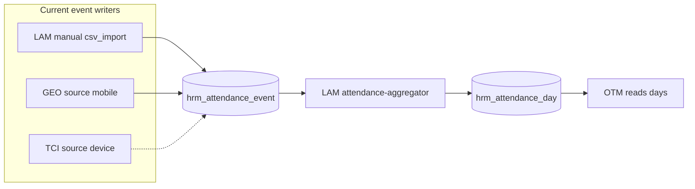

# Time Clock Integration — six-slice full-stack plan

## Current state (disk truth)

| Artifact | Status |
| --- | --- |
| [`ARCHITECTURE.md`](lib/features/hrm/time-attendance/time-clock-integration/ARCHITECTURE.md) | Requirements + **implementation notes** (slice status) |
| Feature code (`time-clock-integration/`) | **Present** — actions, data, components, schemas, contracts |
| Route `app/.../apps/hrm/time-clock/` | **Present** — thin page (matches geolocation) |
| `HRM_CAPABILITIES` / segments / i18n | **Present** — `timeClock`, `time-clock`, `tests/unit/hrm-contract.test.ts` |
| DB tables | **Present** — `hrm_time_clock_*` in `lib/db/schema.ts`, migration `drizzle/0018_premium_ares.sql` |
| `source: device` writer | **Present** — `persistTimeClockPunch` in `tci-punch-commands.server.ts` (sole writer) |
| API / cron | **Present** — `app/api/erp/hrm/time-clock/ingest`, `app/api/cron/hrm-time-clock-sync` (watch tick) |
| Sync-batch UI (`hrm:time-clock:sync-batches`) | **Present** — `TimeClockSyncBatchesSection` + `listTimeClockSyncBatchesForOrg` |
| `#features/hrm/server` integration reads | **Present** — `listDevicePunchesForEmployeeDate`, `hasDevicePunchOnDate`, `getDeviceAttendanceHoursForEmployeeDateRange` |
| Tests | **Present** — `hrm-time-clock-contract.test.ts`, `hrm-time-clock-ingest.test.ts`, `hrm-time-clock-flow.spec.ts` (UI + API ingest + sync batches) |

**Existing ingestion (do not duplicate):**



Gold references for implementation shape:

- **Module scaffold:** [`flexible-work-arrangement-tracking/`](lib/features/hrm/time-attendance/flexible-work-arrangement-tracking/) (`fwa.contract.ts`, `index.ts` / `client.ts` / `server.ts`, `fwa-spec-map.shared.ts`, `*-surface-builders.server.ts`)
- **Sole writer + LAM handoff:** [`geolocation-remote-checkin/data/geolocation-aggregator.server.ts`](lib/features/hrm/time-attendance/geolocation-remote-checkin/data/geolocation-aggregator.server.ts) (`source: mobile` + `regenerateAttendanceDayFromEvents`)
- **Thin route:** [`app/(main)/[locale]/o/[orgSlug]/apps/hrm/geolocation/page.tsx`](app/(main)/[locale]/o/[orgSlug]/apps/hrm/geolocation/page.tsx)

---

## Authority and naming (ADR-0035)

| Layer | Path | Product name |
| --- | --- | --- |
| 1 | `app/(main)/[locale]/o/[orgSlug]/apps/hrm/time-clock/` | `time-clock` route segment |
| 2 | `lib/features/hrm/time-attendance/time-clock-integration/` | `time-clock-integration` (folder); audit object prefix `time_clock` |
| 3 | *(optional Phase 2+)* | No separate `components2/time-clock/` unless shared paint exceeds feature `components/` — same pattern as FWA/GEO (paint stays in Layer 2 `components/`) |

**Forbidden:** parallel module names (`timeclock`, `punch-capture`), business logic in `app/`, reusing `hrm_remote_checkin_device` for physical terminals, implementing LAM policy/OT math inside TCI.

---

## Cross-slice: normalize “identical errors”

These are recurring failure modes across time-attendance siblings; **fix once in Slice 1 conventions** and enforce in every slice:

| Error pattern | Normalized rule | Evidence |
| --- | --- | --- |
| `source: device` never written | **Single writer:** `persistTimeClockPunch` in TCI is the only module that inserts `source: "device"` (mirror GEO comment on `mobile`) | GEO L39–41 |
| Ingest without day rollup | After validated insert, always call `regenerateAttendanceDayFromEvents` from LAM ([`attendance-aggregator.server.ts`](lib/features/hrm/time-attendance/leave-attendance-management/data/attendance-aggregator.server.ts)) | GEO L83–88 |
| Duplicate sync rows | Dedup via `rawPayloadHash` + `(organizationId, sourceRef)` before insert (TCI-013); surface `duplicate_punch` via LAM aggregator, do not reimplement OT engine | LAM import adapter |
| Registry/route drift | Same PR as route: `constants.ts`, `hrm-apps-path.shared.ts`, `messages/en.json`, `tests/unit/hrm-contract.test.ts` | [cursor-scoped-development-prompt](.cursor/rules/cursor-scoped-development-prompt.mdc) HRM checklist |
| Client pulls server barrel | `"use client"` / `*.client.tsx` → `#features/hrm/client` only | ADR-0030 |
| Better Auth `admin` as ERP gate | `requireErpPermission` with keys `hrm.time_clock.*` | AGENTS.md ERP RBAC |
| Three-layer drift | `page.tsx` ≤ guards + single RSC export; no fetch graph in `app/` | ADR-0035 |
| Verification thrash | **L0 per slice:** `pnpm gate -- <touched-paths>` + `pnpm gate:typecheck` before push; **one** `pnpm gate:push` at end | [ADR-0033](docs/decisions/0033-verify-gate-ladder-naming.md) |

**LAM alignment (Slice 5):** extend [`attendance-event.schema.ts`](lib/features/hrm/time-attendance/leave-attendance-management/schemas/attendance-event.schema.ts) display/labels for `device` where UI lists sources — without making LAM the device ingest writer.

---

## Proposed entity model

| Entity | Table (proposed) | Role |
| --- | --- | --- |
| `TimeClockDevice` | `hrm_time_clock_device` | Org terminal registry (TCI-003–004, 027) |
| `TimeClockEmployeeMapping` | `hrm_time_clock_employee_mapping` | Badge/biometric/clock user → `hrm_employee` (TCI-005, 015) |
| `TimeClockSyncConfig` | columns on device or `hrm_time_clock_sync_config` | API key ref, schedule, last sync (TCI-008, 011, 026) |
| `TimeClockSyncBatch` | `hrm_time_clock_sync_batch` | Import/API run id, status, counts (TCI-009–010, 030) |
| `TimeClockPunchStaging` *(optional Slice 3)* | `hrm_time_clock_punch_staging` | Raw pre-validation payloads (TCI-029) — or `metadata` + batch id on event until validated |
| **Canonical punch** | `hrm_attendance_event` | Validated punches only; `source: device`, `deviceId`, `sourceRef`, `rawPayloadHash` |

**Integration doors (read-only / call, never duplicate):**

- Shift context: `#features/hrm/server` or SFT queries (`findShiftAssignmentForCapture` pattern from GEO)
- Day regeneration: LAM `regenerateAttendanceDayFromEvents`
- OT validation: existing `hrmAttendanceDay` reads (no new OT tables)
- Corrections: LAM correction actions; TCI routes invalid punches to correction UX (TCI-024–025)

---

## Six development slices

### Slice 1 — Contracts, registry, three-layer scaffold

**Goal:** Shippable Phase-0 foundation per [cursor-scoped-development-prompt](.cursor/rules/cursor-scoped-development-prompt.mdc) (`PHASE_0_MODE: implement`).

**Requirement codes:** HRM-TCI-001 (capability declaration), HRM-TCI-027 (permission skeleton), HRM-TCI-030 (audit contract skeleton)

**Deliverables:**

- Directory scaffold: `actions/`, `data/`, `components/`, `schemas/`, `tci.contract.ts`, `tci-spec-map.shared.ts`, `index.ts`, `client.ts`, `server.ts`
- `HRM_TCI_AUDIT` via `pnpm gen audit-contract --module hrm --object time_clock_device --verb create` (+ mapping, sync, punch verbs)
- ERP permissions: `hrm.time_clock.device|mapping|sync|punch` × `search|read|create|update`
- Registry: add capability id `time-clock` to [`lib/features/hrm/constants.ts`](lib/features/hrm/constants.ts) + segment in [`hrm-apps-path.shared.ts`](lib/features/hrm/hrm-apps-path.shared.ts)
- Route: thin [`app/(main)/[locale]/o/[orgSlug]/apps/hrm/time-clock/page.tsx`](app/(main)/[locale]/o/[orgSlug]/apps/hrm/time-clock/page.tsx) + `loading.tsx` mirroring geolocation page (access gate + placeholder `TimeClockPage`)
- Export `TimeClockPage`, `resolveTimeClockSurfaceAccess` from `#features/hrm`
- i18n: `Dashboard.Hrm.TimeClock.*` + card keys in [`messages/en.json`](messages/en.json)
- Unit: extend [`tests/unit/hrm-contract.test.ts`](tests/unit/hrm-contract.test.ts) for segment + capability row

**Pattern:** Placeholder **A** shell (`GovernedSurface` + `ModulePageHeader` + “foundation prepared” sections).

**Verify:** `pnpm gate -- lib/features/hrm/time-attendance/time-clock-integration app/(main)/[locale]/o/[orgSlug]/apps/hrm/time-clock lib/features/hrm/constants.ts messages/en.json tests/unit/hrm-contract.test.ts`

---

### Slice 2 — Device registry and employee mapping (persistence + admin UI)

**Goal:** Acceptance criteria 1–2, 23 (partial).

**Requirement codes:** HRM-TCI-002, HRM-TCI-003, HRM-TCI-004, HRM-TCI-005, HRM-TCI-027

**Schema (agent-owned Drizzle):**

- `hrm_time_clock_device`: `organizationId`, `externalDeviceId`, `name`, `deviceType` (biometric|card|rfid|kiosk|web|api), `locationRef`, `state`, `lastSyncAt`, `syncStatus`, credential metadata (encrypted ref / vault id — no secrets in audit metadata)
- `hrm_time_clock_employee_mapping`: `organizationId`, `deviceId`, `employeeId`, `clockUserId`, `badgeId`, `biometricRef`, unique constraints per org

**Deliverables:**

- `data/tci-device-commands.server.ts`, `tci-mapping-commands.server.ts`, `tci.queries.server.ts`
- Server Actions: device CRUD, mapping CRUD (Tier B, audit after commit)
- UI: **Pattern A + B** — device list + mapping list (`tci-surface-builders.server.ts`, surfaceKeys `hrm:time-clock:devices`, `hrm:time-clock:mappings`)
- Forms: `tci-device-form.client.tsx`, `tci-mapping-form.client.tsx`
- `resolveTimeClockSurfaceAccess` enforces ERP permissions per section

**Verify:** + `pnpm lint:drizzle-journal` after migrate; `tests/unit/hrm-time-clock-device.test.ts` (schema parse + action envelopes)

---

### Slice 3 — Punch ingestion plane (API, import, sync, sole `device` writer)

**Goal:** Acceptance criteria 3–4, 5–7, 8 (offline deferred to batch replay), 19 (raw preserved).

**Requirement codes:** HRM-TCI-006, HRM-TCI-007, HRM-TCI-008, HRM-TCI-009, HRM-TCI-010, HRM-TCI-011, HRM-TCI-012, HRM-TCI-013, HRM-TCI-029

**Deliverables:**

- **HTTP boundary:** `app/api/erp/hrm/time-clock/ingest/route.ts` — org auth via API key / integration credential (TCI-010), body parser + Zod (`schemas/tci-ingest.schema.ts`), rate limit stub
- **Manual import:** adapter pattern like [`attendance-import.adapter.server.ts`](lib/features/hrm/time-attendance/leave-attendance-management/data/attendance-import.adapter.server.ts) registered for `hrm_time_clock_import` in org-admin imports (Slice 3b if registry touch is large)
- **Scheduled sync:** `app/api/cron/hrm-time-clock-sync/route.ts` + `data/tci-sync-watch.server.ts` (skeleton → real vendor adapter interface)
- **Core command:** `persistTimeClockPunch` in `data/tci-punch-commands.server.ts`:
  - Resolve mapping → employee
  - Dedup `rawPayloadHash` / `sourceRef`
  - Insert `hrm_attendance_event` with `source: "device"` only here
  - Update device `lastSyncAt`
  - Optional staging row for rejected raw payloads
- **Offline replay:** batch accepts `syncedAt` + ordered punches; idempotent on hash

**Explicitly out of slice:** GPS/mobile capture (GEO), leave policies (LAM).

**Verify:** `tests/unit/hrm-time-clock-ingest.test.ts` (dedup, mapping miss, happy path); contract test forbids `source: device` inserts outside TCI module (grep-based or dedicated test).

---

### Slice 4 — Validation, classification, shift match, exceptions

**Goal:** Acceptance criteria 9–16.

**Requirement codes:** HRM-TCI-014, HRM-TCI-015, HRM-TCI-016, HRM-TCI-017, HRM-TCI-018, HRM-TCI-019, HRM-TCI-020

**Deliverables:**

- `data/tci-validation.server.ts`: active employment, mapping match, eventType classification, duplicate window
- Shift match: reuse SFT assignment lookup (same inputs as GEO `findShiftAssignmentForCapture`) — **read contract only**
- `data/tci-exception-detect.server.ts`: flags stored on event `metadata` or `hrm_time_clock_punch_exception` lightweight table if LAM aggregator should not own pre-LAM flags
- UI: **Pattern B + C** — exception inbox (`tci-exception-inbox.tsx` + decision form) for unmatched/duplicate punches pending HR action
- KPI section: sync health, exception counts (`hrm:time-clock:kpi-summary`)

**Handoff rule:** Valid punches call `regenerateAttendanceDayFromEvents`; invalid stay staged until Slice 5 correction path.

**Verify:** `tests/unit/hrm-time-clock-validation.test.ts`; extend or align with [`hrm-attendance-aggregator.test.ts`](tests/unit/hrm-attendance-aggregator.test.ts) for `device` source rows.

---

### Slice 5 — LAM / OTM integration and correction bridge

**Goal:** Acceptance criteria 17–18, 20; TCI-021–025.

**Requirement codes:** HRM-TCI-021, HRM-TCI-022, HRM-TCI-023, HRM-TCI-024, HRM-TCI-025

**Deliverables:**

- `data/tci-integration.server.ts` (public read helpers for LAM/OTM):
  - `listDevicePunchesForEmployeeDate`
  - `hasDevicePunchOnDate` (mirror GEO `hasVerifiedRemoteCheckinOnDate`)
- Export selective helpers from [`lib/features/hrm/server.ts`](lib/features/hrm/server.ts) — no cross-module deep imports
- Correction UX: link to LAM correction Server Actions or thin wrapper actions that create `eventType: correction` with `source: device` lineage in metadata
- OTM: **no new tables** — document that OT reads `hrm_attendance_day` after regeneration
- LAM UI: device source label in attendance history queries ([`attendance.queries.server.ts`](lib/features/hrm/time-attendance/leave-attendance-management/data/attendance.queries.server.ts))

**Verify:** `tests/unit/hrm-time-clock-integration.test.ts`; smoke `tests/e2e/hrm-time-clock-flow.spec.ts` (register device → ingest punch → see attendance day).

---

### Slice 6 — Ops monitoring, reporting, audit completeness, stabilization

**Goal:** Acceptance criteria 21–22, 24; full HRM-TCI-026, HRM-TCI-028, HRM-TCI-030.

**Requirement codes:** HRM-TCI-026, HRM-TCI-028, HRM-TCI-030 (+ remaining audit coverage for all mutations)

**Deliverables:**

- Sync failure alerts: `tci-sync-watch.server.ts` + cron; in-app org notifications via `tci-notification.server.ts` (`publishOrgNotificationIfMissing`, ERP `time_clock_device` update permission)
- Vendor adapters: `TCI_VENDOR_ADAPTERS` — generic `poll:`, Zebra `vendor:zebra:`, UKG `vendor:ukg:` (`tci-vendor-payload.shared.ts`, `tci-vendor-adapters.server.ts`)
- Reports: CSV export actions (`tci-report.actions.ts`) — by employee, device, location, date, exception, sync status (Pattern B list + export client)
- `TimeClockPage` **mixed** workbench: devices, mappings, sync status, exceptions, reports (reference [`geolocation-page.tsx`](lib/features/hrm/time-attendance/geolocation-remote-checkin/components/geolocation-page.tsx))
- Spec map completeness: all HRM-TCI codes in `tci-spec-map.shared.ts` with `complete|partial|deferred` per code
- Residue sweep: knip, barrel hygiene, no dead `source: device` branches in LAM without writer
- Docs: optional one-line cross-link in LAM/GEO ARCHITECTURE “integration” rows (no new ADR unless you want ADR-0043 TCI)

**Verify:** `pnpm gate:push` once (batch-fix per [gate-batch-fix-workflow](.cursor/rules/gate-batch-fix-workflow.mdc)); `pnpm lint:fixtures-parity` after i18n.

---

## Requirement → slice matrix (summary)

| Codes | Slice |
| --- | --- |
| 001, 027, 030 (skeleton) | 1 |
| 002–005, 027 | 2 |
| 006–013, 029 | 3 |
| 014–020 | 4 |
| 021–025 | 5 |
| 026, 028, 030 (complete) | 6 |

---

## Recommended execution order (Cursor runs)

Use paste blocks from [docs/cursor-scoped-development-prompt.mdc](docs/cursor-scoped-development-prompt.mdc) — one Agent run per slice:

```txt
DEVELOPMENT_SCOPE:
lib/features/hrm/time-attendance/time-clock-integration/**
app/(main)/[locale]/o/[orgSlug]/apps/hrm/time-clock/**
tests/unit/hrm-time-clock*.test.ts
tests/e2e/hrm-time-clock*.spec.ts

ARCHITECTURE: lib/features/hrm/time-attendance/time-clock-integration/ARCHITECTURE.md
MODULE: hrm
ROUTE_SEGMENT: time-clock
```

| Run | `DELIVERY_PHASE` equivalent | `REQUIREMENT_CODES` |
| --- | --- | --- |
| 1 | 0 implement | HRM-TCI-001,HRM-TCI-027,HRM-TCI-030 |
| 2 | 1 | HRM-TCI-002–005 |
| 3 | 1–2 | HRM-TCI-006–013,HRM-TCI-029 |
| 4 | 2 | HRM-TCI-014–020 |
| 5 | 4 integration | HRM-TCI-021–025 |
| 6 | 4 reporting | HRM-TCI-026,HRM-TCI-028,HRM-TCI-030 |

**Also @ on every run:** `@AGENTS.md`, `@lib/features/hrm/time-attendance/leave-attendance-management/ARCHITECTURE.md`, `@lib/features/hrm/time-attendance/geolocation-remote-checkin/ARCHITECTURE.md`, `@.cursor/rules/drizzle-migration-ledger.mdc` (slices 2–3).

---

## Out of scope (entire program)

Per ARCHITECTURE **Does Not Include** — never implement in TCI:

- Leave workflows, attendance policy engine, payroll math (LAM / payroll modules)
- Shift pattern design (SFT)
- OT approval/calculation (OTM)
- GPS/mobile remote check-in (GEO) — parallel `source: mobile` path only
- Physical access / IAM device procurement

---

## Risk notes

- **Vendor adapters:** Slice 3 should define an internal `TimeClockVendorAdapter` interface; real biometric vendors land as additional adapters without schema churn.
- **Secrets:** API keys in Vercel env / org integration table — never in `iam_audit_event.metadata`.
- **Staging vs events:** If staging table is skipped, TCI-029 is satisfied by immutable `hrm_attendance_event` rows + LAM-approved `hrm_attendance_day` separation — document in `tci-integration.server.ts` comments.
