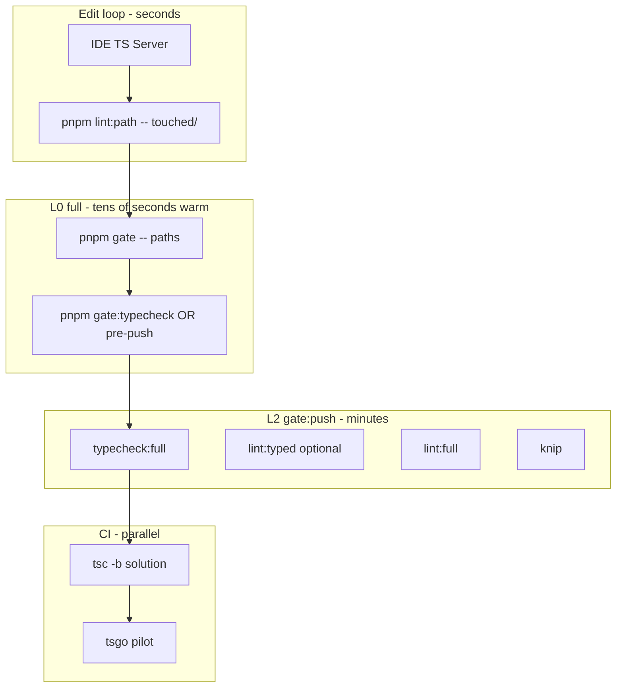

Here is a refined final plan, grounded in your repo, TypeScript’s module/reference model, and what GitHub issues show teams actually hit in 2025–2026.

---

# Afenda TypeScript scaling — final plan

## Executive summary

You are not missing one magic flag. You have **three different type systems** doing three different jobs, but **L0 treats them as one**:

| Layer | What it does | Afenda today |
|--------|----------------|--------------|
| **IDE (TS Server)** | Per-file / incremental feedback while editing | Free; already your real edit-loop checker |
| **ESLint (`lint:path`)** | Syntax, imports, Afenda rules — **path-scoped** | Works as documented |
| **`tsc --noEmit` (`typecheck`)** | Whole-program truth — **never path-scoped** | Always runs on every `pnpm gate -- <paths>` |

ADR-0033’s “~15–45s warm” assumes a warm incremental graph. In practice, **`pretypecheck` → `next typegen` (~15s saved vs workflow plugin, but still costly)** plus **one monolithic program** (8GB heap) means cold runs are often **minutes**, not seconds.

The scaling path is: **(1) fix the gate contract**, **(2) split the TS graph with project references + `tsc -b`**, **(3) add typed lint only at L2+**, **(4) pilot `tsgo` in CI** — not “enable `projectService` on every L0 lint.”

---

## What you were likely missing (from GitHub + TS docs)

### 1. `pnpm gate -- <paths>` does not narrow TypeScript

```51:55:c:\JackProject\afenda-vercel\scripts\gate.mjs
if (paths.length > 0) {
  run("node", ["scripts/lint-path.mjs", ...paths])
}

run("pnpm", ["typecheck"])
```

Paths only affect ESLint. **There is no per-path `tsc` in TypeScript for a single `tsconfig` that includes the whole app** — that is by design ([TS modules theory](https://www.typescriptlang.org/docs/handbook/modules/theory.html): the checker must see the output graph).

**Fix:** Split L0 into **lint-only** vs **lint + typecheck**, and document that IDE + occasional full `typecheck` is the edit loop.

### 2. `parserOptions.projectService` is intentionally off — but for the wrong tier

Your ESLint config documents why typed rules are disabled:

```262:266:c:\JackProject\afenda-vercel\eslint.config.mjs
       * `no-misused-promises` requires parserOptions.projectService (typed
       * linting) which is intentionally not configured here — it would add
       * 30–60s to every lint run. Enable it in a dedicated typed-lint pass
       * once projectService is wired to tsconfig.json.
```

That is correct for **L0**. The missing piece is a **separate command** (`pnpm lint:typed` / L2), not wiring `projectService` into every `gate`.

**GitHub nuance:** [typescript-eslint#9571](https://github.com/typescript-eslint/typescript-eslint/issues/9571) — `projectService` can be **slower** than legacy `project` on large flat repos; gains show up more with **project references** ([project service blog](https://typescript-eslint.io/blog/project-service)). Do not expect typed lint to be “free.”

**Anti-pattern:** `parserOptions.project: ['./packages/**/tsconfig.json']` — classic OOM ([typescript-eslint#1192](https://github.com/typescript-eslint/typescript-eslint/issues/1192)).

### 3. Project references are the official “10× repo” lever (before Turborepo packages)

- Handbook: [Project references](https://www.typescriptlang.org/docs/handbook/project-references.html) — solution `tsconfig` with `files: []` + `references`, build with **`tsc -b`**.
- Discussion hub: [TypeScript#25600](https://github.com/microsoft/TypeScript/issues/25600).
- **Caveat:** Export **type** changes still invalidate downstream projects ([#47793](https://github.com/microsoft/TypeScript/issues/47793) — working as intended).
- **Caveat:** `tsc --noEmit -p child` **fails** without built `.d.ts` from references ([#40431](https://github.com/microsoft/TypeScript/issues/40431)); use **`tsc -b`** on the solution or composite projects with `composite: true`.
- **Caveat:** `node_modules` / lockfile changes can stale `.tsbuildinfo` ([#38648](https://github.com/microsoft/TypeScript/issues/38648)) — invalidate Turbo cache when deps change (you already scope Turbo inputs).

Afenda is **single-package** today; Turbo cannot shard one `tsc` graph across workers. References give you **slice builds** without npm workspaces.

### 4. `tsgo` is a CI accelerator, not an L0 replacement (yet)

- Repo: [microsoft/typescript-go](https://github.com/microsoft/typescript-go).
- Realistic speedups are often **~25–40%**, not 10×, on large apps ([#1507](https://github.com/microsoft/typescript-go/issues/1507)).
- Large monorepos report **OOM** on `tsgo --build` ([#1622](https://github.com/microsoft/typescript-go/issues/1622), [#1541](https://github.com/microsoft/typescript-go/issues/1541)).
- Intermittent correctness issues still appear ([#3276](https://github.com/microsoft/typescript-go/issues/3276)).
- typescript-eslint is tracking native TS for typed lint ([#10940](https://github.com/typescript-eslint/typescript-eslint/issues/10940)) — future, not L0 today.

**Recommendation:** Run **`tsgo` in CI in parallel with `tsc`** until parity is proven on Next plugin + `.next/types` + workflow types — do not drop `tsc` from `gate:push` yet.

### 5. `isolatedDeclarations` is not your next step

TS 5.5+ [`isolatedDeclarations`](https://www.typescriptlang.org/docs/handbook/release-notes/typescript-5-5.html) helps **parallel `.d.ts` emit** without a full checker. Afenda uses **`noEmit: true`** and does not ship TS packages from this repo. **Skip** unless you add publishable composite packages.

### 6. You already did several high-value things — keep them

| Already in repo | Effect |
|-----------------|--------|
| `typecheck` / `typecheck:test` / `typecheck:scripts` split | Keeps Vitest/Playwright types out of app graph |
| `types: ["node"]` | Cuts ambient `@types/*` scan ([Performance wiki](https://github.com/microsoft/TypeScript/wiki/Performance)) |
| `assumeChangesOnlyAffectDirectDependencies` | Faster IDE + incremental |
| `skipLibCheck` | Standard win |
| `scripts/next-typegen-fast.mjs` | ~15s per typecheck when workflow plugin skipped in dev |
| Turbo `typecheck` → `.artifacts/.tsbuildinfo/main` | Warm repeats |
| Client/server barrels (ADR-0030) | Shrinks client bundle; also reduces accidental “import the world” |

### 7. Profile before restructuring

[TypeScript Performance wiki](https://github.com/microsoft/TypeScript/wiki/Performance): use **`tsc --generateTrace`** + **`--extendedDiagnostics`** on a cold run. Hot directories can turn **0.8s → 40s** check time ([#43574](https://github.com/microsoft/TypeScript/issues/43574)) — often one module (heavy generics, giant schema, barrel re-exports).

---

## Target architecture (steady state)



**Doctrine**

- **IDE** owns “is this line wrong?” while typing.
- **`lint:path`** owns style, boundaries, import rules.
- **`tsc -b <slice>`** owns “did my feature slice break?” after meaningful edits in that slice.
- **`tsc -b` (solution)** / **`typecheck:full`** owns merge safety.
- **`tsgo`** owns CI time reduction once trusted.

---

## Implementation phases

### Phase 0 — Baseline & gate honesty (≈2–3 days)

**Goals:** Know real numbers; stop agents from assuming path-scoped TS.

| Task | Deliverable |
|------|-------------|
| Add `pnpm typecheck:diagnostics` | `tsc --noEmit --extendedDiagnostics` (+ optional `--generateTrace` → `.artifacts/ts-trace/`) |
| Split typegen timing | Log `next-typegen-fast` vs `tsc` separately in a small `scripts/typecheck-profile.mjs` |
| Introduce **`pnpm gate:lint -- <paths>`** | ESLint only (alias or flag) |
| Change default **`pnpm gate -- <paths>`** | **Lint only**; typecheck opt-in via **`pnpm gate -- --typecheck`** or **`pnpm gate:typecheck`** |
| Update **ADR-0033**, **AGENTS.md §2**, **targeted-verification.mdc** | L0 default = lint; typecheck = explicit or `pnpm gate` with no paths |
| Document agent rule | “After HRM-only edit: `pnpm gate:lint -- lib/features/hrm/`; run `pnpm typecheck` once before push” |

**Success metrics:** Agent L0 median &lt;30s warm; full typecheck only when requested or pre-push.

---

### Phase 1 — Solution tsconfig + layered references (≈2–4 weeks, incremental)

**Goals:** `tsc -b` rebuilds only affected slices; align with `lib/features/<module>` boundaries.

**Proposed graph** (names illustrative):

```txt
tsconfig.base.json          # shared compilerOptions (paths, strict, moduleResolution)
tsconfig.lib.foundation.json  # lib/auth, lib/db, lib/erp, lib/i18n, lib/portal — composite
tsconfig.lib.support.json     # lib/ask-docs, lib/ai, lib/api, lib/browser, lib/observability
tsconfig.features.core.json   # nexus, orbit, erp-rbac, governed-surface, execution, …
tsconfig.features.hrm.json    # lib/features/hrm/** only
tsconfig.features.domains.json # contacts, org-admin, hrm-adjacent modules batched by coupling
tsconfig.components2.json
tsconfig.app.json           # app/, .next/types, references ↑
tsconfig.json               # solution: files: [], references: [all]
```

**Rules**

- Each composite project: `"composite": true`, `"declaration": true`, `"declarationMap": true`, `"emitDeclarationOnly": true` (or emit to `.artifacts/types/<slice>/`).
- **Cross-module imports stay** `#features/<module>` — references enforce graph, not new import style.
- **No** `tsconfig.eslint.json` — use `projectService` against real configs when Phase 3 lands.

**Commands**

| When | Command |
|------|---------|
| Touched HRM only | `pnpm typecheck:hrm` → `tsc -b tsconfig.features.hrm.json` |
| Touched app routes | `pnpm typecheck:app` → `tsc -b tsconfig.app.json` (pulls needed refs) |
| Pre-push | `pnpm typecheck` → `tsc -b` (solution) replaces monolithic `tsc -p tsconfig.json` |
| CI | Same + cache `.artifacts/.tsbuildinfo/*` per slice in Turbo |

**Migration order:** foundation → one pilot feature (`hrm`) → `components2` → `app` → remaining features in batches.

**Risks (from GitHub):** First setup is tedious; type-only exports in shared barrels trigger downstream rebuilds — acceptable if slices are small.

**ADR:** `docs/decisions/NNNN-typescript-project-references.md` + AGENTS.md §2 update.

---

### Phase 2 — Gate ↔ slice mapping (≈1 week after Phase 1 pilot)

| Command | Behavior |
|---------|----------|
| `pnpm gate -- lib/features/hrm/` | `lint:path` + `tsc -b` for `tsconfig.features.hrm.json` + app if route files in paths |
| `pnpm gate:typecheck` | Full solution `tsc -b` |
| `pnpm gate:push` | Unchanged semantics: `lint:full` + `typecheck:full` + knip + tests |

Optional: `scripts/gate-args.shared.mjs` maps path prefixes → slice tsconfig (deterministic table, no magic).

---

### Phase 3 — Typed ESLint tier (≈3–5 days, optional)

**Goals:** Unlock `no-misused-promises` etc. without bloating L0.

- Add `pnpm lint:typed` — ESLint flat config block with `parserOptions.projectService: true` and **only** `recommendedTypeChecked` rules you need.
- Run in **`gate:push`** or weekly — **not** in `gate --`.
- `allowDefaultProject` for root configs only: `eslint.config.mjs`, `*.config.ts` per [typed linting docs](https://typescript-eslint.io/blog/project-service).

Watch [typescript-eslint#9571](https://github.com/typescript-eslint/typescript-eslint/issues/9571); if slower than `tsc` on your graph, keep typed lint CI-only.

---

### Phase 4 — `tsgo` CI pilot (≈2 days setup + soak)

| Step | Action |
|------|--------|
| 1 | Add devDependency `@typescript/native-preview` |
| 2 | CI job: `tsgo -b` (or `--noEmit`) after `pnpm install`, **parallel** with `tsc -b`, fail only on `tsc` |
| 3 | Track time + memory; cap Node heap like today |
| 4 | Promote to required only after 2–4 weeks without divergence |

Do **not** use `tsgo` for L0 until Next/workflow/plugin parity is confirmed.

---

### Phase 5 — True 10× scale (only if Phases 1–4 plateau)

Consider **Turborepo packages** (`apps/web`, `packages/hrm`, …) when:

- Slice count &gt; ~15 and `tsc -b` solution time still &gt;2–3 min warm, or
- Teams need **parallel CI typecheck** per package.

That is a **product/architecture** migration (ADR-0007 evolves), not a TypeScript knob.

**Not recommended early:** `isolatedDeclarations`, per-file `tsc`, duplicate `tsconfig.eslint.json` trees, full-repo typed ESLint on every save.

---

## Ongoing hygiene (parallel, all phases)

1. **Barrel diet** — `index.ts` re-exports inflate checker work; keep server graphs out of client (already enforced).
2. **Hot-spot audits** — `lib/db/schema.ts`, heavy Drizzle-inferred types, metadata renderers — trace with `--generateTrace`.
3. **`.next/types`** — keep production typegen in CI; dev fast path stays behind `AFENDA_SKIP_WORKFLOW_PLUGIN`.
4. **Concurrent agents** — never run full `typecheck` in parallel on same machine (`.tsbuildinfo` write contention); slice builds reduce blast radius.
5. **Lockfile / deps** — invalidate Turbo typecheck cache when `pnpm-lock.yaml` changes ([#38648](https://github.com/microsoft/TypeScript/issues/38648)).

---

## Decision record (what to adopt / reject)

| Approach | Verdict |
|----------|---------|
| Path-scoped `tsc` on single `tsconfig.json` | **Reject** — impossible for whole-program checking |
| `gate` = lint only; typecheck explicit | **Adopt** (Phase 0) |
| Project references + `tsc -b` | **Adopt** (Phase 1–2) |
| `projectService` on every L0 lint | **Reject** |
| `lint:typed` at L2 | **Adopt** (Phase 3) |
| `tsgo` in CI, dual-run with `tsc` | **Pilot** (Phase 4) |
| Turborepo multi-package | **Defer** to Phase 5 |
| `isolatedDeclarations` | **Defer** (no emit pipeline) |

---

## Suggested first PR (minimal, high leverage)

1. `pnpm gate:lint` + change `gate.mjs` so paths → lint only; add `pnpm gate:typecheck`.
2. `pnpm typecheck:diagnostics` script.
3. Draft ADR for project references; spike **`tsconfig.features.hrm.json`** composite + one `tsc -b` in CI dry-run.

That closes the gap between **documented L0** and **actual cost**, and opens the only path that scales to a 10× file count without rewriting the repo as a monorepo on day one.

---

## References

- [ADR-0033 — Gate ladder](docs/decisions/0033-verify-gate-ladder-naming.md)
- [ADR-0007 — Turbo cache](docs/decisions/0007-turborepo-single-package-verify-cache.md)
- [typescript-eslint — Project Service](https://typescript-eslint.io/blog/project-service)
- [TypeScript — Project references](https://www.typescriptlang.org/docs/handbook/project-references.html)
- [TypeScript — Performance wiki](https://github.com/microsoft/TypeScript/wiki/Performance)
- GitHub: [TS#25600](https://github.com/microsoft/TypeScript/issues/25600), [TS#40431](https://github.com/microsoft/TypeScript/issues/40431), [typescript-eslint#9571](https://github.com/typescript-eslint/typescript-eslint/issues/9571), [typescript-go#1507](https://github.com/microsoft/typescript-go/issues/1507)

If you want this turned into an ADR file and the Phase 0 `gate.mjs` split in the repo, say which default you prefer: **`gate -- paths` = lint-only** (recommended) vs **keep full typecheck but document honest timings**.
