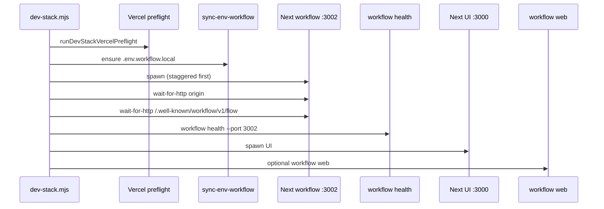

# ADR-0039: Local dev workflow port split (`pnpm dev:stack`)

## Status

Accepted — 2026-05-19

## Context

Workflow DevKit (WDK) runs inside the same Next.js process as the app (`withWorkflow` in `next.config.ts`). Step and workflow callbacks hit `/.well-known/workflow/v1/*` on the **same origin** that called `start()`.

A single `pnpm dev` on port **3000** competes with Turbopack HMR, RSC traffic, and heavy ERP surfaces — workflow runs can stall or fail queue delivery. Playwright E2E already uses port **3001** (`.config/playwright.config.ts`); that port must stay separate from the workflow dev server.

Vercel documents injecting development environment variables via **`vercel env run`** without writing secrets to extra files. The linked project is **`afenda-vercel`** on team **`jacks-projects-7b3cfe94`**.

`proxy.ts` already excludes `/.well-known` from locale/auth middleware (required for WDK callbacks):

```txt
matcher excludes: api, _next, _vercel, .well-known, static files
```

## Decision

### Port roles (fixed)

| Port | Role | Command | WDK enabled |
|------|------|---------|-------------|
| **3000** | UI / day-to-day editing | `pnpm dev`, `dev:stack` (UI leg) | Yes (callbacks stay on 3000 if you enqueue from 3000) |
| **3002** | Durable workflow testing | `dev:stack` (workflow leg), `pnpm dev:workflow` | Yes — **use this origin for workflow QA** |
| **3001** | Playwright E2E only | `pnpm test:e2e` | Production-like `next start` — **never** in `dev:stack` |

**Origin rule:** `start()` from a Server Action on **3000** callbacks to **3000** only. To exercise durable runs without overloading the UI server, browse and enqueue on **http://127.0.0.1:3002**.

### One command: `pnpm dev:stack`

Orchestrator: `scripts/dev-stack.mjs`.

Startup order (default — both servers):



1. **Preflight** — link file, optional `@vercel/sdk` `getProject`, optional `vercel env run` dry-run (skipped with `--no-vercel-env-run`).
2. **Port check** — fail fast if 3000/3002 already bound.
3. **`pnpm env:sync`** if `.env.local` missing.
4. **`sync-env-workflow.mjs`** — create/refresh `.env.workflow.local` (port overrides only).
5. **`clean-workflow-generated.mjs`** — one clean pass before dual `next dev` (shared `app/.well-known/workflow/`).
6. **Workflow Next on 3002** → HTTP ready → WDK route probe → `workflow health`.
7. **UI Next on 3000**.
8. **`workflow web`** (unless `--no-web` or `--ui-only`).

Ctrl+C runs **process-tree kill** on Windows (`taskkill /T`) and POSIX signal cascade via `scripts/lib/dev-stack-kill-tree.shared.mjs`.

### Environment layering (Vercel-first)

Secrets stay in Vercel / `.env.local`. **Do not** duplicate secrets into `.env.workflow.local`.

```txt
Outer (optional):  vercel env run -e development --
Inner:             node scripts/with-env.mjs --env-file=<file> [--file-overrides] --
Child:             pnpm exec next dev -p <port>
```

| Server | Env file | `with-env` mode | Why |
|--------|----------|-----------------|-----|
| UI (3000) | `.env.local` | default (`process.env` wins) | Shell/CI can override; matches Vitest/Playwright |
| Workflow (3002) | `.env.workflow.local` | `--file-overrides` | Port URLs in file beat Vercel-injected `localhost:3000` |

Merge implementation: `scripts/lib/merge-env.shared.mjs` (`mergeChildEnv`).

`pnpm env:sync:workflow` runs `pnpm env:sync` then `scripts/sync-env-workflow.mjs --force` (or no-op if file exists without `--force`). Rewrites these keys (and any value containing `:3000`):

- `BETTER_AUTH_URL`, `NEXT_PUBLIC_SITE_URL`, `NEXT_PUBLIC_APP_URL`, `NEXT_PUBLIC_AUTH_URL`, `NEXT_PUBLIC_BETTER_AUTH_URL`

Constants: `scripts/lib/dev-stack-constants.shared.mjs` (`AFENDA_WORKFLOW_ENV_URL_KEYS`).

### Isolated Next build output

`next.config.ts`:

```ts
distDir: process.env.AFENDA_NEXT_DIST_DIR ?? ".next"
```

| Role | `AFENDA_NEXT_DIST_DIR` | Gitignored |
|------|------------------------|------------|
| UI | `.next-ui` | yes |
| Workflow | `.next-workflow` | yes |

Avoids Turbopack cache fights between two concurrent `next dev` processes.

### Auth / trusted origins (development)

`lib/site.ts` adds explicit dev origins for **3000** and **3002** (`localhost` and `127.0.0.1`) so Neon Auth / Better Auth callbacks work on both servers without editing production allowlists.

### Preflight (`pnpm dev:stack:preflight`)

`scripts/lib/dev-stack-vercel-preflight.mjs`:

- Warns if `.env.local` missing
- Reads `.vercel/project.json` or falls back to pinned team/project IDs in constants
- With `VERCEL_TOKEN` / `VERCEL_ACCESS_TOKEN`: `@vercel/sdk` `projects.getProject`
- Optional `vercel env run` dry-run (node exit 0) when CLI present and not skipped
- `--strict` — missing token or SDK failure is fatal

### Remote workflow inspection

`pnpm dev:stack:inspect` → `scripts/dev-stack-inspect.mjs` → `workflow inspect runs --backend vercel` with project/team from constants.

## Rules of use

| Task | Origin |
|------|--------|
| UI / HRM editing | http://127.0.0.1:3000 |
| Durable workflow testing | http://127.0.0.1:3002 (enqueue and browse here) |
| Remote WDK inspection | `pnpm dev:stack:inspect` |
| E2E | `pnpm test:e2e` on **3001** separately |

**Forbidden:** Running Playwright inside `dev:stack` — second WDK-enabled Next against the same Neon DB causes duplicate or stuck runs.

## Commands

| Command | Purpose |
|---------|---------|
| `pnpm dev` | UI-only on 3000 (default for agents; unchanged) |
| `pnpm dev:stack` | Full stack (workflow → UI → `workflow web`) |
| `pnpm dev:stack:preflight` | SDK + link + env dry-run (no servers) |
| `pnpm dev:stack:inspect` | Remote WDK runs on Vercel |
| `pnpm dev:ui` | UI role only (`scripts/run-next-dev.mjs --role=ui`) |
| `pnpm dev:workflow` | Workflow role only (`--role=workflow`) |
| `pnpm env:sync:workflow` | `env:sync` + regenerate `.env.workflow.local` |

### `dev:stack` flags

| Flag | Effect |
|------|--------|
| `--help`, `-h` | Usage banner |
| `--no-vercel-env-run` | Skip `vercel env run`; use dotenv files only |
| `--no-web` | Skip `workflow web` |
| `--strict` | Preflight errors are fatal |
| `--refresh-env` | Force-regenerate `.env.workflow.local` |
| `--workflow-only` | Port 3002 only |
| `--ui-only` | Port 3000 only |

### Operator prerequisites (once per machine)

```powershell
vercel link --scope jacks-projects-7b3cfe94   # project: afenda-vercel
vercel login
pnpm env:sync
pnpm env:sync:workflow   # optional; dev:stack creates if missing
pnpm dev:stack
```

Without link/token: `pnpm dev:stack --no-vercel-env-run` (`.env.local` + `.env.workflow.local` only).

## Implementation map

| File | Responsibility |
|------|----------------|
| `scripts/dev-stack.mjs` | Orchestrator, banner, shutdown |
| `scripts/dev-stack-inspect.mjs` | Vercel backend inspect wrapper |
| `scripts/run-next-dev.mjs` | Single-role dev (`--role=ui\|workflow`) |
| `scripts/wait-for-http.mjs` | Poll until HTTP ready (`--accept=404,405` for WDK routes) |
| `scripts/with-env.mjs` | Dotenv merge + `--file-overrides` |
| `scripts/sync-env-workflow.mjs` | Generate `.env.workflow.local` |
| `scripts/lib/dev-stack-constants.shared.mjs` | Ports, origins, Vercel IDs, URL keys |
| `scripts/lib/dev-stack-spawn-next.shared.mjs` | `vercel env run` + `with-env` + `next dev` |
| `scripts/lib/dev-stack-vercel-preflight.mjs` | SDK + CLI checks |
| `scripts/lib/dev-stack-port-check.shared.mjs` | Bind probe before spawn |
| `scripts/lib/dev-stack-kill-tree.shared.mjs` | Clean shutdown (incl. Windows) |
| `scripts/lib/merge-env.shared.mjs` | Env precedence helper |
| `tests/unit/merge-env.shared.test.ts` | `fileOverrides` contract |
| `tests/unit/dev-stack-sync-env-workflow.test.ts` | `rewriteDevPorts` contract |

**Dependencies:** `@vercel/sdk` (scripts/preflight only), `vercel` CLI (devDependency, `node_modules/vercel/dist/vc.js`).

**Gitignore:** `.env.workflow.local`, `.next-ui/`, `.next-workflow/`, `/.workflow-data/`, `app/.well-known/workflow/` (generated bundles).

## Alternatives considered

| Alternative | Rejected because |
|-------------|------------------|
| Separate WDK microservice | WDK is embedded in Next via `withWorkflow`; callbacks require same origin |
| Third dev port inside `dev:stack` for Playwright | Duplicate WDK + shared DB → stuck runs |
| Only `.env.workflow.local` without `vercel env run` | Drifts from Vercel dev secrets; operators copy stale keys |
| Same `.next` for both servers | Turbopack/cache corruption under concurrent dev |
| `process.env` always wins over workflow file | Vercel injects `localhost:3000` URLs; breaks 3002 auth callbacks |

## Consequences

### Positive

- UI stays responsive on 3000 while workflow load is isolated on 3002.
- Single operator command aligns with Vercel `env run` best practice.
- Preflight surfaces link/token/deployment issues before long `next dev` boot.
- Documented port contract reduces “works on my machine” WDK confusion.

### Negative / operational

- Two `next dev` processes share generated `app/.well-known/workflow/` — mitigated by `clean-workflow-generated` and workflow-first start.
- Operators must remember **3002** for workflow QA; enqueuing from 3000 still callbacks to 3000.
- `@vercel/sdk` and preflight add devDependency surface (scripts-only, not app bundle).
- Without `vercel link`, stack still runs with `--no-vercel-env-run` but secrets may be stale vs cloud.

### Troubleshooting

| Symptom | Check |
|---------|--------|
| `workflow health` fails | `proxy.ts` excludes `.well-known`; restart stack; port 3002 not blocked |
| Auth redirect loop on 3002 | Run `pnpm env:sync:workflow`; confirm workflow server uses `--file-overrides` |
| Port already in use | Stop stray `next dev`; use `--workflow-only` / `--ui-only` |
| Stuck / duplicate runs | Ensure Playwright (3001) not running alongside stack |
| Preflight SDK warning | `vercel login` or set `VERCEL_TOKEN`; or `--no-vercel-env-run` |

## References

- [useworkflow.dev — Next.js getting started](https://useworkflow.dev/docs/getting-started/next)
- [Vercel CLI — `vercel env run`](https://vercel.com/docs/cli/env)
- [ADR-0033](./0033-verify-gate-ladder-naming.md) — gate ladder (`pnpm gate` after script edits)
- `AGENTS.md` — Quickstart row “Local dev stack (WDK)”, §2 commands
- `.cursor/rules/testing.mdc` — Playwright vs `dev:stack` boundary
