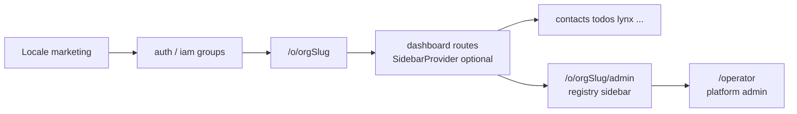

# App shell learnings (OSS synthesis)

Observational architecture synthesis — not a migration plan. Use this doc before changing dashboard chrome so shell work stays **surgical**, **registry-aligned**, and **boring** (operational continuity over visual novelty).

**Contract:** [AGENTS.md](../../AGENTS.md) §6–§7, [`.cursor/rules/app-shell-directory.mdc`](../../.cursor/rules/app-shell-directory.mdc).

---

## Shell ownership doctrine

The app shell is **operational infrastructure**, not feature UI.

Changes to shell structure should prioritize:

- navigation continuity
- organization context clarity
- capability discoverability
- layout stability
- keyboard and accessibility consistency

before visual differentiation.

**Operational consequences**

- The shell is graded on reliability, orientation, continuity, and low cognitive load — not on differentiation.
- Visual novelty, animated chrome, and “AI workspace” energy are out of scope for shell iterations unless explicitly product-owned elsewhere.
- Feature modules **consume** the shell; they do not reshape shell structure for one module’s convenience.

---

## Current baseline (afenda-vercel)

| Area                           | Location                                                                                                      | Notes                                                                                                                                              |
| ------------------------------ | ------------------------------------------------------------------------------------------------------------- | -------------------------------------------------------------------------------------------------------------------------------------------------- |
| Dashboard chrome               | [`components/dashboard/dashboard-shell.tsx`](../../components/dashboard/dashboard-shell.tsx)                  | Flat `max-w-7xl` card: brand, title, pill nav — no persistent sidebar, org switcher, or command surface.                                           |
| Module nav                     | [`components/dashboard/module-nav.tsx`](../../components/dashboard/module-nav.tsx)                            | Driven by **`DASHBOARD_NAV_MODULES`** in [`lib/dashboard-module-paths.ts`](../../lib/dashboard-module-paths.ts) (single source with path helpers). |
| Top region                     | [`components/dashboard/top-bar.tsx`](../../components/dashboard/top-bar.tsx)                                  | Title, sign-out, Home — minimal product top bar.                                                                                                   |
| Org admin (reference registry) | [`lib/features/org-admin/constants.ts`](../../lib/features/org-admin/constants.ts) (`ORG_ADMIN_CAPABILITIES`) | Sidebar + paths + audit prefixes derive from one registry — **dashboard nav has not yet adopted the same discipline**.                             |
| Auth framing                   | [`components/auth/`](../../components/auth/), `app/[locale]/(auth)`, `app/[locale]/(iam)`                     | Locale-first auth surfaces; compose [`auth-page-frame`](../../components/auth/auth-page-frame.tsx) patterns — not part of `components/dashboard/`. |

---

## Six OSS exemplars (architecture + UX)

Verified via GitHub repository search, May 2026. Extract **patterns**, not file-by-file clones.

### Architecture

| Repository                                | Stars (approx.) | What to learn                                                                                                                                                                                                                                                                                                                               | Link                                                                                                                          |
| ----------------------------------------- | --------------- | ------------------------------------------------------------------------------------------------------------------------------------------------------------------------------------------------------------------------------------------------------------------------------------------------------------------------------------------- | ----------------------------------------------------------------------------------------------------------------------------- |
| **satnaing/shadcn-admin**                 | ~12k            | Authenticated shell **composition**: `SearchProvider` → `LayoutProvider` → `SidebarProvider` → `AppSidebar` → **`SidebarInset`** + skip link; **cookie-backed `defaultOpen`** for sidebar state reduces hydration mismatch. Do **not** mirror full template file fragmentation — see [Decomposition discipline](#decomposition-discipline). | [authenticated-layout.tsx](https://github.com/satnaing/shadcn-admin/blob/main/src/components/layout/authenticated-layout.tsx) |
| **arhamkhnz/next-shadcn-admin-dashboard** | ~2.2k           | **Route groups**: `(main)` = shell-wrapped product vs `(external)` = unwrapped — **ownership via filesystem**, not pathname regex.                                                                                                                                                                                                          | [src/app](https://github.com/arhamkhnz/next-shadcn-admin-dashboard/tree/main/src/app)                                         |
| **vercel/platforms**                      | ~6.7k           | **Separation discipline** between operator/admin surface and tenant surface. Take **ownership topology**, not subdomain routing — Afenda’s **`/o/[orgSlug]`** model stays authoritative per AGENTS.md.                                                                                                                                      | [app tree](https://github.com/vercel/platforms/tree/main/app)                                                                 |

### UI / UX

| Source                                        | What to learn                                                                                                                                       | Caveat                                                                                                     |
| --------------------------------------------- | --------------------------------------------------------------------------------------------------------------------------------------------------- | ---------------------------------------------------------------------------------------------------------- |
| **shadcn Sidebar** (`SidebarInset`, CSS vars) | **`--sidebar-width` / `--sidebar-width-icon`** centralize width; inset content tracks sidebar — avoids duplicated `pl-*` mirroring legacy patterns. | Already aligned with repo primitives under `components/ui` — extend, don’t fork.                           |
| **satnaing/shadcn-admin** `team-switcher`     | Compact **workspace/org switcher** pattern in sidebar header — maps to multi-org users when product-ready.                                          | Ship as its own ticket; not a prerequisite for every shell tweak.                                          |
| **dubinc/dub**                                | Production **cmdk / breadcrumb** style top workspace chrome — reference for discoverability.                                                        | **Do not** adopt Dub’s per-domain App Router layout — conflicts with locale-first `/o/[orgSlug]` contract. |

---

## Decomposition discipline

**Rule:** decompose only when **ownership stabilizes**.

**Minimum viable split** when dashboard chrome grows beyond one file:

- One **sidebar (or shell) composition** module
- One **nav data** module (registry or constants next to path helpers)

Defer extra files (`nav-group.tsx`, `nav-user.tsx`, `sidebar-footer-actions.tsx`, …) until each has a **distinct, sustained boundary** in this repo — not because an OSS template names them.

Afenda stays **ERP-operational**: dense, calm, structurally minimal — not template-fragmented.

---

## Pain → minimal direction (one line each)

| Id    | Pain                                                    | Minimal direction                                                                                                                                                                                           |
| ----- | ------------------------------------------------------- | ----------------------------------------------------------------------------------------------------------------------------------------------------------------------------------------------------------- |
| **A** | Flat shell; no stable decomposition                     | Target **minimum split** only — shell composer + `nav-data` (names fit repo conventions). No bulk file explosion.                                                                                           |
| **B** | Sidebar width duplicated in main padding                | Migrate toward **`SidebarProvider` + `SidebarInset`** and CSS variables — stop manual width mirroring.                                                                                                      |
| **C** | Implicit shell via pathname regex (legacy anti-pattern) | Prefer **route groups** / nested layouts for shell vs chrome-less surfaces.                                                                                                                                 |
| **D** | Hard-coded `NAV_ITEMS` in module nav                    | Introduce **`DASHBOARD_NAV`-style registry** next to [`lib/dashboard-module-paths.ts`](../../lib/dashboard-module-paths.ts), mirroring org-admin registry discipline — **no parallel constants elsewhere**. |
| **E** | No org switcher / cmdk / breadcrumbs                    | **Three independent tickets** — do not merge into one “shell v2”. Command palette must not become open-ended “workspace intelligence.”                                                                      |
| **F** | Inconsistent auth framing                               | Reuse **`components/auth/auth-page-frame`** patterns across `(auth)` / `(iam)` — no second IAM shell stack.                                                                                                 |

---

## Target flow (conceptual)

---

## Anti-patterns

- **Per-domain App Router trees** like Dub’s — incompatible with enforced **`/[locale]/o/[orgSlug]`** product URLs.
- **Subdomain-multi-tenant cargo-cult** from `vercel/platforms` — extract separation discipline only.
- **Pathname-regex shell wrappers** at locale root — brittle as routes grow; use route groups.
- **Template file-granularity mirroring** — new files need an ownership reason in **this** repo.
- **Visual-first shell evolution** — novelty motion and chrome animations ahead of continuity and stability.
- **Feature-team shell mutations** — modules under `lib/features/<module>/` do not own dashboard chrome.
- **`services` / `helpers` / “shell v2 platform”** folders — forbidden vocabulary unless AGENTS.md is updated first.

---

## Suggested follow-ups (independent tickets)

One ticket each — ship or skip on merit; avoid a single mega “shell rewrite.”

1. Registry-driven **`DASHBOARD_NAV`** + replace scattered nav constants.
2. **`SidebarInset`** migration path + remove duplicated layout padding assumptions.
3. Optional **org switcher** (when multi-org UX is prioritized).
4. Optional **command palette** (narrow scope — navigation/search only).
5. Optional **breadcrumbs** aligned with module path helpers.
6. Audit **`auth-page-frame`** usage across `(auth)` / `(iam)` for consistency.

---

## Related docs

- [`governance.md`](governance.md) — token and primitive authority
- [`figma-code-connect-mapping.md`](figma-code-connect-mapping.md) — design reference table
